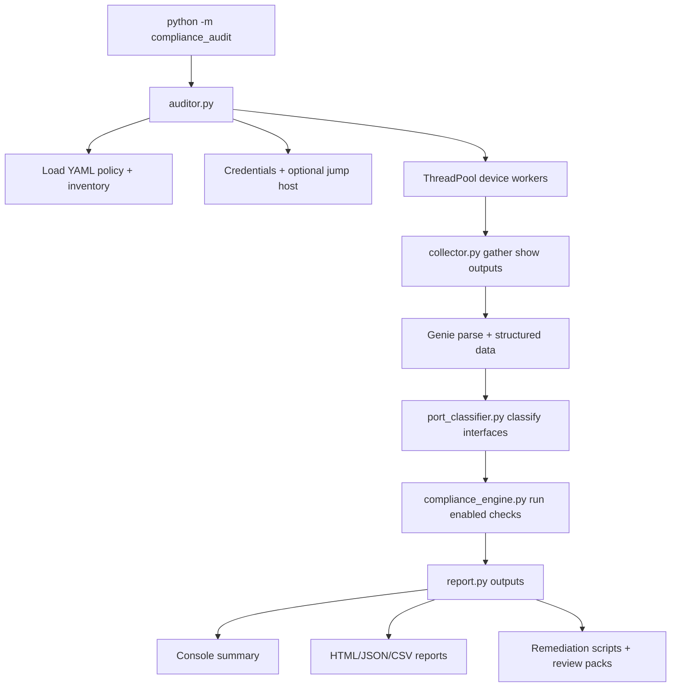

## Deep Dive: Cisco IOS-XE Compliance Audit

### "Policy-Driven Compliance, Engineered for Real Networks."

!!! info "Version Alignment"
    This deep dive reflects the **current main branch state (May 2026)** of Cisco IOS-XE Compliance Auditor and includes the split configuration model, governed remediation lifecycle workflow, severity/tag filtering, guided interactive mode (`--interactive`), full-screen TUI mode (`--tui`), and CLI option discovery (`--list-options`).

The **Cisco IOS-XE Compliance Audit** tool is a role-aware, policy-driven audit framework for Cisco switching and routing estates. It connects to devices (directly or through a jump host), collects operational and configuration state, classifies every interface by intent, runs 90+ toggleable compliance checks, and generates actionable reports with remediation commands.

This is one of the most comprehensive projects in the Nautomation Prime ecosystem, and this guide is intentionally thorough so your team can move from "we ran a script" to "we can defend every check and every result."

!!! abstract "Premium tool — buy ready-to-run or have it customised"
    The **Cisco IOS-XE Compliance Audit** tool is a production-grade Nautomation Prime tool — the most comprehensive in the catalogue. This deep dive shows exactly how it works; the tool itself is a premium product, available on request rather than as a free download.

    - **Buy as-is (unmodified) — £1,495:** the full auditor with its policy packs and multi-format reporting, delivered with a setup runbook and licensed for use in your environment.
    - **Customised to your estate — £3,500–£8,000:** bespoke policy model, role classification, remediation workflow, and reporting aligned to your governance and change process.

[Request this tool](../../contact.md){ .md-button .md-button--primary }
[Explore Services](../../services.md){ .md-button }

---

## 🧭 How to Read This Deep Dive

This page is deliberately written as an operational tutorial, not a marketing overview. Use it to understand:

- **What the auditor collects and evaluates**
- **Why policy, classification, and remediation are separated**
- **How to execute and scope the tool safely** on real estates
- **Where to change policy or behaviour** without introducing governance drift

---

## 🗺️ Tutorial Roadmap

For a full understanding, read this guide in sequence:

1. Start with the problem statement, architecture, and quick-start sections.
2. Move into configuration, engine concepts, and code walkthrough sections to understand how findings are produced.
3. Review reporting, operator workflow, remediation, and troubleshooting sections to understand day-two operations.
4. Finish with rollout guidance and runbook summary for production use.

---

## 🔍 Transparency Contract

This page is designed to make four things explicit:

- What state is collected from devices and how it becomes findings
- Why classification, policy, and remediation are separate layers
- How to scope execution safely on live estates
- Where to extend checks or policy without introducing audit drift

---

## ✨ Why This Tool Matters

Most compliance scripts fail in production because they are:

- Hardcoded and brittle
- Blind to topology and role context
- Too noisy for operations teams
- Weak on remediation guidance

This auditor solves that with:

- **Policy-as-data in YAML**: Every check can be enabled or disabled
- **Role-aware logic**: Access vs core vs SD-WAN vs industrial behaviour
- **Port-intent classification**: ACCESS, TRUNK_UPLINK, TRUNK_DOWNLINK, TRUNK_ENDPOINT, UNUSED, ROUTED, and more
- **Operational output**: Rich console summaries, HTML dashboards, JSON, CSV, and per-device remediation scripts
- **Operator UX modes**: Guided wizard (`--interactive`) and full-screen TUI (`--tui`) for day-to-day execution
- **Remediation lifecycle workflow**: Review packs, approvals, change-ticket linkage, expiry control, and guarded apply operations
- **Bulk operations**: `--remediation-approve-all` and `--remediation-apply-all` for scalable change windows
- **ROI reporting**: Optional estimated time/value saved in console, JSON, and HTML outputs
- **Scoped execution**: Categories, severity, and tags help teams phase adoption safely on live estates

---

## 🎯 PRIME Philosophy in Practice

### 1. Transparency Over Magic

Checks are explicit and traceable. Every finding maps to a check key in YAML and a specific evaluation path in the engine.

### 2. Hardened for Production

The auditor uses concurrent workers, optional jump-host access, fallback parsing strategies, and safe failure behaviour so one bad device does not invalidate an entire run.

### 3. Policy Before Code

Audit standards live in a **split YAML config directory** under `compliance_audit/compliance_config/`, not hidden in Python conditionals. Teams can evolve audit settings, connection details, role classification, and individual policy domains without rewriting tooling.

### 4. Actionable Outcomes

A failed finding includes remediation intent, and the tool can compile per-device remediation snippets to accelerate fix cycles.

---

## 🧱 Project Architecture

```text
Cisco-Compliance-Audit/
├── .env.example                    # Credential variables template — copy to .env
├── pyproject.toml                  # Canonical package metadata and version
├── compliance_audit/
│   ├── __about__.py                # Package metadata (name, author, licence)
│   ├── __init__.py                 # Package exports and dynamic version
│   ├── __main__.py                 # CLI entry point (python -m compliance_audit)
│   ├── compliance_config/          # ★ Compliance policy (split YAML files)
│   │   ├── audit_settings.yaml
│   │   ├── connection.yaml
│   │   ├── classification.yaml
│   │   ├── management_plane.yaml
│   │   ├── control_plane.yaml
│   │   └── data_plane.yaml
│   ├── devices/
│   │   └── devices.yaml            # ★ Device inventory
│   ├── auditor.py                  # Orchestrator (concurrent via ThreadPoolExecutor)
│   ├── cli_discovery.py            # CLI option table helper
│   ├── collector.py                # Data collection + Genie/TextFSM parsing
│   ├── compliance_engine.py        # All compliance checks
│   ├── credentials.py              # Credential handler (.env / keyring / env / prompt)
│   ├── hostname_parser.py          # Hostname naming convention parser
│   ├── interactive_cli.py          # Guided wizard CLI (questionary)
│   ├── jump_manager.py             # SSH jump host via Paramiko
│   ├── logging_setup.py            # Logging bootstrap
│   ├── netmiko_utils.py            # Netmiko connection wrapper
│   ├── port_classifier.py          # Interface role classification + EtherChannel detection
│   ├── remediation.py              # Remediation script generation
│   ├── remediation_cli.py          # Remediation CLI helpers
│   ├── remediation_workflow.py     # Approval lifecycle workflow
│   ├── report.py                   # Rich console + interactive HTML + JSON + CSV reports
│   ├── textual_app.py              # Full-screen 3-screen Textual TUI
│   └── version.py                  # Version reader (pyproject.toml)
├── assets/
│   └── config_files/
│       └── logging.conf
├── docs/
│   ├── RUNBOOK.html                # Operator runbook (rendered HTML)
│   └── RUNBOOK.md                  # Operator runbook (Markdown source)
├── logs/                           # Runtime log files
├── reports/                        # Default report output directory
├── scripts/
│   └── render_runbook.py
├── tests/
│   ├── test_annotate_findings.py
│   ├── test_hostname_parser.py
│   ├── test_inventory.py
│   └── test_remediation_workflow.py
├── run.bat                         # Windows daily launcher
├── run.sh                          # Linux/WSL daily launcher
├── setup.bat                       # Windows first-time setup (portable Python 3.12)
├── setup.sh                        # Linux/WSL first-time setup
├── requirements.txt
├── README.md
└── LICENSE
```

### Runtime Flow



---

## 📦 Prerequisites and Platform Notes

- Python 3.10+
- SSH reachability to targets (direct or via jump host)
- Privileged access for command collection
- Dependencies from `requirements.txt`

!!! tip "Windows — portable launcher available"
    Run `setup.bat` once (or double-click it) — it downloads a portable Python 3.12 runtime and installs all dependencies automatically. No system Python required. Use `run.bat` as your daily launcher after that.

!!! note "Windows + PyATS/Genie"
    Full Genie structured parsing is most reliable on Linux/macOS or WSL. On native Windows the tool falls back to TextFSM parsing automatically, which covers the majority of checks. For production estates requiring full Genie coverage, use WSL or a Linux host.

Install pattern (Linux/macOS/WSL):

```bash
# The licensed Cisco IOS-XE Compliance Audit package is provided on purchase
cd Cisco-Compliance-Audit
python3 -m venv .venv
source .venv/bin/activate
pip install -r requirements.txt
```

Install pattern (Windows — portable launcher):

```batch
# First-time setup
setup.bat

# Daily use
run.bat
```

---

## 🚀 Quick Start

```bash
# Audit a single device
python -m compliance_audit --device ZZ-LAB1-001ASW001:192.0.2.61

# Audit all devices in devices.yaml
python -m compliance_audit

# Use a site-specific config directory
python -m compliance_audit -c configs/site_alpha

# Use a different device inventory
python -m compliance_audit -i inventories/site_alpha_devices.yaml

# Audit only devices from one or more site groups
python -m compliance_audit --site site_lab
python -m compliance_audit --site site_lab site_brn

# Filter to high-severity findings
python -m compliance_audit --min-severity high

# Filter to CIS or PCI-tagged findings
python -m compliance_audit --tags cis pci

# List remediation review packs
python -m compliance_audit --remediation-list pending

# Approve all pending packs for a change ticket
python -m compliance_audit --remediation-approve-all --approver "john.doe" --ticket-id "CHG0012345"

# Apply one approved remediation pack
python -m compliance_audit --remediation-apply PACK_ID

# Guided interactive wizard
python -m compliance_audit --interactive

# Full-screen terminal app (TUI)
python -m compliance_audit --tui

# Discover all options in a CLI table
python -m compliance_audit --list-options
```

---

## 🧭 CLI Reference (Operationally Important Flags)

```text
python -m compliance_audit [-h] [--version] [-c CONFIG] [-d DEVICE] [-i INVENTORY]
                           [--site SITE [SITE ...]] [--no-jump]
                           [--categories CAT [CAT ...]]
                           [--tags TAG [TAG ...]] [--min-severity LEVEL]
                           [-o OUTPUT_DIR] [--fail-threshold PCT]
                           [--csv] [--no-csv] [-v]
                           [--remediation-list [STATUS]]
                           [--remediation-approve PACK_ID]
                           [--remediation-approve-all]
                           [--remediation-reject PACK_ID]
                           [--remediation-apply PACK_ID]
                           [--remediation-apply-all]
                           [--approver NAME] [--ticket-id ID] [--reason TEXT]
                           [--expires-hours HOURS]
                           [--allow-high-risk] [--interactive] [--tui]
                           [--list-options]
```

Most useful real-world options:

- `--categories management_plane control_plane` to run scoped audits
- `--fail-threshold 80` for pipeline quality gates
- `--csv` / `--no-csv` for explicit report behaviour
- `--remediation-list pending` to view queued review packs
- `--remediation-approve PACK_ID --approver NAME --ticket-id CHG_ID` for approval control
- `--remediation-apply PACK_ID` to execute an approved remediation pack
- `--remediation-apply-all` for approved bulk operations
- `--interactive` for guided operator workflows
- `--tui` for full-screen operational runs and live UX
- `--list-options` to quickly discover available flags and defaults
- `-v` or `-vv` for run-time diagnostics

---

## 🆕 Current-State Enhancements (May 2026)

Key enhancements reflected in this deep dive update:

1. **Split config directories**: Policy is organised into focused YAML files under `compliance_config/`, not a single monolithic config file.
2. **Separate device inventories**: Inventory can move independently of policy through `devices.yaml` or `-i` overrides.
3. **Per-check metadata and filtering**: Severity, tags, role scope, and exclusion patterns support safer phased adoption.
4. **Enterprise remediation lifecycle**: Review packs are generated, tracked, and governed through approval and apply states.
5. **Ticket-aware approvals and expiry**: Change metadata and approval windows are built into the workflow.
6. **Risk controls**: High-risk command blocks, checksum checks, drift checks, and hostname validation reduce apply risk.
7. **Bulk lifecycle operations**: Approve-all and apply-all workflows support larger estates.
8. **ROI instrumentation**: Optional effort/value estimation is embedded in console, JSON, and HTML outputs.
9. **Operator-focused execution modes**: `--interactive`, `--tui`, and `--list-options` improve day-to-day usability.
10. **Expanded runbook assets**: Repository runbook documentation is available in markdown and HTML formats.

---

## ⚙️ Configuration Model

The current repository uses a **directory of focused YAML files** rather than a single monolithic policy file. That split is one of the biggest improvements in the current code line: teams can change connection settings, classification rules, or one policy domain without editing unrelated controls.

| File | Purpose | Typical change cadence |
| --- | --- | --- |
| `audit_settings.yaml` | Concurrency, report outputs, timeouts, ROI, reference VLANs, remediation policy | Per run or per environment |
| `connection.yaml` | SSH device type, jump-host behaviour, retries, credential backend | Per environment |
| `classification.yaml` | Hostname role codes, endpoint patterns, `inventory_file` path | Rarely |
| `devices.yaml` | Default device inventory | Per run |
| `management_plane.yaml` | SSH, AAA, NTP, logging, SNMP, VTY, banner checks | When policy changes |
| `control_plane.yaml` | STP, VTP, DHCP snooping, DAI, UDLD, errdisable controls | When policy changes |
| `data_plane.yaml` | Access, trunk, and unused-port checks | When policy changes |

### Multiple Config Directories

Per-site or per-environment policy is now a first-class pattern:

```bash
cp -r compliance_audit/compliance_config configs/site_alpha
cp -r compliance_audit/compliance_config configs/site_beta

python -m compliance_audit -c configs/site_alpha
python -m compliance_audit -c configs/site_beta
```

Each config directory is self-contained. The device inventory stays separate and can be referenced from `classification.yaml` or overridden at run time:

```yaml
# configs/site_alpha/classification.yaml
inventory_file: "../inventories/site_alpha_devices.yaml"
```

```bash
python -m compliance_audit -c configs/site_alpha -i inventories/site_alpha_devices.yaml
```

### Per-Check Metadata

Every check remains policy-driven, but the current model is richer than simple on/off toggles:

```yaml
some_check_name:
  enabled: true
  severity: high
  tags: [cis, pci]
  applies_to_roles:
    - access_switch
  exclude_hostnames:
    - ".*-LEGACY-.*"
  exclude_interfaces:
    - "GigabitEthernet0/0"
```

That metadata powers scoped enforcement, filtered reporting, and safer exception handling without code forks.

---

## 🧠 Core Engine Concepts

### 1) Structured Collection First

`collector.py` gathers key show commands and parses them into structured models (Genie preferred, with fallback behaviour when unavailable).

This provides stable inputs for compliance checks and avoids fragile single-line CLI scraping.

### 2) Parse Running Config Into Queryable Sections

The running config is transformed into:

- Global lines
- Per-interface blocks
- Per-line-config blocks (e.g., VTY/console)

This gives the engine consistent helpers for checks like "present globally" vs "present on interface".

### 3) Classify Every Interface by Intent

`port_classifier.py` combines signals from:

- STP root-port state
- CDP/LLDP neighbour identity
- Hostname role parsing
- EtherChannel mapping
- Interface config and operational metadata

Result: checks are applied to the right interfaces for the right reasons.

### 4) Execute Enabled Checks by Category

`compliance_engine.py` runs check families only when enabled:

- Management plane
- Control plane
- Data plane
- Role-specific checks

This avoids policy drift between intended standards and actual enforcement.

---

## 🧬 Code Walkthrough: Why the Implementation Looks Like This

This section is the "under the hood" explanation many engineers ask for: not just what the tool does, but why the code is structured this way.

!!! info "How to read this section"
  Snippets below are intentionally simplified to focus on the design pattern.
  They represent the production structure and decision logic used by the project.

### 1) CLI Entry Point and Exit Behaviour

The entrypoint keeps the interface thin and delegates implementation detail to the orchestrator.

```python
def main() -> None:
  parser = _build_parser()
  args = parser.parse_args()

  results = run_audit(
    config_path=args.config,
    device_overrides=args.devices,
    skip_jump=args.no_jump,
    categories=args.categories,
    output_dir=args.output_dir,
    dry_run_dir=args.dry_run,
    csv_report=args.csv_report,
    inventory_path=args.inventory,
  )

  if args.fail_threshold is not None:
    if any(r.score_pct < args.fail_threshold for r in results):
      sys.exit(1)
  elif any(r.fail_count > 0 for r in results):
    sys.exit(1)
```

### Why this design

- The CLI only parses intent and routes to `run_audit(...)`.
- Quality-gate semantics are explicit via exit codes.
- This makes the tool CI-friendly: policy violations can block merges or releases.

### Trade-off

- The process-level pass/fail is simple and strict.
- If teams need nuanced gating (for example, allow WARN but not FAIL in certain categories), that policy should be added intentionally rather than hidden in ambiguous CLI behaviour.

---

### 2) Orchestrator Pattern and Concurrency Safety

The orchestrator builds per-device jobs and executes them with a thread pool.

```python
with ThreadPoolExecutor(max_workers=max_workers) as executor:
  future_to_job = {
    executor.submit(_audit_single_device, job): job
    for job in jobs
  }
  for future in as_completed(future_to_job):
    job = future_to_job[future]
    result = future.result()
    if result is not None:
      results.append(result)
```

### Why this design

- Each device is isolated as an independent job.
- One failing device does not collapse the whole run.
- Throughput scales predictably with `max_workers`.

### Operational effect

- Large inventories complete quickly.
- Run outcomes stay deterministic enough for operations reporting.

### Trade-off

- More concurrency increases pressure on jump hosts and AAA backends.
- The tool caps workers and keeps job payloads explicit to reduce accidental overload.

---

### 3) ParsedConfig Model: Avoid Regex Chaos

Instead of scanning full running config text repeatedly, the parser creates queryable sections.

```python
@dataclass
class ParsedConfig:
  global_lines: list[str]
  interfaces: dict[str, list[str]]
  line_configs: dict[str, list[str]]

  def has_line(self, pattern: str) -> bool: ...
  def interface_has(self, intf: str, pattern: str) -> bool: ...
  def line_config_has(self, line_name: str, pattern: str) -> bool: ...
```

### Why this design

- Check code remains readable and testable.
- Management-plane, interface-plane, and line-level checks use a shared abstraction.
- Fewer parsing edge cases leak into compliance methods.

### Design decision

- The parser treats many indented non-interface lines as globally searchable lines to preserve practical matching for router, crypto, and nested blocks.

---

### 4) Signal Fusion for Port Classification

The classifier does not trust a single signal. It combines STP, CDP/LLDP, EtherChannel, and interface metadata.

```python
ports = build_from_interface_blocks(data.parsed_config)
enrich_with_show_interfaces(ports, data.interfaces)
mark_stp_root_ports(ports, data.stp)
map_cdp_neighbors(ports, data.cdp, role_config, endpoint_patterns)
map_lldp_neighbors(ports, data.lldp, role_config, endpoint_patterns)
map_etherchannel_members(ports, data.etherchannel)
assign_final_roles(ports)
```

### Why this design

- STP root-port signal is strong but not always complete.
- CDP/LLDP hostname signal adds role context.
- EtherChannel awareness avoids evaluating member links independently when policy should apply to the logical bundle.

### Failure mode prevented

- Without this fusion, trunk direction can be misclassified, which leads directly to incorrect root-guard decisions.

---

### 5) Policy-Driven Check Execution

Checks are method-based, but all enablement is policy-driven.

```python
checks = [
  ("management_plane", self._check_services),
  ("management_plane", self._check_ssh),
  ("control_plane", self._check_stp),
  ("data_plane", self._check_interfaces),
  ("role_specific", self._check_role_specific),
]

for category, fn in checks:
  if category in self.policy:
    findings.extend(fn(cfg, data, host_info, ports))
```

### Why this design

- New checks can be added without rewriting framework flow.
- Category filtering from CLI naturally maps to engine behaviour.
- Teams can disable checks in YAML without code edits.

### Trade-off

- There is intentional verbosity in check methods.
- That verbosity is a feature: explicit checks are easier to audit and safer to modify.

---

### 6) Finding Model: Standardised Audit Currency

Every check emits a normalised finding object.

```python
Finding(
  check_name="root_guard",
  status=Status.FAIL,
  detail="Gi1/0/48: root guard on uplink must be removed",
  category="data_plane",
  interface="Gi1/0/48",
  remediation="no spanning-tree guard root",
)
```

### Why this design

- A single schema powers console, HTML, CSV, JSON, and remediation generation.
- Reporting layers stay thin because they consume one consistent model.
- The remediation field converts detection into immediate action guidance.

---

### 7) Direction-Aware Guard Logic (Critical Example)

This is a signature implementation detail and a strong example of policy with topology context.

```python
if is_downlink:
  if has_root_guard:
    PASS
  else:
    FAIL("root guard missing", remediation="spanning-tree guard root")
elif is_uplink:
  if has_root_guard:
    FAIL("root guard on uplink", remediation="no spanning-tree guard root")
  else:
    PASS
else:
  if has_root_guard:
    WARN("direction unknown - verify manually")
```

### Why this design

- Security controls are not binary; they are context-dependent.
- The WARN path for unknown direction avoids false certainty.

### Operational value

- Prevents dangerous guidance that would break spanning-tree stability.

---

### 8) Native VLAN Validation with Structured-Then-Fallback Logic

The trunk native VLAN check attempts structured data first, then falls back to interface config parsing.

```python
native_vlan = None

if data.switchports:
  native_vlan = data.switchports.get(intf, {}).get("native_vlan")

if native_vlan is None:
  native_vlan = parse_native_vlan_from_interface_lines(pi.config_lines)

if native_vlan is None:
  WARN("native VLAN not determined")
elif native_vlan == expected_native:
  PASS
else:
  FAIL(f"expected {expected_native}, got {native_vlan}")
```

### Why this design

- Structured parsing gives better fidelity when available.
- Fallback logic keeps the check useful in imperfect collection conditions.

### Trade-off

- Fallback parsing is less authoritative, so uncertain states become WARN rather than hard FAIL.

---

### 9) Remediation Script Generation Strategy

The remediation builder only includes FAIL findings with remediation commands and then organises commands by scope.

```python
fails = [f for f in findings if f.status == FAIL and f.remediation]

global_cmds, interface_cmds = split_by_scope(fails)

lines = ["configure terminal", "!"]
lines.extend(deduplicate(global_cmds))
lines.extend(render_interface_blocks(interface_cmds))
lines.extend(["end", "write memory", "!"])
```

### Why this design

- Keeps output practical for engineers during maintenance windows.
- Prevents duplicate command spam.
- Preserves interface-level context where needed.

### Important caution

- Generated snippets should still pass change control and peer review before deployment in production.

---

### 10) Reporting Layers and Operator Outputs

The reporting pipeline keeps terminal output compact while pushing detail into HTML, CSV, JSON, and remediation artefacts.

```python
render_console_summary(results)
write_html_reports(results)
write_json_reports(results, enabled=audit_settings.json_report)
write_csv_report(results, enabled=audit_settings.csv_report)
write_remediation_artifacts(results, enabled=remediation.generate_script)
```

### Why this design

- Operators need a quick score table during the run.
- Audit evidence needs portable artefacts after the run.
- Remediation output should be generated from the same finding model, not a separate toolchain.

### Operational benefit

- Live runs stay readable.
- Post-run evidence is consistent across manual review, spreadsheets, and downstream automation.

---

### 11) Credential Chain and Operator Experience

Credential handling follows a strict lookup order: `.env` file, keyring, environment variables, then prompt.

```python
# 1. .env file (copy .env.example → .env, fill values)
creds = from_dotenv()  # SWITCH_USER / SWITCH_PASS etc.
if not creds:
  # 2. OS keyring (optional, requires keyring library)
  creds = from_keyring()
if not creds:
  # 3. Environment variables
  creds = from_env([("SWITCH_USER", "SWITCH_PASS"), ...])
if not creds:
  # 4. Interactive prompt
  creds = prompt_user()
```

### Why this design

- Supports both fully automated and interactive operations.
- Avoids hardcoded secrets in config files.
- Can become hands-free after first secure run when keyring mode is enabled.

---

### 12) Live Collection as the Single Execution Path

The current tool path assumes live collection against reachable devices rather than replaying saved command outputs.

```python
collector = DataCollector(live_connection)
data = collector.collect(hostname, ip)
```

### Why this design

- Findings stay tied to current device state.
- Audit and remediation workflows operate against the same live evidence path.
- Operators do not need to maintain parallel saved-output fixtures for production use.

### Operational implication

- Safer rollout now comes from scoped live runs, approval gates, and immediate post-change re-audits.
- Decouples standards engineering from live network access constraints.

---

### 13) Design Principles You Can Reuse in Other Automation Projects

If you are building your own automation framework, these patterns are worth copying:

- **Policy-as-data** rather than hardcoded checks
- **Normalised finding model** consumed by all report channels
- **Signal fusion** for topology-aware decisions
- **Structured-first, fallback-second parsing** for robustness
- **Per-check metadata and filtered outputs** for safer, phased adoption
- **Separation of orchestration, collection, classification, evaluation, reporting**

These are the reasons this implementation scales beyond a lab script into a platform pattern.

---

## 🔎 Line-by-Line Spotlights: 5 Critical Checks

This is the practical "show me exactly how it thinks" section.

Each spotlight below breaks down:

1. The logic path used by the check
2. Why the design decision exists
3. What operational outcome it creates

---

### Spotlight 1: Root Guard (Direction-Aware STP Safety)

```python
is_uplink = pi.role == PortRole.TRUNK_UPLINK
is_downlink = pi.role == PortRole.TRUNK_DOWNLINK

if is_downlink:
  if pi_has(pi, r"spanning-tree guard root"):
    PASS
  else:
    FAIL("root guard missing", remediation="spanning-tree guard root")
elif is_uplink:
  if pi_has(pi, r"spanning-tree guard root"):
    FAIL("root guard on UPLINK", remediation="no spanning-tree guard root")
  else:
    PASS
else:
  if pi_has(pi, r"spanning-tree guard root"):
    WARN("direction unknown - verify manually")
```

How to read this:

1. Interface role is decided first; the check never assumes all trunks are equal.
2. Downlinks are expected to enforce root guard.
3. Uplinks must not enforce root guard, because that can block valid root behaviour.
4. Unknown direction downgrades certainty to WARN.

Why this design:

1. STP controls are topology-dependent.
2. A strict but context-aware model avoids both false PASS and dangerous FAIL guidance.

Operational outcome:

1. Prevents outages caused by accidental root guard on uplinks.
2. Surfaces real risk on downlinks without over-asserting where context is incomplete.

!!! tip "Operator Checklist"
  1. Pre-check: Confirm the interface role classification (`TRUNK_UPLINK` vs `TRUNK_DOWNLINK`) from the report before changing STP guard settings.
  2. Change: Apply `spanning-tree guard root` only on validated downlinks, and remove it from validated uplinks.
  3. Post-check: Re-run the audit and verify downlinks show PASS for root guard while uplinks show PASS for no root guard.
  4. Safety check: If role remains unknown, do not enforce guard changes until topology intent is confirmed.

---

### Spotlight 2: Native VLAN Validation (Structured Data With Safe Fallback)

```python
native_vlan = None

if data.switchports:
  sw_data = data.switchports.get(intf) or data.switchports.get(pi.name)
  if isinstance(sw_data, dict):
    native_vlan = sw_data.get("native_vlan")

if native_vlan is None:
  for line in pi.config_lines:
    m = re.search(r"switchport trunk native vlan\s+(\d+)", line, re.I)
    if m:
      native_vlan = int(m.group(1))
      break

if native_vlan is None:
  WARN("native VLAN not determined")
elif native_vlan == expected_native:
  PASS
else:
  FAIL(f"native VLAN {native_vlan}, expected {expected_native}")
```

How to read this:

1. Try structured parser output first.
2. If unavailable, parse interface config lines.
3. If still unknown, emit WARN rather than hard FAIL.

Why this design:

1. Structured parser data is preferred for accuracy.
2. Fallback keeps checks useful in partial-data scenarios.
3. WARN-on-unknown prevents false confidence.

Operational outcome:

1. Better resilience during incomplete collection or parser variance.
2. Fewer noisy false negatives when evidence quality is mixed.

!!! tip "Operator Checklist"
  1. Pre-check: Verify expected native VLAN policy in YAML for uplinks, downlinks, and endpoint trunks.
  2. Change: Correct native VLAN on mismatched trunks using the defined policy value, not ad-hoc values.
  3. Post-check: Re-run the audit and ensure `trunk_native_vlan` findings move from FAIL or WARN to PASS.
  4. Hygiene check: Investigate recurring WARN states to improve parser fidelity or command coverage.

---

### Spotlight 3: DHCP Snooping Trust (Role-Based Interface Intent)

```python
trust_node = dp.get("dhcp_snooping_trust", {})
want_trust = (
  (is_uplink and trust_node.get("on_uplinks", True)) or
  (is_downlink and trust_node.get("on_downlinks", True))
)
has_trust = pi_has(pi, r"ip dhcp snooping trust")

if want_trust:
  if has_trust:
    PASS
  else:
    FAIL("DHCP snooping trust missing", remediation="ip dhcp snooping trust")
```

How to read this:

1. Policy decides where trust should exist, not hardcoded assumptions.
2. Check compares desired state against observed state.
3. Failure includes exact remediation command.

Why this design:

1. Some environments trust uplinks only; others trust specific downlinks too.
2. The model supports both without rewriting engine logic.

Operational outcome:

1. Reduces mis-scoped trust that can weaken DHCP protections.
2. Keeps policy portable across sites with different designs.

!!! tip "Operator Checklist"
  1. Pre-check: Validate trust intent in policy (`on_uplinks`, `on_downlinks`) against your DHCP relay and gateway topology.
  2. Change: Apply `ip dhcp snooping trust` only where policy indicates trust is required.
  3. Post-check: Confirm audit findings align with intended trust boundaries and no extra trusted ports remain.
  4. Risk check: Review unexpected trusted interfaces manually before closing the change.

---

### Spotlight 4: Unused Port Hardening (Defense-in-Depth by Default)

```python
if node.get("must_be_shutdown", True):
  if not pi.admin_down:
    FAIL("unused port not shutdown", remediation="shutdown")

if node.get("must_be_in_parking_vlan", True):
  if pi.access_vlan != parking:
    FAIL("unused port wrong parking VLAN", remediation=f"switchport access vlan {parking}")

if node.get("must_have_bpduguard", True):
  if not pi_has(pi, r"spanning-tree bpduguard enable"):
    FAIL("unused port missing BPDU guard", remediation="spanning-tree bpduguard enable")

if node.get("must_have_no_cdp", True):
  if not pi_has(pi, r"no cdp enable"):
    FAIL("unused port has CDP enabled", remediation="no cdp enable")
```

How to read this:

1. This is a layered control stack, not a single condition.
2. Each control is independently toggleable in policy.
3. Each miss creates a specific failure with direct corrective action.

Why this design:

1. Unused ports are frequent ingress points for misconfiguration and abuse.
2. Independent toggles let governance teams phase controls without code forks.

Operational outcome:

1. Hardens dormant edge interfaces consistently.
2. Improves auditability because every missed layer is explicit.

!!! tip "Operator Checklist"
  1. Pre-check: Confirm parking VLAN and unused-port standards for the site to avoid breaking reserved operational ports.
  2. Change: Apply shutdown, parking VLAN, BPDU guard, and CDP/LLDP restrictions in one controlled template pass.
  3. Post-check: Re-run the audit and verify all unused-port controls pass as a bundle.
  4. Exception check: Document approved exceptions in policy rather than leaving ports partially hardened.

---

### Spotlight 5: Remediation Script Builder (Actionable Output, Not Just Findings)

```python
fails = [f for f in result.findings if f.status == Status.FAIL and f.remediation]

global_cmds: list[str] = []
intf_cmds: dict[str, list[str]] = {}

for f in fails:
  if f.interface:
    intf_cmds.setdefault(f.interface, []).append(f.remediation)
  else:
    global_cmds.append(f.remediation)

lines.append("configure terminal")
lines.extend(dedup(global_cmds))
lines.extend(render_interface_blocks(intf_cmds))
lines.extend(["end", "write memory"])
```

How to read this:

1. Only FAIL findings with remediation are considered.
2. Commands are split into global and interface-scoped blocks.
3. Duplicates are removed before rendering.
4. Output is ready for controlled operational use.

Why this design:

1. Engineers need fix-ready artifacts, not just pass/fail data.
2. Scope separation avoids command ordering confusion.

Operational outcome:

1. Speeds up remediation during change windows.
2. Reduces human transcription errors from manual report reading.

!!! tip "Operator Checklist"
  1. Pre-check: Review generated remediation commands line-by-line and remove anything outside approved change scope.
  2. Change: Apply remediation in a maintenance window, preferably in staged blocks (global first, then interface blocks).
  3. Post-check: Re-run the audit immediately to verify FAIL findings were resolved and no regressions were introduced.
  4. Governance check: Attach the generated script and post-audit results to the change record for traceability.

---

### What These 5 Spotlights Demonstrate

Across all five examples, the core pattern is the same:

1. Infer context first (role, direction, evidence quality)
2. Apply policy second (enabled rules and expected states)
3. Produce an actionable finding third (clear detail + remediation)

That sequence is exactly why this auditor works well in real enterprise operations.

---

## 🔬 How Port Classification Avoids False Positives

A major challenge in network compliance is avoiding wrong conclusions on trunk links. This project handles that with a layered signal model.

### Trunk Direction Logic

Primary and secondary signals are combined:

1. STP root-port election (strong signal)
2. Neighbour role from CDP/LLDP hostname parsing (context signal)

This helps correctly label ports as:

- `TRUNK_UPLINK`
- `TRUNK_DOWNLINK`
- `TRUNK_UNKNOWN`
- `TRUNK_ENDPOINT`

### Why This Matters

Security checks are direction-sensitive. Example:

- Root guard on downlinks: expected
- Root guard on uplinks: dangerous and should fail

Without direction awareness, many "compliance" tools generate misleading guidance.

---

## 🌩️ Storm Control and STP Guard Enforcement

Two notable strengths of this auditor are speed-aware and direction-aware validations.

### Storm Control

Checks can enforce threshold behaviour based on interface speed tiers (10G/1G/100M), reducing one-size-fits-none policy mistakes.

### BPDU Guard and Root Guard Matrix

Operational intent is encoded clearly:

- BPDU guard expected on access ports
- Root guard expected on downlink trunks
- Root guard on uplinks flagged as failure
- Unknown-direction trunks may produce warn-level findings for review

This is exactly the kind of nuanced behaviour needed for enterprise-safe automation.

---

## 🛡️ Compliance Coverage by Domain

The check library spans governance domains rather than isolated commands.

### Management Plane (Examples)

- Service hardening
- SSH hardening
- AAA/TACACS/RADIUS posture
- SNMP restrictions (including public/private community handling)
- Logging/NTP standards
- Banner and local account hygiene
- VTY and console control standards

### Control Plane (Examples)

- STP global posture and priority behaviour
- VTP mode requirements
- DHCP snooping controls
- Dynamic ARP inspection controls
- UDLD / errdisable / CoPP-related controls

### Data Plane (Examples)

- Access-port hardening (portfast/BPDU guard/nonegotiate/port-security)
- Trunk policy (allowed VLAN pruning, native VLAN expectations)
- DHCP snooping trust and DAI trust by direction
- Unused-port lockdown patterns
- Routed-interface security checks

### Role-Specific (Examples)

- Core should be STP root where expected
- Access should not be root
- Access uplink redundancy via port-channel
- Additional role-bound checks for specialised topologies

---

## 🧾 Reporting and Artifacts

This project is built to support both operators and auditors.

### Console Summary

A compact score-driven table keeps terminal output readable while still surfacing pass/fail posture by device.

### JSON (Per Device)

Machine-readable artifact for downstream pipelines and baselining.

### CSV (Consolidated)

Cross-device tabular export suitable for governance dashboards, spreadsheets, and data ingest.

### HTML Reports

- Per-device interactive pages
- Consolidated dashboard for multi-device audits
- Filtering, searching, and collapsible sections

### Remediation Script Generation

For fail findings with known fixes, the tool can produce ready-to-apply IOS-XE snippets.

Important implementation detail:

- Commands are grouped globally and per-interface
- Duplicates are removed
- Port-channel members are remediated at the logical Port-channel where appropriate

### Worked Example: From Policy to Finding to Remediation Intent

This is the most important transparency chain in the entire auditor: one policy rule becomes one finding, which can then become one remediation action.

**1. Policy snippet**

```yaml
bpdu_guard:
  enabled: true
  severity: high
  tags: [layer2-security, stp, cis, pci]
```

**2. Narrow execution example**

```bash
python -m compliance_audit --device ZZ-LAB1-001ASW001:192.0.2.61 --categories data_plane --tags stp
```

**3. Example finding in JSON output**

```json
{
  "check": "bpdu_guard",
  "status": "FAIL",
  "detail": "GigabitEthernet1/0/5: BPDU guard missing (access port)",
  "severity": "high",
  "tags": ["layer2-security", "stp", "cis", "pci"],
  "remediation": "spanning-tree bpduguard enable"
}
```

**4. Resulting remediation intent**

```text
interface GigabitEthernet1/0/5
 spanning-tree bpduguard enable
```

Why this example matters:

- The **YAML policy** controls whether the check runs and how it is classified
- The **engine** evaluates the live interface state against that policy
- The **report** preserves the result as a structured artifact
- The **remediation workflow** can then group and govern the corrective command

---

## 🧭 Operator Experience and Workflow Control

The current code line is built for both scripted execution and day-to-day operations. Operators can choose the interface that matches the moment:

- `--interactive` for guided prompts and command previews
- `--tui` for a full-screen terminal workflow
- `--list-options` for a complete, discoverable CLI table
- `--categories`, `--min-severity`, and `--tags` for scoped execution
- `--fail-threshold` for CI gates and pre-change quality checks

That mix matters because compliance tooling only sticks when it works equally well for operators, automation pipelines, and change-control processes.

---

## 🧵 Interactive Modes, Remediation Workflow, and Testability

The core engine walkthrough above explains how the auditor reasons about devices. The missing production lesson is how the outer execution modes are kept aligned so the tool does not fragment into separate behaviours over time.

### 1. All Operator Interfaces Terminate in the Same Audit Engine

The current `__main__.py` routes several operator experiences:

- direct CLI execution
- `--interactive` guided wizard mode
- `--tui` full-screen Textual mode
- remediation lifecycle commands
- `--list-options` discovery mode

The important design choice is that these do **not** implement separate audit engines. Both the guided CLI and the TUI eventually hand work to `run_audit(...)`.

Why this matters:

- feature drift between CLI and TUI is reduced
- fixes to filtering, reporting, and concurrency land in one shared path
- operational training is easier because different interfaces still drive the same underlying behaviour

That is a repeatable engineering pattern: multiple operator entry points are fine, but they should converge on one core execution path.

### 2. The TUI Is a Shell Around the Core Engine, Not a Parallel Product

`textual_app.py` is careful about its boundaries.

The setup screen gathers:

- config directory
- inventory path or device overrides
- category scope and output override
- username and password

The audit screen then starts the real work in a background thread, injects credentials into the environment for the worker lifecycle, and calls `run_audit(...)`. Log output is routed through a dedicated `TUILogHandler` and Textual message bus so worker-thread logs can be rendered safely in the interface.

Why this matters:

- the UI remains responsive while live audits are running
- log transport is thread-safe rather than relying on ad hoc print calls
- the statistics panel is derived from real result objects, not guessed state

This is a production-quality terminal UI pattern: use the UI for collection, progress, and visibility, but keep policy logic and network collection in shared backend modules.

### 3. The Interactive CLI Is Built for Explainability, Not Just Convenience

`interactive_cli.py` does more than prompt for flags. It builds an `AuditWizardConfig`, shows the equivalent CLI command preview, and then still calls `run_audit(...)` with the selected options.

Why this matters:

- operators can learn the non-interactive command form while using the wizard
- the guided mode becomes training material, not a separate opaque workflow
- the preview makes execution intent reviewable before the run starts

That is very aligned with PRIME Philosophy: convenience should increase transparency, not replace it.

### 4. Remediation Workflow Is Governed State, Not Just Generated Text

The remediation lifecycle is one of the clearest examples of deliberate production design in the whole codebase.

`generate_review_pack(...)` converts FAIL findings into a structured review artifact containing:

- device identity
- finding list
- grouped commands
- per-command risk labels
- script checksum
- lifecycle metadata

That data is then persisted through `ReviewStore`, a SQLite-backed state store. Approval and rejection update the same durable record instead of relying on loose files and human memory.

When `apply_approved_pack(...)` runs, it enforces several gates before touching a device:

- pack status must be approved
- approval must not be expired
- checksum must still match
- high-risk packs are blocked unless explicitly allowed
- optional Linux-only runtime enforcement can be applied
- optional hostname matching prevents applying to the wrong prompt
- preflight drift checking confirms the approved findings still exist
- post-check verification measures what was actually resolved

Why this matters:

- remediation becomes auditable and reviewable
- stale or modified scripts are caught before implementation
- the apply path behaves more like governed change control than like a quick push script

That is a major lesson for anyone building automation for production networks: the harder part is often not generating commands, but governing when those commands are still safe to use.

### 5. Bulk Apply and Post-Remediation Reporting Reuse Existing Layers

`apply_all_approved_packs(...)` does not invent a new execution model. It sequences approved packs through the same controlled apply path, then optionally produces consolidated post-remediation reports.

Because post-check reporting reuses collection, classification, engine, and report modules, the audit evidence after implementation is derived from the same logic as the baseline assessment.

Why this matters:

- pre-change and post-change evidence stay comparable
- success is measured by re-audit, not by assuming the command was accepted
- governance features scale beyond one-device manual workflows

### 6. Testability Is an Outcome of the Architecture

The repository already carries targeted tests for hostname parsing, inventory handling, finding annotation, and remediation workflow behaviour. That is possible because the code is split into narrow, composable units instead of one large script.

Practical examples of testable boundaries include:

- `_annotate_findings(...)` for severity, tags, and include/exclude policy behaviour
- inventory normalisation and deduplication in the orchestrator
- `ParsedConfig` helpers for global, line, and interface section queries
- remediation review-pack state transitions and checksum logic

Why this matters:

- extensions can be verified at the abstraction boundary where they live
- regressions are easier to isolate than in end-to-end-only test suites
- the code teaches a useful pattern: separate policy evaluation, transport, parsing, and reporting so each can be tested with intent

If you extend this tool, the right habit is to add the YAML change, the engine or workflow change, and the smallest targeted test that proves the new behaviour. That is how the project stays explainable as it grows.

---

## 🔐 Credential Strategy

Credential lookup order is intentionally practical:

1. OS keyring (when enabled)
2. Environment variables
3. Interactive prompt fallback

When keyring mode is active, prompted/env credentials can be written back for future non-interactive runs.

Enable-secret support is environment-driven when required for privileged workflows.

---

## 🧪 Safe Validation in Live Runs

With replay-based and non-executing apply stages removed, safer validation now depends on narrowing live scope and using governance controls intentionally.

Recommended patterns:

- Start with a single device using `--device`
- Limit execution with `--categories`, `--min-severity`, or `--tags`
- Review remediation packs before any apply action
- Re-run the audit immediately after implementation to confirm outcomes

---

## 🧩 Extending the Auditor Safely

### Add a New Global Check

1. Add a new key in the relevant YAML section with `enabled: true`
2. Implement logic in the corresponding engine method
3. Use existing helper patterns for consistency (`_present`, `_absent`, finding model)

### Add a New Per-Interface Check

1. Define policy node under `data_plane`
2. Implement in `_check_access_port`, `_check_trunk_port`, `_check_unused_port`, or `_check_routed_port`
3. Reuse interface helper matching patterns for deterministic behaviour

### Add a New Device Role

1. Extend `hostname_roles` in YAML
2. Add role-specific policy nodes
3. Add/extend logic only if simple policy toggles are insufficient

---

## 🧯 Troubleshooting Patterns

Common issues and high-confidence fixes:

- **Genie parser unavailable**: install PyATS/Genie in Linux/macOS/WSL runtime
- **No devices audited**: verify inventory path or use explicit `--device`
- **Role not parsed**: use `hostname:ip` format for stronger role inference
- **TRUNK_UNKNOWN proliferation**: verify CDP/LLDP visibility and hostname standards
- **Connection failures**: confirm SSH enablement, jump-host path, and credentials

---

## 🏁 Production Rollout Playbook

Recommended phased adoption:

1. **Start with a single device or narrow category scope**
2. **Run management-plane only** to validate baseline policy assumptions
3. **Enable full categories** and review false positives with operations
4. **Adopt fail thresholds** in CI/CD or pre-change validation
5. **Introduce scoped filtering and governed remediation** once baseline policy is trusted

---

## 📋 Runbook Summary (Change Window Ready)

Use this as a single operational workflow that combines all five spotlight controls.

Need a compact printable version? A full `RUNBOOK.md` is included with the licensed package.

### Phase 1: Pre-Change Validation

1. Run the auditor and export current HTML, JSON, and CSV outputs.
2. Confirm interface direction classification for all trunk controls before applying STP guard changes.
3. Verify policy values for native VLAN, parking VLAN, and trust intent in YAML.
4. Identify unknown-direction or unknown-native-VLAN findings and mark them for manual review.
5. Prepare remediation script output, then review and prune to approved scope.

### Phase 2: Controlled Implementation

1. Apply root guard changes only where direction is validated.
2. Correct trunk native VLAN mismatches using policy-defined values.
3. Apply DHCP snooping trust only on policy-approved interfaces.
4. Enforce unused-port hardening as a complete bundle (shutdown, parking VLAN, BPDU guard, CDP/LLDP restrictions).
5. Execute remediation commands in staged order: global configuration first, interface blocks second.

### Phase 3: Post-Change Verification

1. Re-run the auditor immediately after changes.
2. Confirm target findings moved from FAIL or WARN to PASS.
3. Confirm no new failures were introduced in adjacent controls.
4. Review consolidated HTML dashboard for cross-device regressions.
5. Validate consolidated reports and remediation status for each changed device.

### Phase 4: Evidence and Governance Closure

1. Attach before-and-after reports to the change record.
2. Include generated remediation script and final executed command set.
3. Document approved exceptions directly in policy, not as undocumented operational drift.
4. Schedule follow-up run to confirm controls remain stable after normal operations resume.
5. Capture lessons learned and update site-specific policy defaults.

!!! success "Fast Pass Criteria"
  1. No critical FAIL findings in changed scope.
  2. No unexpected score regressions on unaffected devices.
  3. Applied packs show successful status, or any exceptions are documented.
  4. Change record contains complete evidence package.

!!! note "Current Operational Model"
  In addition to command-level remediation scripts, the current code line includes governed remediation lifecycle operations, scoped filtering, and two operator-focused experiences (`--interactive` and `--tui`). For day-to-day execution, use the one-page runbook linked above.

---

## Related Resources

- [Technical Deep Dives](./index.md) — Compare this platform pattern with the rest of the portfolio
- [Cisco Config Generator Deep Dive](./cisco-config-generator.md) — See how intent, policy, and templates are modelled before audit time
- [CDP Network Audit Deep Dive](./cdp-audit.md) — Study crawl control, fallback parsing, and topology reporting patterns
- [PRIME Framework](../../prime-framework/index.md) — Review the operational principles behind the governance model

---

## Final Takeaway

This project is not just a compliance checker. It is a full compliance platform pattern:

- Policy-driven
- Context-aware
- Report-rich
- Extensible
- Safe to operate at scale

If your goal is to move from ad-hoc standards checks to engineering-grade compliance automation, this is one of the strongest reference implementations currently in the Nautomation Prime portfolio.

---

> **Mission Alignment:** This deep dive reflects the **[PRIME Framework](../../prime-framework/index.md)** focus on measurable outcomes, operational safety, and transparent engineering decisions that teams can sustain long-term.
