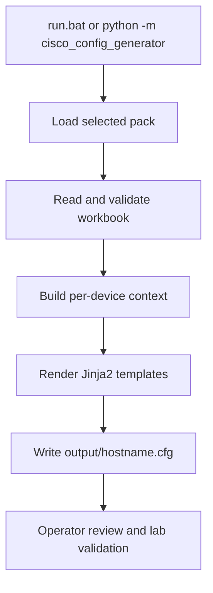
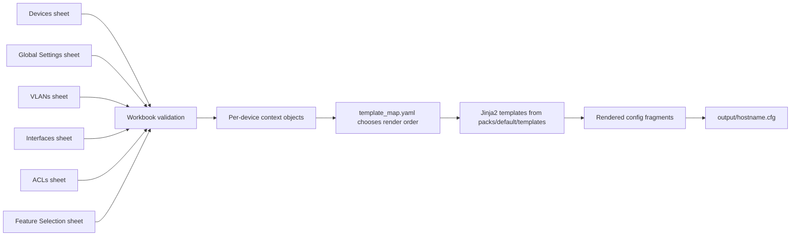

## Deep Dive: Cisco Config Generator

### "From Intent Workbook to Production-Ready Configurations."

!!! info "Version Alignment"
    This tutorial reflects the **current main branch state (May 2026)** of Cisco Config Generator and aligns with the current pack model, workbook flow, TUI experience, and headless CLI options.

The **Cisco Config Generator** turns structured Excel intent into per-device Cisco IOS-XE configuration files using a reusable Python core and Jinja2 templates. It is engineered as a repeatable delivery platform where customer-specific rules live in data and templates, not hardcoded branching logic.

If your team needs "complete transparency", this guide is built for exactly that. Every section explains:

- **What** happens
- **Why** it is designed that way
- **How** to run or verify it in practice
- **Where** to customise safely

!!! abstract "Premium tool — buy ready-to-run or have it customised"
    The **Cisco Config Generator** is a production-grade Nautomation Prime tool. This deep dive shows exactly how it works; the tool itself is a premium product, available on request rather than as a free download.

    - **Buy as-is (unmodified) — £595:** the production-ready Python core and Jinja2 templates, delivered with a setup runbook and licensed for use in your environment.
    - **Customised to your estate — £1,500–£4,000:** bespoke packs, templates, and validation rules built around your platforms, naming conventions, and standards.

[Request this tool](../../contact.md){ .md-button .md-button--primary }
[Explore Services](../../services.md){ .md-button }

---

## 🧭 How to Read This Deep Dive

This page is written as a tutorial for engineers who want to understand both the output and the code structure behind it. Read it using four lenses:

- **What the tool does** from workbook ingest through rendered configuration output
- **Why the implementation is split this way** across CLI, workbook, rendering, and pack layers
- **How to run and validate it safely** with repeatable commands and review steps
- **Where to customise behaviour** without breaking the stable core engine

---

## ✨ Why This Tool Matters

Most configuration-generation projects become brittle because they mix customer policy directly into Python logic. Cisco Config Generator avoids that trap:

- **Intent is data** (Excel workbook)
- **Policy is data** (pack YAML)
- **Rendering is code** (stable Python + Jinja2)

This separation means you can change site standards quickly without rewriting core engine code.

---

## 🎯 PRIME Philosophy in Practice

### 1. Transparency by Design

Workbook input, template selection, and rendered output are all traceable. Nothing important is hidden behind opaque generation steps.

### 2. Hardened for Delivery

Validation happens before rendering, which reduces the chance of bad intent becoming bad production configuration.

### 3. Policy Before Python

Customer-specific behaviour belongs in packs, YAML, and templates. The engine stays stable while delivery standards evolve.

### 4. Reusable Engineering

One codebase can serve multiple estates because intent, policy, and rendering layers are cleanly separated.

---

## 🧭 Tutorial Roadmap

Follow this page in order for a practical, end-to-end understanding:

1. **Understand the architecture** and runtime flow.
2. **Run the tool once** with the sample workbook.
3. **Learn each workbook sheet** and how values map to rendered CLI.
4. **Understand packs and templates** so customisation is controlled.
5. **Use headless mode and tests** for repeatable operations.
6. **Apply troubleshooting and safety checks** before production rollout.

---

## 🔍 Transparency Contract

To align with the PRIME Philosophy, this deep dive explicitly covers:

- System boundaries and data flow
- Inputs, outputs, and transformation logic
- Operational commands that can be executed as shown
- Common failure modes and recovery paths
- Safe extension points for customer-specific behaviour

---

## 🧱 Project Architecture

```text
Cisco-Config-Generator/
├─ cisco_config_generator/   # Core Python package
│  ├─ workbook/              # Workbook parsing and validation
│  ├─ rendering/             # Jinja2 rendering and output writer
│  └─ tui/                   # Interactive Textual UI
├─ packs/                    # Customer packs (YAML + templates)
├─ scripts/                  # Utilities (e.g. workbook generation)
├─ assets/                   # Sample and generated workbooks
├─ output/                   # Generated configuration files
├─ tests/                    # pytest suite
├─ setup.bat                 # First-time setup (portable Python runtime)
└─ run.bat                   # Daily launcher
```

### Runtime Flow



### Why This Design

- **Pack isolation** keeps customer policy modular.
- **Workbook validation first** prevents half-generated outputs from bad data.
- **Per-device rendering** makes outputs deterministic and easy to review.

---

## 🧬 Code Walkthrough: What the Python Layers Actually Do

This is the part that turns the generator from a useful tool into a reusable engineering pattern. The value is not only that it emits `.cfg` files, but that the code is split so each layer does one job clearly and predictably.

### 1. Entry Layer: `__main__.py` and `cli.py`

The package entry point is intentionally minimal: `__main__.py` imports `main()` from `cli.py` and exits. That tells you immediately where real control flow starts.

`cli.py` then owns only process concerns:

- parsing `--pack`, `--workbook`, `--output`, `--no-tui`, and `--version`
- deciding whether to launch the Textual interface or the headless execution path
- requiring `--workbook` only when running without the TUI
- routing both modes into the same orchestration layer

Why this matters:

- the CLI stays thin and testable
- interactive mode and automation mode do not diverge into separate products
- exit behaviour is explicit and suitable for both operators and pipelines

That split is a strong production pattern: argument handling should decide **how** the tool starts, not **how** network intent is interpreted.

### 2. TUI Layer: Operator UX Without Engine Sprawl

The Textual app in `tui/app.py` is deliberately a front end, not a second implementation of the generator.

Before it runs anything expensive, it performs cheap operator-facing checks:

- workbook path present
- workbook file exists
- selected output path resolved

When the operator presses **Run**, the app starts a background thread and calls `_run_orchestrator(...)` rather than running the build directly on the UI thread. Log updates and status changes are pushed back into the interface with `call_from_thread(...)`.

Why this design matters:

- the terminal UI stays responsive while configs are being built
- progress messages can stream live without corrupting the UI state
- validation failures are caught separately from unexpected exceptions, so the operator sees actionable workbook issues instead of a generic crash

This is a reusable pattern for any production automation tool with a terminal UI: the UI should gather intent, validate local inputs, launch the worker safely, and report progress. It should not become the business-logic layer.

### 3. Workbook Loader: Excel Becomes Typed Intent Once

The workbook loader is where the loose, human-edited spreadsheet is converted into structured Python objects.

The important helpers are small but intentional:

- `_header_map(...)` normalises column names so sheet parsing does not depend on fragile manual indexing
- `_validate_required_headers(...)` fails fast if a required workbook column is missing
- `_parse_int_cell(...)` raises row-aware and field-aware errors instead of vague conversion failures
- `_cell_value(...)` and `_list_field(...)` centralise common coercion behaviour

The sheet loaders then each do one domain job:

- `_load_devices(...)`
- `_load_vlans(...)`
- `_load_interfaces(...)`
- `_load_global_settings(...)`
- `_load_feature_selection(...)`
- `_load_acls(...)`

Finally, `load_workbook(...)` assembles those pieces into one `Intent` object.

Why this design matters:

- Excel ambiguity is resolved once, near the input boundary
- downstream code works with structured data instead of reopening spreadsheets repeatedly
- error messages stay anchored to the operator's real artefact: workbook sheet, row, and column

That is a core production-grade lesson: turn messy human input into stable internal models as early as possible.

### 4. Hardware Expansion: Omitted Ports Still Become Explicit State

One of the most important design decisions lives in `_expand_interfaces_from_hardware(...)`.

The generator does **not** assume that only workbook rows matter. Instead, it builds the full port inventory from:

- the selected device model
- the selected uplink module
- the hardware catalogue
- the available port profiles

It then applies a strict merge policy:

1. build the expected inventory for that hardware profile
2. preserve any explicit workbook override for a matching interface
3. create an `unused` interface object for every omitted port
4. keep out-of-inventory rows rather than silently deleting them

Why this design matters:

- operators can document only the exceptions instead of every port manually
- generated output stays deterministic because every interface is accounted for
- shutdown/unused intent is enforced by construction rather than by hope

This is exactly the sort of design choice that separates a demo generator from a delivery-safe one. Missing workbook rows are not treated as "unknown"; they are normalised into a governed default state.

### 5. Rendering Engine: Templates Stay Declarative, Python Owns Validation

The rendering engine is intentionally tiny:

- `create_jinja_env(...)` builds a Jinja environment with `FileSystemLoader`
- `render_template(...)` renders a named template with a prepared context

The most important line is the use of `StrictUndefined`.

That means if a template references a value that is not present in the context, rendering fails immediately instead of silently producing a partial or broken configuration.

Why this design matters:

- template mistakes are caught during generation, not during change implementation
- pack authors cannot accidentally rely on undefined variables
- the logic boundary remains clean: Python validates and assembles context; Jinja formats output

This is a textbook production choice. Silent template fallback is convenient in prototypes and dangerous in real delivery tooling.

### 6. Pack and Orchestrator Boundary: Customer Variation Lives in Data

Both the CLI path and the TUI path resolve the selected pack, load pack settings, construct an `Orchestrator`, and call `run()`.

The orchestrator is given the minimum runtime contract it needs:

- `pack_path`
- `workbook_path`
- `output_dir`
- optional progress callback

It then returns the written output paths.

Why this design matters:

- the same engine is reused whether the operator clicks through the TUI or runs headless in a script
- customer-specific behaviour stays in YAML and templates under `packs/`
- the Python core remains stable while packs vary per customer or per standard

This is the PRIME Philosophy in code form: policy and site variation belong in governed data, not in customer-specific Python forks.

### 7. Failure Model and Safe Extension Path

The current code shape makes failure handling and extension more predictable than they would be in a monolithic generator.

Failure handling is layered:

- workbook/path issues are caught near the operator boundary
- validation issues are surfaced as structured `ValidationError` messages
- template/context mismatches fail during rendering rather than producing silent output drift
- unexpected exceptions are logged as tool errors rather than being confused with workbook mistakes

Safe extension points are also clear:

- change **templates** when output syntax or style changes
- change **pack YAML** when hardware, defaults, or feature mapping changes
- change **workbook content** when site intent changes
- change **Python loaders/models** only when you are introducing a genuinely new intent field or runtime behaviour

In practical terms, if you want to add a new per-port intent value, the clean path is:

1. add it to the workbook schema
2. parse it in the loader
3. carry it through the intent model and template context
4. render it in the correct Jinja template

What you should not do is hide business logic directly inside a template. That makes the pack harder to reason about, harder to test, and easier to break silently.

---

## 📦 Requirements and Installation Paths

### Standard Operator Workflow (Windows)

- Windows 10/11 (64-bit)
- Internet access for first-time setup only
- No system Python needed

```batch
:: One-time setup
setup.bat

:: Daily use
run.bat
```

### Developer Workflow (Optional)

If you prefer a normal development environment:

```bash
python -m venv .venv
.venv\Scripts\activate
pip install -e .[dev]
```

---

## 🚀 First Run Tutorial (Hands-On)

### Step 1: Run setup

```batch
setup.bat
```

What this does:

- Downloads portable Python into `python_runtime\`
- Installs dependencies inside the project folder
- Leaves system Python and global packages untouched

### Step 2: Open the sample workbook

Use `assets/sample_intent.xlsx` first.

Why: it provides a known-good reference for sheet structure and realistic values.

### Step 3: Launch the TUI

```batch
run.bat
```

In the UI:

1. Select pack (usually `default` first).
2. Select workbook path.
3. Run generation.
4. Review output summary.

### TUI Preview

_The interactive TUI walks operators through pack selection, workbook selection, generation, and a final output summary on a single guided screen._

Why this matters: the TUI gives operators a guided execution path, which reduces avoidable CLI mistakes during day-to-day use.

### Step 4: Verify generated files

Expected result:

- Per-device files in `output\`
- File naming pattern: `output\<hostname>.cfg`

### Rendered Output Callout

For the workbook example later in this guide, the generated artefact should conceptually look like this:

```text
output/
└── BRN1-ACC-01.cfg

! Base Configuration
hostname BRN1-ACC-01
...

! Access Port Configuration
interface GigabitEthernet1/0/10
 description Finance desk phone + PC
 switchport mode access
 switchport access vlan 20
 switchport voice vlan 30
 ...
```

The exact lines vary with workbook values, feature toggles, and selected pack, but the file-per-device pattern is stable.

### Step 5: Run headless mode (automation path)

```batch
python_runtime\python.exe -m cisco_config_generator --no-tui --workbook assets\sample_intent.xlsx
```

Why this matters: headless mode is the path for CI/CD and repeatable, non-interactive runs.

---

## ⚙️ CLI Reference and Working Examples

```text
run.bat [OPTIONS]
python_runtime\python.exe -m cisco_config_generator [OPTIONS]

Options:
  -p, --pack TEXT       Pack name (folder under packs/) or full path  [default: default]
  -w, --workbook PATH   Path to the intent workbook (.xlsx)
  -o, --output TEXT     Directory to write generated config files      [default: output]
  --no-tui              Run headless without the interactive TUI
  --version             Print version and exit
```

Examples:

```batch
:: Default pack, headless mode
python_runtime\python.exe -m cisco_config_generator --no-tui --workbook assets\sample_intent.xlsx

:: Explicit pack and output directory
python_runtime\python.exe -m cisco_config_generator --no-tui --pack default --workbook assets\sample_intent.xlsx --output output

:: Check installed version
python_runtime\python.exe -m cisco_config_generator --version
```

---

## 📘 Workbook Deep Dive (Every Sheet Explained)

The workbook is the source-of-truth input model.

| Sheet | What It Controls | Why It Exists | Common Pitfall |
| :--- | :--- | :--- | :--- |
| **Devices** | Device identity, model, uplink module, timezone metadata | Defines target inventory and hardware assumptions | Model/uplink mismatch to actual hardware |
| **Global Settings** | Shared controls (NTP, DNS, SNMP, AAA, banners, ACL refs) | Centralises site-wide standards | Referencing ACL names not defined in ACLs sheet |
| **VLANs** | VLAN IDs, names, descriptions | Builds deterministic VLAN config blocks | Missing VLAN used by interface profiles |
| **Interfaces** | Per-port intent for non-default behaviour | Keeps workbook concise while allowing exceptions | Assuming omitted interfaces are ignored (they default to unused) |
| **ACLs** | ACL statements referenced elsewhere | Keeps ACL logic structured and reusable | Invalid action/wildcard combinations |
| **Feature Selection** | Toggle config sections on/off | Allows phased adoption and scoped output | Forgetting a feature toggle is off |

### Key Behaviour: Omitted Interfaces

If an interface is not explicitly listed in the Interfaces sheet, the generator still derives full interface inventory from hardware definitions and treats omitted ports as unused/shutdown according to pack defaults.

Why this is important: you can model intent by exception instead of maintaining thousands of spreadsheet rows.

### Workbook-to-Config Mapping Flow

This is the core data path inside the tool:



Why this matters: each stage has a clear responsibility. If output is wrong, you can trace whether the problem came from workbook input, validation, context building, template selection, or the template itself.

### Worked Example: One Workbook Row to Cisco CLI

The example below uses the **current default pack** and the `interfaces_access.j2` template.

#### Example workbook inputs

**Devices sheet**

| Hostname | Model | Uplink Module |
| :--- | :--- | :--- |
| `BRN1-ACC-01` | `C9200-24P` | `C9200-NM-4X` |

**Interfaces sheet**

| Device | Interface | Profile | Description | Access VLAN | Voice VLAN |
| :--- | :--- | :--- | :--- | :--- | :--- |
| `BRN1-ACC-01` | `GigabitEthernet1/0/10` | `access-voip` | `Finance desk phone + PC` | `20` | `30` |

#### How the generator interprets it

- `Profile = access-voip` maps to `template_hint: interfaces_access` in `port_profiles.yaml`
- `interfaces_access` maps to `interfaces_access.j2` in `template_map.yaml`
- `access-voip` sets `qos_trust_dscp: true`, so the QoS line is rendered
- `Access VLAN` and `Voice VLAN` become `iface.access_vlan` and `iface.voice_vlan` in template context

#### Rendered CLI from the default template

```text
interface GigabitEthernet1/0/10
 description Finance desk phone + PC
 switchport mode access
 switchport access vlan 20
 switchport voice vlan 30
 switchport nonegotiate
 load-interval 30
 auto qos trust dscp
 storm-control broadcast level 1.00 0.70
 storm-control multicast level 1.00 0.70
 spanning-tree portfast
 spanning-tree guard root
 spanning-tree bpduguard enable
 no shutdown
```

#### Why this example is useful

It shows the exact separation of concerns:

- The **workbook** defines intent
- The **port profile** chooses behaviour class
- The **template map** chooses the render path
- The **Jinja template** emits the final IOS-XE syntax

That separation is what makes the tool explainable, testable, and safe to extend.

---

## 🔐 ACL Workflow (Transparent Path)

ACL handling is explicit and validated:

1. Define ACL entries in **ACLs** sheet.
2. Reference ACL names in **Global Settings**.
3. Generator validates that referenced ACL names exist.

Example pattern:

```text
ACL_VTY_ACCESS  permit 10.0.0.0 0.0.0.255
ACL_VTY_ACCESS  deny any
```

If ACLs are not required for a run, disable ACL rendering via **Feature Selection -> ACLs -> No**.

---

## 🧩 Pack System Deep Dive

All customer-specific behaviour lives in `packs/<name>/`.

```text
packs/default/
├─ settings.yaml          # Defaults (unused VLAN, native VLAN, log level)
├─ hardware_catalog.yaml  # Switch models and uplink modules
├─ port_profiles.yaml     # Port profile definitions
├─ template_map.yaml      # Maps profiles/features to Jinja2 templates
├─ features.yaml          # Feature toggle defaults
└─ templates/
   ├─ acls.j2
   ├─ base.j2
   ├─ vlans.j2
   ├─ interfaces_access.j2
   ├─ interfaces_access_server.j2
   ├─ interfaces_trunk.j2
   ├─ interfaces_trunk_portchannel.j2
   ├─ interfaces_trunk_server.j2
   ├─ interfaces_ap_trunk.j2
   └─ interfaces_unused.j2
```

### Safe Customer Onboarding Pattern

1. Copy `packs/default/` to `packs/<customer-name>/`.
2. Update YAML defaults and mapping files first.
3. Modify templates only where policy differs.
4. Run against sample workbook.
5. Diff output before production adoption.

Why this pattern works: it preserves a stable baseline and makes customer-specific deltas explicit in version control.

---

## 🧠 Template Context (What Templates Actually Receive)

All Jinja2 templates receive a structured context like:

```python
{
  "device": Device,
  "vlans": [VLAN],
  "interfaces": [Interface],
  "global": GlobalSettings,
  "hardware": HardwareProfile,
  "acls": [ACLEntry],
  "features": FeatureSelection,
  "settings": {"defaults": {}}
}
```

### Why This Matters

- Templates remain declarative.
- Logic stays centralised in Python validation/rendering layers.
- Outputs are predictable across engineers and environments.

---

## 🏗️ Hardware Catalogue and Port Profiles

### Hardware Catalogue

`hardware_catalog.yaml` defines supported switch models and uplink modules. This drives automatic port inventory derivation.

### Port Profiles

Profiles in `port_profiles.yaml` express intent classes such as:

- `access-user`
- `access-voip`
- `access-ap-trunk`
- `trunk-uplink`
- `trunk-uplink-portchannel`
- `unused`

Why profiles are powerful: they let teams apply standard policy repeatedly without rewriting line-by-line interface config in every workbook row.

---

## 🧪 Testing, Validation, and Quality Gates

### Run test suite

```batch
python_runtime\python.exe -m pytest tests/ -v
```

### Recommended delivery gate before deployment

1. Generate configs in headless mode.
2. Run tests.
3. Diff outputs against prior baseline.
4. Perform lab validation on representative hardware.
5. Promote to production only after peer review.

---

## 🔐 Security and Operational Safety

- Treat workbooks and generated configs as sensitive operational artefacts.
- Keep repository and output access role-scoped.
- Avoid storing secrets in workbooks where possible.
- Use controlled change windows and peer review before production push.

---

## 🛠️ Troubleshooting Guide

| Symptom | Likely Cause | Resolution |
| :--- | :--- | :--- |
| `setup.bat` fails | No internet or restricted proxy | Run from a network with package access or pre-stage dependencies |
| No output files generated | Workbook validation failed or wrong workbook path | Verify workbook path and required sheets/headers |
| Unexpected interface output | Model/uplink selection mismatch | Confirm `Devices` sheet model/uplink values |
| ACLs not rendered | Feature disabled or ACL names unresolved | Check Feature Selection and ACL name references |
| Pack not found | Wrong `--pack` value | Use folder name under `packs/` or full path |

---

## ✅ What Good Looks Like

A production-ready generation workflow should have:

- Version-controlled pack files
- Reviewed workbook changes
- Deterministic output diffs between versions
- Test and lab validation evidence
- Clear approval trail before deployment

---

## 🎓 Learning Outcomes

After completing this tutorial, an engineer should be able to:

- Explain the full intent-to-config pipeline end to end
- Build and validate workbooks confidently
- Extend packs without editing core engine logic
- Run both interactive and headless execution modes
- Troubleshoot common generation failures quickly
- Use headless mode for CI/CD pipelines and repeatable generation jobs
- Validate rendered output in a lab before production deployment

---

## Related Resources

- [Technical Deep Dives](./index.md) — Browse the full set of code-first walkthroughs
- [Cisco IOS-XE Compliance Audit Deep Dive](./cisco-compliance-audit.md) — Learn how generated standards are later audited and governed
- [Access Switch Port Audit Deep Dive](./access-switch-audit.md) — Study parallel collection, enrichment, and Excel reporting patterns
- [PRIME Framework](../../prime-framework/index.md) — See the operating model behind the tool design choices

---

> **Mission Fit:** This deep dive supports the PRIME Framework by showing how to turn operational intent into repeatable, governable outputs without sacrificing transparency or maintainability.
