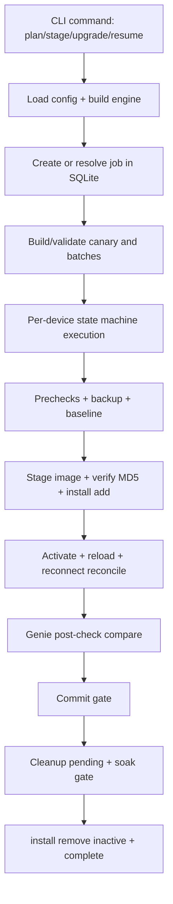

## Deep Dive: Cisco IOS-XE Software Upgrade Orchestrator

### "Safe, Resumable IOS-XE Upgrades with Real-World Failure Handling Built In."

!!! info "Version Alignment"
    This deep dive reflects the **current implemented state (2026)** of the Cisco IOS-XE Software Upgrade Orchestrator and aligns with the live CLI command surface, durable state engine, canary/topology-aware batching, install-mode-only policy, and pyATS/Genie comparison gates in the current repository.

The **Cisco IOS-XE Software Upgrade Orchestrator** is a production-grade Python CLI that coordinates multi-device software upgrades with persistent checkpoints, strict safety gates, and deterministic recovery behaviour. It is designed for high-consequence maintenance windows where partial success and restart recovery must be handled explicitly, not guessed.

!!! abstract "Premium tool — buy ready-to-run or have it customised"
    The **IOS-XE Software Upgrade Orchestrator** is a production-grade Nautomation Prime tool. This deep dive explains exactly how it works; the tool itself is a premium product, available on request rather than as a free download.

    - **Buy as-is (unmodified):** production-ready orchestrator with setup guidance and operational runbook.
    - **Customised to your estate:** platform policy tuning, workflow controls, and reporting integration aligned to your operating model.

[Request this tool](../../contact.md){ .md-button .md-button--primary }
[Explore Services](../../services.md){ .md-button }

---

## 🧭 How to Read This Deep Dive

This guide is written for engineers who want execution-path transparency, not marketing summaries. It covers:

- **What the orchestrator does** from inventory planning to cleanup
- **Why each control boundary exists** (state, lock, commit, rollback, soak)
- **How the code is structured** across CLI, orchestration, device policy, and state
- **Where to customise safely** without weakening upgrade safety

---

## ✨ Why This Tool Exists

Classic upgrade scripts fail in predictable ways: they lose state on restart, they replay disruptive commands, they merge topology risk into naive parallelism, or they "pass" without robust post-upgrade verification.

This orchestrator solves that by enforcing:

- **Durable intent and checkpoints** in SQLite before disruptive actions
- **Bounded canary and batch rollout** with failure halting policy
- **Install-mode split gates** (`add` → `activate` → verify → `commit` → soak → cleanup)
- **pyATS/Genie operational comparison** before commit
- **Explicit rollback boundary rules** (safe before commit, governed after commit)

---

## 🧱 Repository Architecture

```text
Cisco-IOS-XE-Software-Upgrade-Orchestrator/
├─ orchestrator.py                 # Click CLI entry point and command routing
├─ config/config.example.yaml      # Safety/workflow/connection/comparison policy
├─ src/
│  ├─ orchestration/
│  │  ├─ engine.py                 # Core run/resume/cleanup/rollback orchestration
│  │  └─ batching.py               # Canary + redundancy-aware batch planner
│  ├─ state/__init__.py            # SQLite schema, transitions, job/device locks
│  ├─ device/iosxe.py              # IOS-XE parsing + compatibility policy
│  ├─ comparison/__init__.py       # Genie snapshot capture/diff gating
│  ├─ credentials/                 # Keyring/env credential resolution
│  ├─ transport/                   # Device command and transfer operations
│  ├─ inventory/                   # Excel inventory I/O and validation
│  └─ jumphost/                    # Optional SSH tunnel path
├─ inventory/inventory_template.xlsx
└─ tests/                          # Unit tests for CLI, orchestration, state, transport
```

---

## 🏗️ Real Runtime Path



The critical implementation choice is that **state transitions are persisted before risky actions**. If the CLI process dies during reload, `resume` continues from persisted `rebooting/reconnecting/post_checking` states instead of replaying activation.

---

## 🧬 Code Walkthrough: Why the Architecture Is Built This Way

### 1. CLI as a thin control layer (`orchestrator.py`)

The CLI uses `click` for commands such as `plan`, `stage`, `upgrade`, `resume`, `cleanup`, `rollback`, and `cancel`. It intentionally does not embed network logic; it:

- loads config
- builds an `UpgradeEngine`
- resolves job-id vs inventory-file mode
- enforces approvals for disruptive steps
- presents plan/status summaries

This keeps operator interaction and orchestration logic separated, so automation mode and human-in-the-loop mode share the same core engine.

### 2. UpgradeEngine as the state-machine coordinator (`src/orchestration/engine.py`)

`UpgradeEngine` coordinates per-device lifecycles and batch rollout with these key patterns:

- **Durable job creation** (`create_job`) validates inventory, builds batches, and persists full job context.
- **Mode-safe execution** (`run`) binds persisted config and enforces run-mode constraints.
- **Batch orchestration** (`_execute_run`) applies canary/batch failure halts and controlled pause boundaries.
- **Execution lease fencing** prevents two processes from advancing the same job simultaneously.

This design avoids split-brain control where parallel operators or restarted processes can issue conflicting commands.

### 3. Topology-aware batching (`src/orchestration/batching.py`)

`build_upgrade_batches(...)` and `validate_batches(...)` enforce:

- bounded batch sizes
- canary-first rollout
- no duplicate device across batches
- no repeated `redundancy_group` in a single batch

The planner is deliberately strict because availability incidents usually come from co-scheduling dependent devices together. Redundancy must be explicit in inventory; it is not inferred from hostname patterns.

### 4. Device compatibility and parsing boundary (`src/device/iosxe.py`)

`parse_install_facts(...)` and `evaluate_compatibility(...)` convert raw CLI output into structured upgrade decisions:

- install mode detection (`flash:packages.conf`)
- model and image-family matching
- boot target and boot setting safety checks
- stack member detection and stack policy gating
- flash capacity checks
- install summary validity checks

This front-loads upgrade risk decisions into one deterministic policy layer before image activation is attempted.

### 5. Durable source of truth (`src/state/__init__.py`)

SQLite holds:

- jobs
- per-device state and metadata
- events audit trail
- snapshots references
- reservation locks and execution leases

`DeviceState` explicitly models lifecycle and failure branches (for example `STAGING_FAILED`, `ACTIVATION_UNCERTAIN`, `POST_CHECK_FAILED`, `ROLLBACK_REQUIRED`). This is why recovery can be safe and deterministic: state is explicit and auditable, not implicit in logs.

### 6. Genie health gates (`src/comparison/__init__.py`)

The snapshot manager captures pre/post Ops data for core and optional features and compares them with curated excludes for volatile counters/timers. Key design intent:

- keep operational/topology state visible
- suppress expected noise
- block on critical feature drift or missing required post-capture

`interface` and `platform` are required by default; policy is configurable through `comparison.required_features` and `comparison.critical_features`.

---

## 🛡️ Safety Controls Mapped to Real Code

| Safety Requirement | Implementation |
| :--- | :--- |
| No unsafe replay after restart | Persist state before disruptive command and resume from checkpointed state |
| No overlapping jobs on same device | Device reservation locks + renewable execution leases in SQLite |
| No blind activation | Compatibility gates, MD5 verification, install-mode-only policy |
| No commit before health confidence | Pre/post Genie compare + exact version/install reconciliation |
| No immediate image cleanup risk | Soak-gated cleanup (`cleanup_pending` then `install remove inactive`) |
| No implicit "safe" rollback claim after commit | Rollback path limited to activated/uncommitted image boundary |

---

## ⚙️ Configuration Model (Operationally Important Sections)

The orchestrator is policy-driven through `config/config.yaml`:

- `workflow`: concurrency, canary size, failure thresholds, approval requirement
- `safety`: stack allowance, downgrade policy, supported major versions
- `comparison`: core/optional/required/critical Genie features
- `cleanup`: soak seconds and cleanup command timeout
- `connection`: direct or jump-host path

Design choice: runtime policy is bound to the job record, so a resumed job cannot silently continue under altered safety gates.

---

## 🚀 Real Command Path

```bash
# Validate and plan
python orchestrator.py validate-inventory --file inventory/devices.xlsx
python orchestrator.py plan --file inventory/devices.xlsx

# Optional pre-staging before the change window
python orchestrator.py stage --file inventory/devices.xlsx

# Activation run
python orchestrator.py upgrade --file inventory/devices.xlsx

# Resume after process interruption/reload wait
python orchestrator.py resume --job-id <job-id>

# Observe state and event trail
python orchestrator.py status --job-id <job-id> --events

# Cleanup after soak gate
python orchestrator.py cleanup --job-id <job-id>
```

---

## 🔁 Failure Handling Model

The tool is intentionally fail-closed:

- Canary/batch failures halt later batches based on configured thresholds.
- Failed jobs keep reservation context until explicitly handled.
- `cancel` exists to release stalled/failed reservations with guardrails.
- Activation retries require explicit operator intent (`--retry-failed --retry-activation`).
- Uncertain activation states are never auto-replayed blindly.

This is safer than "auto-fix everything" behaviour, because uncertain network state must be confirmed before another disruptive action.

---

## 🧪 Supported Scope and Guardrails

Current implemented boundaries:

- Catalyst 9200/9300 families
- install mode only
- Linux/WSL runtime for pyATS/Genie
- optional single jump-host path
- stack upgrades blocked by default (`safety.allow_stacks: false`)
- bundle mode, ISSU, and dual-SUP workflows intentionally excluded

These are deliberate engineering constraints to keep behaviour deterministic and supportable within known-safe paths.

---

## 🧭 Safe Customisation Points

Safest customisation layers are:

1. `config/config.yaml` (workflow and comparison policy)
2. inventory design and `redundancy_group` modelling
3. optional/critical feature sets for Genie comparison

Avoid bypassing persistent state transitions or lock mechanisms inside `engine.py` and `state/__init__.py`; those are core safety boundaries, not convenience plumbing.

---

## ✅ What Makes This Production-Grade

This is not a one-shot script. It is a resumable orchestration system with:

- explicit state machine semantics
- durable recovery behaviour
- policy-bound execution
- topology-aware rollout
- health-gated commit boundaries
- auditable event and snapshot artefacts

That is why it is suited to governed enterprise upgrade windows rather than ad-hoc maintenance scripting.

