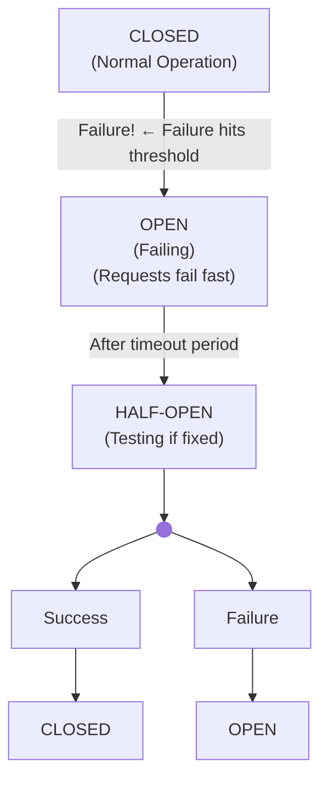

## Why Circuit Breakers Matter

**Scenario:** You're deploying to 100 devices in parallel. On device 47, SSH starts timing out.

**Without Circuit Breaker:**

- 🔴 All 100 connections timeout (all threads blocked)
- 🔴 No resources for other operations
- 🔴 Deployment takes 2 hours instead of 5 minutes
- 🔴 System looks completely dead

**With Circuit Breaker:**

- 🟢 Detect failures early
- 🟢 Stop wasting resources on failing devices
- 🟢 Deployment completes in 5 minutes
- 🟢 System remains responsive
- 🟢 Manual investigation possible while other work continues

**Circuit breakers prevent cascade failures and maintain system stability under failure.**

---

## Architecture: Circuit Breaker States



---

## Pattern 1: Circuit Breaker Implementation

### The Implementation

```python
# src/circuit_breaker.py
from enum import Enum
from datetime import datetime, timedelta
import time
from threading import Lock

class CircuitState(Enum):
    """Circuit breaker state."""
    CLOSED = "closed"      # Normal operation
    OPEN = "open"          # Failing, reject requests
    HALF_OPEN = "half_open"  # Testing if recovered

class CircuitBreakerConfig:
    """Circuit breaker configuration."""
    def __init__(
        self,
        failure_threshold: int = 5,
        success_threshold: int = 2,
        timeout: int = 60,
        name: str = "circuit_breaker"
    ):
        self.failure_threshold = failure_threshold
        self.success_threshold = success_threshold
        self.timeout = timeout
        self.name = name

class CircuitBreaker:
    """
    Circuit breaker for preventing cascade failures.
    
    Usage:
        breaker = CircuitBreaker(
            CircuitBreakerConfig(failure_threshold=5)
        )
        
        for device in devices:
            try:
                result = breaker.call(configure_device, device)
            except CircuitBreakerOpen:
                print(f"Skipping {device} - circuit open")
    """
    
    def __init__(self, config: CircuitBreakerConfig):
        self.config = config
        self.state = CircuitState.CLOSED
        self.failure_count = 0
        self.success_count = 0
        self.last_failure_time = None
        self.lock = Lock()
    
    def call(self, func, *args, **kwargs):
        """
        Execute function through circuit breaker.
        
        Raises:
            CircuitBreakerOpen: If circuit is open
        """
        with self.lock:
            if self.state == CircuitState.OPEN:
                if self._should_attempt_reset():
                    self.state = CircuitState.HALF_OPEN
                    self.success_count = 0
                else:
                    raise CircuitBreakerOpen(
                        f"Circuit breaker '{self.config.name}' is OPEN"
                    )
        
        try:
            result = func(*args, **kwargs)
            self._record_success()
            return result
        except Exception as e:
            self._record_failure()
            raise
    
    def _record_success(self):
        """Record successful call."""
        with self.lock:
            self.failure_count = 0
            
            if self.state == CircuitState.HALF_OPEN:
                self.success_count += 1
                if self.success_count >= self.config.success_threshold:
                    self.state = CircuitState.CLOSED
                    print(f"✓ Circuit '{self.config.name}' closed (recovered)")
    
    def _record_failure(self):
        """Record failed call."""
        with self.lock:
            self.failure_count += 1
            self.last_failure_time = datetime.utcnow()
            self.success_count = 0
            
            if (
                self.state == CircuitState.HALF_OPEN
                or self.failure_count >= self.config.failure_threshold
            ):
                self.state = CircuitState.OPEN
                print(f"✗ Circuit '{self.config.name}' opened (threshold hit)")
    
    def _should_attempt_reset(self) -> bool:
        """Check if enough time has passed to try resetting."""
        if not self.last_failure_time:
            return True
        
        elapsed = (datetime.utcnow() - self.last_failure_time).total_seconds()
        return elapsed >= self.config.timeout
    
    def get_state(self) -> dict:
        """Get circuit breaker state."""
        with self.lock:
            return {
                "name": self.config.name,
                "state": self.state.value,
                "failures": self.failure_count,
                "successes": self.success_count,
                "last_failure": self.last_failure_time.isoformat() if self.last_failure_time else None
            }

class CircuitBreakerOpen(Exception):
    """Raised when circuit breaker is open."""
    pass
```

### Usage Example

```python
from circuit_breaker import CircuitBreaker, CircuitBreakerConfig, CircuitBreakerOpen

# Create circuit breaker for device connections
breaker = CircuitBreaker(
    config=CircuitBreakerConfig(
        failure_threshold=5,  # Open after 5 failures
        success_threshold=2,  # Close after 2 successes in half-open
        timeout=60,  # Try reset after 60 seconds
        name="device_connections"
    )
)

devices = ["router1", "router2", ..., "router100"]
results = {
    "success": [],
    "failed": [],
    "skipped": []
}

for device in devices:
    try:
        # Circuit breaker prevents calling function if open
        result = breaker.call(configure_device, device)
        results["success"].append(device)
    
    except CircuitBreakerOpen:
        # Circuit is open, skip this device
        results["skipped"].append(device)
        print(f"⏭ Skipping {device} - circuit breaker open")
    
    except Exception as e:
        # Configuration failed
        results["failed"].append(device)
        print(f"✗ {device} failed: {str(e)}")

print(f"\nResults:")
print(f"  ✓ Success: {len(results['success'])}")
print(f"  ✗ Failed: {len(results['failed'])}")
print(f"  ⏭ Skipped: {len(results['skipped'])}")
print(f"\nCircuit breaker state: {breaker.get_state()}")
```

---

## Pattern 2: Backpressure & Rate Limiting

### The Problem

Fast deployment to fast-failing devices overwhelms systems.

```python
# ❌ BAD - No rate limiting
for device in devices_100:
    spawn_thread(configure, device)  # All 100 at once!
    # SSHd can't handle load → all timeout
```

### The Solution: Backpressure

```python
# ✅ GOOD - Limited concurrency
from concurrent.futures import ThreadPoolExecutor

executor = ThreadPoolExecutor(max_workers=10)  # Only 10 at a time
futures = []

for device in devices:
    future = executor.submit(configure_device, device)
    futures.append(future)

# This automatically queues requests when 10 are running
```

### Implementation with Circuit Breakers

```python
# src/backpressure_manager.py
from concurrent.futures import ThreadPoolExecutor, as_completed
from circuit_breaker import CircuitBreaker, CircuitBreakerConfig, CircuitBreakerOpen

class BackpressureManager:
    """Manage concurrency with circuit breaker protection."""
    
    def __init__(self, max_workers: int = 10, circuit_breaker: CircuitBreaker = None):
        self.max_workers = max_workers
        self.breaker = circuit_breaker
        self.executor = ThreadPoolExecutor(max_workers=max_workers)
        self.results = {
            "success": [],
            "failed": [],
            "circuit_open": []
        }
    
    def execute(self, tasks: list) -> dict:
        """
        Execute tasks with backpressure and circuit breaker.
        
        Args:
            tasks: List of (func, args, kwargs) tuples
        
        Returns:
            dict: Results organized by outcome
        """
        self.results = {
            "success": [],
            "failed": [],
            "circuit_open": []
        }
        futures = {}
        
        # Submit all tasks (executor will queue them)
        for task_id, (func, args, kwargs) in enumerate(tasks):
            if self.breaker:
                # Wrap function with circuit breaker
                future = self.executor.submit(
                    self._execute_with_breaker,
                    func,
                    args,
                    kwargs,
                    task_id
                )
            else:
                future = self.executor.submit(func, *args, **kwargs)
            
            futures[future] = task_id
        
        # Process completions as they arrive
        for future in as_completed(futures):
            task_id = futures[future]
            
            try:
                result = future.result()
                self.results["success"].append({
                    "task_id": task_id,
                    "result": result
                })
            except CircuitBreakerOpen:
                self.results["circuit_open"].append(task_id)
            except Exception as e:
                self.results["failed"].append({
                    "task_id": task_id,
                    "error": str(e)
                })
        
        return self.results
    
    def _execute_with_breaker(self, func, args, kwargs, task_id):
        """Execute function through circuit breaker."""
        return self.breaker.call(func, *args, **kwargs)
```

### Usage

```python
devices = ["r1", "r2", ..., "r100"]
tasks = [
    (configure_device, (device,), {})
    for device in devices
]

breaker = CircuitBreaker(
    config=CircuitBreakerConfig(
        failure_threshold=5,
        name="device_config"
    )
)

manager = BackpressureManager(
    max_workers=10,  # Only 10 SSH connections at a time
    circuit_breaker=breaker
)

results = manager.execute(tasks)

print(f"✓ Success: {len(results['success'])}")
print(f"✗ Failed: {len(results['failed'])}")
print(f"⏭ Circuit open: {len(results['circuit_open'])}")
```

---

## Pattern 3: Graceful Degradation

```python
# src/graceful_degradation.py
class DeploymentStrategy:
    """Deployment strategy with graceful degradation."""
    
    @staticmethod
    def incremental_deploy(
        devices: list,
        deploy_func,
        max_failures: int = 5,
        batch_size: int = 10
    ) -> dict:
        """
        Deploy incrementally, stopping if failure rate is too high.
        
        Args:
            devices: List of devices
            deploy_func: Function to deploy to device
            max_failures: Stop if failures exceed this
            batch_size: Deploy in batches
        """
        results = {
            "total": len(devices),
            "success": 0,
            "failed": 0,
            "completed_batches": 0,
            "failures_detail": []
        }
        
        # Deploy in batches
        for batch_num, i in enumerate(range(0, len(devices), batch_size)):
            batch = devices[i:i+batch_size]
            
            print(f"\nBatch {batch_num+1}: Deploying {len(batch)} devices...")
            
            for device in batch:
                try:
                    deploy_func(device)
                    results["success"] += 1
                except Exception as e:
                    results["failed"] += 1
                    results["failures_detail"].append({
                        "device": device,
                        "error": str(e)
                    })
                    
                    # Stop if failures exceed threshold
                    failure_rate = results["failed"] / (results["success"] + results["failed"])
                    
                    if results["failed"] >= max_failures:
                        print(f"✗ Failure threshold ({max_failures}) reached, stopping deployment")
                        return results
                    
                    if failure_rate > 0.5:
                        print(f"✗ Failure rate >50%, stopping deployment")
                        return results
            
            results["completed_batches"] += 1
            
            # Summary after batch
            print(f"  ✓ Success: {results['success']}")
            print(f"  ✗ Failed: {results['failed']}")
        
        return results
```

### Usage

```python
results = DeploymentStrategy.incremental_deploy(
    devices=all_devices,
    deploy_func=safe_deploy_to_device,
    max_failures=3,
    batch_size=10
)

if results["failed"] < 3:
    print("✓ Deployment acceptable, continuing...")
else:
    print("✗ Too many failures, please investigate before retrying")
```

---

## Best Practices

### 1. Set Thresholds Based on Operational Tolerance

```python
# ✅ GOOD - Configured for your environment
config = CircuitBreakerConfig(
    failure_threshold=5,      # Open after 5 successive failures
    success_threshold=3,      # Close after 3 successes
    timeout=300,              # 5 minute retry period
)

# ❌ BAD - Magic numbers
config = CircuitBreakerConfig(failure_threshold=1)  # Too aggressive
```

### 2. Monitor Circuit Breaker State

```python
# ✅ GOOD - Know when circuits open
state = circuit_breaker.get_state()
if state["state"] == "open":
    logger.warning(f"Circuit {state['name']} is OPEN - investigate!")
```

### 3. Test Failure Scenarios

```python
def test_circuit_opens_on_threshold(mock_device):
    """Verify circuit breaker protection works."""
    breaker = CircuitBreaker(
        config=CircuitBreakerConfig(failure_threshold=3)
    )
    
    mock_device.send_command.side_effect = Exception("Timeout")
    
    # Fail 3 times
    for _ in range(3):
        try:
            breaker.call(configure_device, mock_device)
        except:
            pass
    
    # Fourth call should hit open circuit
    with pytest.raises(CircuitBreakerOpen):
        breaker.call(configure_device, mock_device)
```

---

## Summary

Circuit breakers enable safe scale:

- **CLOSED** → Normal operation
- **OPEN** → Failing fast, reject requests  
- **HALF-OPEN** → Testing recovery

With backpressure and graceful degradation, large deployments remain safe and controllable.

---

## Next Steps

- **[Dependency Ordering](./dependency-ordering-task-orchestration.md)** — Complex multi-device workflows
- **[Incident Response](./incident-response-automation.md)** — Automated fixes
