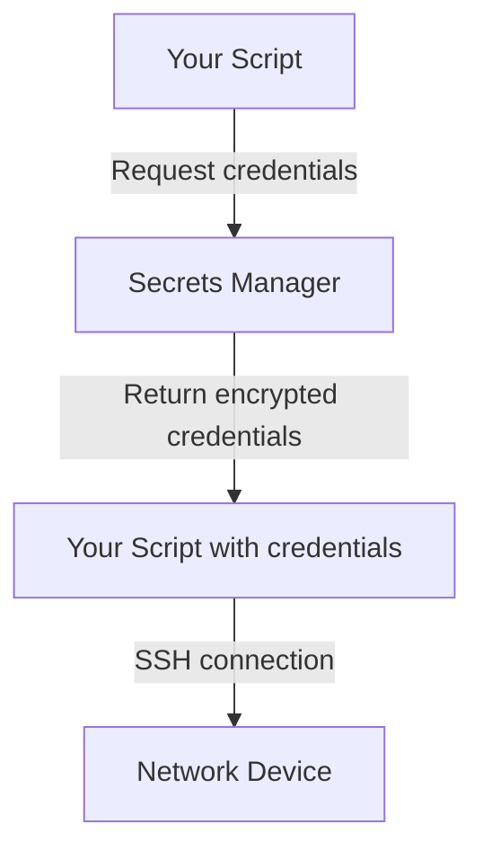

## Why Credential Management Matters

You need credentials (usernames, passwords, API keys) to automate network devices. But your automation code is often checked into Git.

**Never hardcode credentials in code.**

```python
# ❌ ABSOLUTELY NOT
device = ConnectHandler(
    device_type="cisco_ios",
    host="10.0.0.1",
    username="admin",
    password="SuperSecret123!"  # 🚨 Now in Git history forever
)
```

When credentials are hardcoded:

- Anyone with code access can see production passwords
- Git history stores them forever (even after `git rm`)
- They appear in logs, backups, screenshots
- Compliance audits fail
- When leaked (and they will), you have to rotate everything

**Credential management isolates secrets from code.**

---

## The Business Case: Security is Not Optional

### The Reality

Credential breaches happen constantly:

- Developer laptop stolen (credentials in ~/.netrc or scripts)
- Git repository publicly exposed
- Logs containing passwords archived
- Credentials in environment variables that get dumped in stack traces
- Insider threats

### The Cost

| Incident | Impact |
| :--- | :--- |
| Credentials hardcoded in Git | Fire everyone with access, rotate all credentials |
| API key in logs | Audit trail compromised, potential unauthorized access |
| Vault not used | Compliance fails, cannot operate in regulated industry |
| Credential rotation not automated | Manual process breaks, credentials pile up |

### The Solution: Centralized Secret Management

```python
# ✅ RIGHT - Credentials come from secure vault
from vault import get_secret

device = ConnectHandler(
    device_type="cisco_ios",
    host="10.0.0.1",
    username=get_secret("network/devices/admin/username"),
    password=get_secret("network/devices/admin/password"),
)
```

Benefits:

- Code contains NO secrets
- Credentials rotated without code changes
- Audit trail of who accessed what
- Granular permissions (this script only gets these credentials)
- Encryption at rest and in transit

---

## Architecture: Credential Flow



---

## Pattern 1: Environment Variables (Dev/Small Scale)

### When to Use

- Development and testing
- Small teams
- Non-sensitive environments
- CI/CD systems that support secure env vars

### Implementation

```python
# src/credentials.py
import os

class CredentialsNotFoundError(Exception):
    pass

def get_device_credentials(device_name):
    """Get credentials from environment variables."""
    username = os.getenv(f"DEVICE_{device_name.upper()}_USERNAME")
    password = os.getenv(f"DEVICE_{device_name.upper()}_PASSWORD")
    
    if not username or not password:
        raise CredentialsNotFoundError(
            f"Credentials for {device_name} not found in environment"
        )
    
    return {
        "username": username,
        "password": password
    }
```

Usage:

```bash
# Set environment variables (never in code)
export DEVICE_ROUTER1_USERNAME=admin
export DEVICE_ROUTER1_PASSWORD=SecurePassword123

# Or from .env file (never committed to Git)
# .env should be in .gitignore
```

```python
from netmiko import ConnectHandler
from credentials import get_device_credentials

creds = get_device_credentials("router1")
device = ConnectHandler(
    device_type="cisco_ios",
    host="10.0.0.1",
    **creds
)
```

### Best Practices

```python
# ✅ GOOD
password = os.getenv("DEVICE_PASSWORD")
if not password:
    raise CredentialsNotFoundError("DEVICE_PASSWORD not set")

# ❌ BAD - Returns None silently
password = os.getenv("DEVICE_PASSWORD", "default_password")

# ❌ BAD - Provides fallback (defeats security)
password = os.getenv("DEVICE_PASSWORD") or "localhost"
```

---

## Pattern 2: HashiCorp Vault (Production Standard)

### Why Vault?

Vault is the **industry standard** for credential management:

- ✅ Encryption at rest and in transit
- ✅ Audit logging (who accessed what, when)
- ✅ Dynamic credentials (auto-rotate)
- ✅ Fine-grained access control
- ✅ Multi-factor authentication
- ✅ Compliance ready (SOC 2, HIPAA, PCI)

### Vault Setup

```bash
# Install Vault CLI
# On macOS: brew install vault
# On Linux: https://www.vaultproject.io/downloads

# Start Vault dev server (development only)
vault server -dev

# In another terminal, login
export VAULT_ADDR="http://127.0.0.1:8200"
export VAULT_TOKEN="s.xxxxxxxx"  # From dev server output

# Store a credential
vault kv put secret/network/devices/router1 \
  username=admin \
  password="SuperSecurePassword123!"

# Retrieve it
vault kv get secret/network/devices/router1
```

### Python Integration

Install hvac (Vault client):

```bash
pip install hvac
```

```python
# src/vault_client.py
import hvac
import os

class VaultClient:
    """Wrapper for HashiCorp Vault credential retrieval."""
    
    def __init__(self, vault_addr=None, vault_token=None):
        """
        Initialize Vault client.
        
        Args:
            vault_addr: Vault server URL (default: env var VAULT_ADDR)
            vault_token: Vault auth token (default: env var VAULT_TOKEN)
        """
        self.vault_addr = vault_addr or os.getenv("VAULT_ADDR")
        self.vault_token = vault_token or os.getenv("VAULT_TOKEN")
        
        if not self.vault_addr:
            raise ValueError("VAULT_ADDR environment variable not set")
        if not self.vault_token:
            raise ValueError("VAULT_TOKEN environment variable not set")
        
        self.client = hvac.Client(
            url=self.vault_addr,
            token=self.vault_token
        )
        
        # Verify authentication
        if not self.client.is_authenticated():
            raise RuntimeError("Failed to authenticate with Vault")
    
    def get_secret(self, secret_path):
        """
        Retrieve secret from Vault.
        
        Args:
            secret_path: Path in Vault (e.g., 'secret/network/devices/router1')
        
        Returns:
            dict: Secret data (username, password, etc.)
        """
        try:
            response = self.client.secrets.kv.read_secret_version(
                path=secret_path
            )
            return response['data']['data']
        except hvac.exceptions.InvalidPath:
            raise CredentialsNotFoundError(
                f"Secret not found at {secret_path}"
            )
        except Exception as e:
            raise CredentialRetrievalError(
                f"Failed to retrieve secret: {str(e)}"
            )
    
    def get_device_credentials(self, device_name):
        """
        Retrieve device credentials from Vault.
        
        Args:
            device_name: Device identifier (e.g., 'router1')
        
        Returns:
            dict: Credentials with 'username' and 'password'
        """
        secret_path = f"secret/network/devices/{device_name}"
        return self.get_secret(secret_path)
    
    def rotate_secret(self, secret_path, new_data):
        """
        Update secret in Vault (credential rotation).
        
        Args:
            secret_path: Path to secret
            new_data: New secret data (dict)
        """
        try:
            self.client.secrets.kv.create_or_update_secret(
                path=secret_path,
                secret=new_data
            )
        except Exception as e:
            raise CredentialRotationError(
                f"Failed to rotate credential: {str(e)}"
            )

# Custom exceptions
class CredentialsNotFoundError(Exception):
    pass

class CredentialRetrievalError(Exception):
    pass

class CredentialRotationError(Exception):
    pass
```

### Usage Example

```python
from netmiko import ConnectHandler
from vault_client import VaultClient

# Initialize Vault client (uses VAULT_ADDR and VAULT_TOKEN from env)
vault = VaultClient()

# Get credentials for a device
creds = vault.get_device_credentials("router1")
# Returns: {"username": "admin", "password": "SuperSecurePassword123!"}

# Connect to device
device = ConnectHandler(
    device_type="cisco_ios",
    host="10.0.0.1",
    username=creds["username"],
    password=creds["password"]
)

config = device.send_command("show running-config")
device.disconnect()
```

### Vault in Nornir Workflows

```python
from nornir import InitNornir
from nornir.core.task import Task, Result
from vault_client import VaultClient

vault = VaultClient()

def get_device_credentials_task(task: Task) -> Result:
    """Nornir task to inject credentials from Vault."""
    device_name = task.host.name
    
    try:
        creds = vault.get_device_credentials(device_name)
        
        # Inject credentials into Nornir inventory
        task.host.username = creds["username"]
        task.host.password = creds["password"]
        
        return Result(
            host=task.host,
            result=f"Credentials loaded for {device_name}"
        )
    except Exception as e:
        return Result(
            host=task.host,
            failed=True,
            result=f"Failed to load credentials: {str(e)}"
        )

# Usage
nr = InitNornir(config_file="config.yaml")
nr.run(task=get_device_credentials_task)
```

---

## Pattern 3: AWS Secrets Manager

### When to Use

- Already using AWS
- Want managed service (no self-hosting)
- Need automatic rotation
- Team in AWS ecosystem

### Implementation

Install boto3:

```bash
pip install boto3
```

```python
# src/aws_secrets.py
import boto3
import json

class AWSSecretsManager:
    """Retrieve credentials from AWS Secrets Manager."""
    
    def __init__(self, region_name="us-east-1"):
        """Initialize AWS Secrets Manager client."""
        self.client = boto3.client('secretsmanager', region_name=region_name)
    
    def get_secret(self, secret_name):
        """
        Retrieve secret from AWS Secrets Manager.
        
        Args:
            secret_name: Name of secret (e.g., 'network/router1')
        
        Returns:
            dict: Parsed secret data
        """
        try:
            response = self.client.get_secret_value(SecretId=secret_name)
            
            # Parse JSON if stored as string
            if 'SecretString' in response:
                return json.loads(response['SecretString'])
            else:
                # Binary secret
                return response['SecretBinary']
        
        except self.client.exceptions.ResourceNotFoundException:
            raise CredentialsNotFoundError(
                f"Secret '{secret_name}' not found in AWS"
            )
        except Exception as e:
            raise CredentialRetrievalError(str(e))
    
    def get_device_credentials(self, device_name):
        """Retrieve device credentials from AWS."""
        secret_name = f"network/{device_name}"
        return self.get_secret(secret_name)
```

### AWS Setup

```bash
# Store credentials in AWS Secrets Manager
aws secretsmanager create-secret \
  --name network/router1 \
  --secret-string '{"username":"admin","password":"SecurePass123!"}'

# Retrieve
aws secretsmanager get-secret-value --secret-id network/router1
```

---

## Pattern 4: Azure Key Vault

### When to Use

- Using Azure cloud
- Enterprise Azure environment
- Need integration with Azure AD

### Implementation

Install azure-identity and azure-keyvault-secrets:

```bash
pip install azure-identity azure-keyvault-secrets
```

```python
# src/azure_keyvault.py
from azure.identity import DefaultAzureCredential
from azure.keyvault.secrets import SecretClient

class AzureKeyVaultClient:
    """Retrieve credentials from Azure Key Vault."""
    
    def __init__(self, vault_url):
        """
        Initialize Azure Key Vault client.
        
        Args:
            vault_url: Azure Key Vault URL (e.g., 'https://myvault.vault.azure.net/')
        """
        credential = DefaultAzureCredential()
        self.client = SecretClient(vault_url=vault_url, credential=credential)
    
    def get_secret(self, secret_name):
        """Retrieve secret from Azure Key Vault."""
        try:
            secret = self.client.get_secret(secret_name)
            return secret.value
        except Exception as e:
            raise CredentialRetrievalError(f"Failed to retrieve secret: {str(e)}")
    
    def get_device_credentials(self, device_name):
        """Retrieve device credentials (stored as JSON)."""
        import json
        secret_name = f"network-{device_name}"
        secret_value = self.get_secret(secret_name)
        return json.loads(secret_value)
```

---

## Pattern 5: Encrypted Configuration Files

### When to Use

- Lab environments
- Single-server deployments
- Need simple but reasonably secure approach

### Implementation

```bash
pip install cryptography
```

```python
# src/encrypted_config.py
from cryptography.fernet import Fernet
import json
import os

class EncryptedConfig:
    """Store credentials in encrypted YAML/JSON files."""
    
    def __init__(self, encryption_key=None):
        """
        Initialize with encryption key.
        
        Args:
            encryption_key: Fernet key (default: read from env var)
        """
        self.encryption_key = encryption_key or os.getenv("ENCRYPTION_KEY")
        if not self.encryption_key:
            raise ValueError("ENCRYPTION_KEY environment variable not set")
        
        self.cipher = Fernet(self.encryption_key.encode())
    
    def encrypt_credentials(self, credentials_dict, output_file):
        """
        Encrypt and save credentials.
        
        Args:
            credentials_dict: Dict with credentials
            output_file: File to save encrypted data
        """
        json_str = json.dumps(credentials_dict)
        encrypted = self.cipher.encrypt(json_str.encode())
        
        with open(output_file, 'wb') as f:
            f.write(encrypted)
        
        # Never commit encrypted file with sensitive data
        print(f"✓ Encrypted credentials saved to {output_file}")
    
    def decrypt_credentials(self, encrypted_file):
        """
        Decrypt and load credentials.
        
        Args:
            encrypted_file: File with encrypted credentials
        
        Returns:
            dict: Decrypted credentials
        """
        with open(encrypted_file, 'rb') as f:
            encrypted = f.read()
        
        decrypted = self.cipher.decrypt(encrypted)
        return json.loads(decrypted.decode())
```

### Usage

```python
# Generate encryption key (do this ONCE and save securely)
from cryptography.fernet import Fernet
key = Fernet.generate_key()
print(key.decode())  # Save this somewhere secure
# Set as: export ENCRYPTION_KEY="<key>"

# Encrypt credentials
from encrypted_config import EncryptedConfig
config = EncryptedConfig()
config.encrypt_credentials(
    {
        "router1": {"username": "admin", "password": "SecurePass123!"},
        "router2": {"username": "admin", "password": "SecurePass456!"}
    },
    "credentials.enc"
)

# Load encrypted credentials
creds = config.decrypt_credentials("credentials.enc")
```

---

## Pattern 6: Temporary Credentials (TACACS+/RADIUS)

### When to Use

- Enterprise networks using TACACS+ or RADIUS
- Don't want to store long-lived credentials
- Each automation run uses fresh temporary credentials

### Implementation

```python
# src/tacacs_credentials.py
import paramiko
from tacacs_plus.client import TACACSClient

def get_tacacs_credentials(username, password, device_ip):
    """
    Authenticate with TACACS+ and get session token.
    
    Args:
        username: Service account username
        password: Service account password
        device_ip: Target device IP
    
    Returns:
        str: Session authorisation token
    """
    tacacs = TACACSClient(
        server="10.0.0.100",  # TACACS+ server
        port=49,
        secret="shared_secret",
        timeout=5
    )
    
    # Authenticate service account
    authen = tacacs.authenticate(
        username=username,
        password=password,
        authen_type=TACACSClient.AUTHEN_TYPE_PAP
    )
    
    if not authen.ok:
        raise CredentialRetrievalError("TACACS+ authentication failed")
    
    # Request authorisation for specific device
    author = tacacs.authorize(
        username=username,
        arguments=[
            f"device={device_ip}",
            "service=network",
        ]
    )
    
    if not author.ok:
        raise CredentialRetrievalError("TACACS+ authorisation failed")
    
    return authen.session_id
```

---

## Testing Credential Management

```python
# tests/test_credential_management.py
import pytest
from unittest.mock import MagicMock, patch
from hvac.exceptions import InvalidPath
from src.vault_client import VaultClient, CredentialsNotFoundError

class TestVaultClient:
    """Test credential retrieval without real Vault."""
    
    @patch('hvac.Client')
    def test_get_secret_success(self, mock_hvac_client):
        """Successfully retrieve secret from Vault."""
        mock_client = MagicMock()
        mock_client.is_authenticated.return_value = True
        mock_client.secrets.kv.read_secret_version.return_value = {
            'data': {'data': {'username': 'admin', 'password': 'secret'}}
        }
        mock_hvac_client.return_value = mock_client
        
        vault = VaultClient(vault_addr="http://localhost:8200", vault_token="token")
        creds = vault.get_secret("secret/network/devices/router1")
        
        assert creds['username'] == 'admin'
        assert creds['password'] == 'secret'
    
    @patch('hvac.Client')
    def test_get_secret_not_found(self, mock_hvac_client):
        """Handle missing secret gracefully."""
        mock_client = MagicMock()
        mock_client.is_authenticated.return_value = True
        mock_client.secrets.kv.read_secret_version.side_effect = \
            InvalidPath("secret not found")
        mock_hvac_client.return_value = mock_client
        
        vault = VaultClient(vault_addr="http://localhost:8200", vault_token="token")
        
        with pytest.raises(CredentialsNotFoundError):
            vault.get_secret("secret/nonexistent")
    
    def test_missing_vault_token_raises_error(self):
        """Fail fast if Vault token not set."""
        with pytest.raises(ValueError, match="VAULT_TOKEN"):
            VaultClient(vault_addr="http://localhost:8200", vault_token=None)
```

---

## Best Practices

### 1. Never Commit Secrets

```bash
# .gitignore
*.enc
.env
.env.local
credentials*.json
secrets/
```

### 2. Rotate Credentials Regularly

```python
def rotate_all_device_credentials():
    """Rotate all device credentials (weekly task)."""
    vault = VaultClient()
    devices = get_managed_devices()
    
    for device in devices:
        old_creds = vault.get_device_credentials(device)
        new_password = generate_secure_password()
        
        # Update device password
        update_device_password(device, new_password)
        
        # Update Vault
        new_creds = {**old_creds, "password": new_password}
        vault.rotate_secret(f"secret/network/devices/{device}", new_creds)
        
        print(f"✓ Rotated credentials for {device}")
```

### 3. Use Service Accounts

```python
# ✅ GOOD - Service account with minimal permissions
# Created: 2026-03-04
# Permissions: read-only on network/devices/* in Vault
# Rotation: every 90 days
service_account_token = os.getenv("VAULT_SERVICE_TOKEN")

# ❌ BAD - Admin account for every script
admin_token = "hvs.CAwEB_secret_admin_token_xyzabc"
```

### 4. Audit Credential Access

```python
# All credential retrievals should be logged
import logging
import os
from datetime import datetime, timezone
from vault_client import VaultClient

logger = logging.getLogger(__name__)

def get_device_credentials(device_name):
    """
    Retrieve credentials (with audit logging).
    
    Args:
        device_name: Device to get credentials for
    
    Returns:
        dict: Credentials
    """
    logger.info(
        f"Retrieved credentials",
        extra={
            "device": device_name,
            "user": os.getenv("USER"),
            "timestamp": datetime.now(timezone.utc).isoformat()
        }
    )
    
    vault = VaultClient()
    return vault.get_device_credentials(device_name)
```

### 5. Limit Credential Scope

```python
# ✅ GOOD - Script only gets credentials it needs
vault = VaultClient()
device_creds = vault.get_secret("secret/network/devices/router1")
# Can only access this ONE secret

# ❌ BAD - Script can access entire Vault
vault_token = "hvs.CBwQv28r_FULL_ADMIN_ACCESS"
```

---

## Migration Strategy: From Hardcoded to Vault

1. **Audit current practice**

    ```bash
    # Find hardcoded passwords
    grep -r "password\s*=" src/ --include="*.py"
    grep -r "api_key\s*=" src/ --include="*.py"
    ```

2. **Move to environment variables (Phase 1)**
    - Extract secrets to `.env` file
    - Add to `.gitignore`
    - Update code to read from env

3. **Move to Vault/Secrets Manager (Phase 2)**
    - Set up Vault instance
    - Migrate credentials to Vault
    - Update code to read from Vault
    - Remove env vars

4. **Implement rotation (Phase 3)**
    - Automated credential rotation
    - Audit logging
    - Emergency rollback procedures

---

## Summary

| Solution | Complexity | Security | Scale | Use Case |
| :--- | :--- | :--- | :--- | :--- |
| Hardcoded | None | 🔴 Terrible | ❌ No | NEVER USE |
| Environment vars | Low | 🟡 Good | Small | Dev/testing |
| Encrypted files | Low | 🟡 Good | Small | Lab |
| AWS Secrets Manager | Medium | 🟢 Excellent | Large | AWS deployments |
| HashiCorp Vault | Medium | 🟢 Excellent | Large | Enterprise |
| TACACS+ | High | 🟢 Excellent | Large | Enterprise networks |

**For production: Use Vault or managed secrets service. Always.**

---

## Next Steps

- **[Error Recovery & Rollback](./error-recovery-rollback-network-automation.md)** — Protect against configuration failures
- **[Testing Network Automation](./testing-network-automation.md)** — Test credential handling safely
