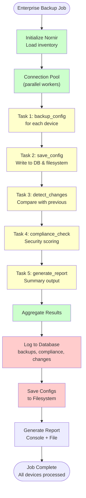
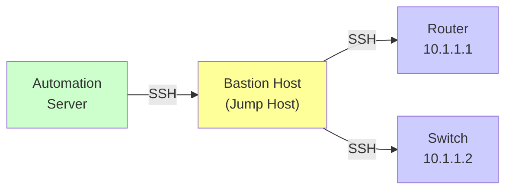
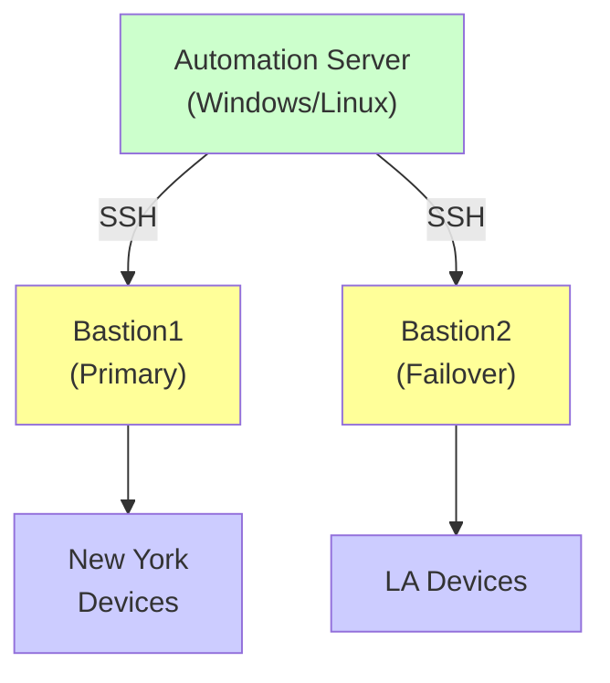

## Enterprise Config Backup Deep Dive: Real System Build

## "From Simple Backup to Automated Compliance — Real Enterprise Architecture"

In [Tutorial #2](./nornir-fundamentals.md), you built a parallel config backup system. It's functional, but it's missing critical enterprise features:

- **Where are historical backups stored?** (Text files alone don't scale)
- **Can you detect when configs change?** (Compliance auditing)
- **Can you see which devices are non-compliant?** (Reporting)
- **How do you retrieve a specific backup from 6 months ago?** (Archival)

In this tutorial, we'll build a **production-grade backup system** with database integration, change detection, and compliance reporting.

---

## 🎯 What You'll Learn

By the end of this tutorial, you'll understand:

- ✅ Multi-step task composition (tasks calling other tasks)
- ✅ Database integration with SQLite
- ✅ Config comparison and change detection
- ✅ Compliance checking and scoring
- ✅ Professional result processing and reporting
- ✅ Production patterns for Nornir systems
- ✅ Building reusable task libraries
- ✅ Troubleshooting complex workflows

---

## 📋 Prerequisites

### Required Knowledge

- ✅ **Completed [Tutorial #2: Nornir Fundamentals](./nornir-fundamentals.md)** — Understand tasks, inventory, and parallel execution
- ✅ Basic SQL (SELECT, CREATE TABLE)
- ✅ Understanding of Python dictionaries and JSON
- ✅ File I/O and comparison concepts

### Required Software

```bash
# SQLite3 ships with Python; no install needed in most environments
# If `import sqlite3` fails, install the fallback package:
pip install pysqlite3-binary
```

SQLite3 is included in Python by default. If `import sqlite3` fails, install `pysqlite3-binary`.

---

## 🏗️ Architecture Overview

Before writing code, let's understand the system:

```text
Nornir Task Flow:

1. backup_config (task)
   └─ Retrieve running config from device

2. save_config (task)
   └─ Write to database & filesystem

3. compare_configs (task)
   └─ Compare with previous backup
   └─ Detect changes

4. compliance_check (task)
   └─ Compare against standards
   └─ Generate compliance score

5. generate_report (task)
   └─ Create summary report
   └─ Database logging
```

**Key difference from Tutorial #2:** Each device's data flows through a 5-step pipeline.

### Complete System Diagram



---

## ⚡ Start Simple: Minimal Enterprise Example

Before building the full system above, let's start with just the filesystem version (no database). This shows the core pattern.

### Step 1: Basic Multi-Step Task Pipeline

Create `simple_backup.py`:

```python
#!/usr/bin/env python3
"""
Simple backup (no database, just files)
Shows task composition pattern
"""

from nornir import InitNornir
from nornir.core.task import Task, Result
from nornir_netmiko.tasks import netmiko_send_command
from datetime import datetime
import os

def get_config(task: Task) -> Result:
    """Step 1: Get the config"""
    result = task.run(
        netmiko_send_command,
        command_string="show running-config"
    )
    
    config = result[0].result
    return Result(
        host=task.host,
        result={'config': config, 'timestamp': datetime.now()}
    )

def save_to_file(task: Task, config_data: dict) -> Result:
    """Step 2: Save it to disk"""
    device_name = task.host.name
    
    os.makedirs("configs", exist_ok=True)
    filename = f"configs/{device_name}_backup.txt"
    
    with open(filename, 'w') as f:
        f.write(config_data['config'])
    
    return Result(
        host=task.host,
        result={'filepath': filename, 'size': len(config_data['config'])}
    )

# Initialize and run
nr = InitNornir(config_file="nornir_config.yaml")

# Get password
import getpass
pwd = getpass.getpass("Password: ")
for host in nr.inventory.hosts.values():
    host.password = pwd

# Run pipelines
print("\n✓ Step 1: Getting configs from all devices...")
results1 = nr.run(task=get_config)

print("✓ Step 2: Saving to filesystem...")
# For each device, save its config
for device_name, result_obj in results1.items():
    if not result_obj.failed:
        config_data = result_obj.result
        # Save this device's config
        save_task = nr.filter(name=device_name)
        save_task.run(task=save_to_file, config_data=config_data)

print("\n✓ Done! Check ./configs/ directory")
```

**Why this matters:** By breaking it into separate steps, we can:

1. Add change detection between saves
2. Add compliance checking
3. Add database logging
4. Each step can have different error handling
5. Each step can run on different devices

---

## 🗄️ Database Schema

First, we need a database to store backup metadata. Create `init_db.py`:

```python
"""
Initialize the backup database schema
Run once: python init_db.py
"""

import sqlite3
import os

def init_database(db_file='backup.db'):
    """Create database tables for backup tracking"""
    
    # Create connection
    conn = sqlite3.connect(db_file)
    cursor = conn.cursor()
    
    # Table 1: Backup metadata
    cursor.execute('''
    CREATE TABLE IF NOT EXISTS backups (
        id INTEGER PRIMARY KEY AUTOINCREMENT,
        device_name TEXT NOT NULL,
        backup_timestamp DATETIME DEFAULT CURRENT_TIMESTAMP,
        config_size INTEGER,
        config_hash TEXT,
        changed BOOLEAN DEFAULT 0,
        status TEXT,
        filepath TEXT
    )
    ''')
    
    # Table 2: Compliance history
    cursor.execute('''
    CREATE TABLE IF NOT EXISTS compliance (
        id INTEGER PRIMARY KEY AUTOINCREMENT,
        device_name TEXT NOT NULL,
        check_timestamp DATETIME DEFAULT CURRENT_TIMESTAMP,
        compliance_score REAL,
        issues TEXT,
        status TEXT
    )
    ''')
    
    # Table 3: Changes detected
    cursor.execute('''
    CREATE TABLE IF NOT EXISTS changes (
        id INTEGER PRIMARY KEY AUTOINCREMENT,
        device_name TEXT NOT NULL,
        change_timestamp DATETIME DEFAULT CURRENT_TIMESTAMP,
        previous_backup_id INTEGER,
        new_backup_id INTEGER,
        lines_added INTEGER,
        lines_removed INTEGER,
        summary TEXT,
        FOREIGN KEY(previous_backup_id) REFERENCES backups(id),
        FOREIGN KEY(new_backup_id) REFERENCES backups(id)
    )
    ''')
    
    conn.commit()
    conn.close()
    print(f"✓ Database initialized: {db_file}")

if __name__ == "__main__":
    init_database()
```

**Run this once:**

```bash
python init_db.py
```

---

## 🚀 The Complete Production Script

Create `tasks/enterprise_backup.py` with advanced task composition:

```python
"""
Enterprise Configuration Backup with Nornir
Includes: Database logging, change detection, compliance checking
"""

import sqlite3
import hashlib
import difflib
import os
from datetime import datetime
from nornir.core.task import Task, Result
from nornir_netmiko.tasks import netmiko_send_command
import logging

logger = logging.getLogger(__name__)

# ============================================================================
# TASK 1: Retrieve Configuration
# ============================================================================

def backup_config(task: Task) -> Result:
    """
    Retrieve running configuration from device
    
    Returns config data without saving (that's Task 2)
    """
    device_name = task.host.name
    device_ip = task.host.hostname
    
    logger.info(f"[{device_name}] Retrieving configuration...")
    
    try:
        result = task.run(
            netmiko_send_command,
            command_string="show running-config",
            use_textfsm=False,
            name="Get running config"
        )
        
        config = result[0].result
        
        if isinstance(config, str) and len(config) > 100:
            # Calculate config hash for change detection
            config_hash = hashlib.sha256(config.encode()).hexdigest()
            logger.info(f"[{device_name}] ✓ Retrieved {len(config):,} bytes")
            
            return Result(
                host=task.host,
                result={
                    'success': True,
                    'config': config,
                    'size': len(config),
                    'hash': config_hash,
                    'timestamp': datetime.now()
                }
            )
        else:
            logger.warning(f"[{device_name}] Config data invalid")
            return Result(
                host=task.host,
                result={'success': False, 'error': 'Invalid config data'},
                failed=True
            )
            
    except Exception as e:
        logger.error(f"[{device_name}] ✗ Connection failed: {str(e)}")
        return Result(
            host=task.host,
            result={'success': False, 'error': str(e)},
            failed=True
        )

# ============================================================================
# TASK 2: Save Configuration and Log to Database
# ============================================================================

def save_config(task: Task, config_data: dict, backup_dir: str = "configs", db_file: str = "backup.db") -> Result:
    """
    Save configuration to file and database
    Tracks: size, hash, timestamp, change status
    """
    device_name = task.host.name
    this_config = config_data.get(device_name)
    
    if not this_config or not this_config.get('success'):
        logger.warning(f"[{device_name}] Skipping save (config retrieval failed)")
        return Result(
            host=task.host,
            result={'success': False, 'reason': 'config_retrieval_failed'},
            failed=True
        )
    
    try:
        # Save to filesystem
        os.makedirs(backup_dir, exist_ok=True)
        safe_name = device_name.replace('.', '-')
        filename = f"{safe_name}_running-config.txt"
        filepath = os.path.join(backup_dir, filename)
        
        with open(filepath, 'w') as f:
            f.write(this_config['config'])
        
        file_size = os.path.getsize(filepath)
        
        # Log to database
        conn = sqlite3.connect(db_file)
        cursor = conn.cursor()
        
        # Get previous backup to detect change
        cursor.execute('''
            SELECT id, config_hash FROM backups 
            WHERE device_name = ? 
            ORDER BY backup_timestamp DESC LIMIT 1
        ''', (device_name,))
        
        previous = cursor.fetchone()
        changed = False
        
        if previous:
            # Compare with previous
            previous_hash = previous[1]
            changed = (previous_hash != this_config['hash'])
        
        # Insert new backup record
        cursor.execute('''
            INSERT INTO backups (device_name, config_size, config_hash, changed, status, filepath)
            VALUES (?, ?, ?, ?, ?, ?)
        ''', (device_name, file_size, this_config['hash'], changed, 'success', filepath))
        
        backup_id = cursor.lastrowid
        conn.commit()
        conn.close()
        
        status_msg = "CHANGED" if changed else "unchanged"
        logger.info(f"[{device_name}] ✓ Saved ({status_msg}): {file_size:,} bytes")
        
        return Result(
            host=task.host,
            result={
                'success': True,
                'filepath': filepath,
                'size': file_size,
                'backup_id': backup_id,
                'changed': changed
            }
        )
        
    except Exception as e:
        logger.error(f"[{device_name}] Save failed: {str(e)}")
        return Result(
            host=task.host,
            result={'success': False, 'error': str(e)},
            failed=True
        )

# ============================================================================
# TASK 3: Detect Changes
# ============================================================================

def detect_changes(task: Task, current_config: dict, db_file: str = "backup.db") -> Result:
    """
    Compare current config with previous backup
    Calculate added/removed lines
    """
    device_name = task.host.name
    this_config = current_config.get(device_name)
    
    if not this_config:
        logger.warning(f"[{device_name}] Skipping change detection (no config)")
        return Result(
            host=task.host,
            result={'success': False, 'reason': 'config_retrieval_failed'},
            failed=True
        )
    
    try:
        conn = sqlite3.connect(db_file)
        cursor = conn.cursor()
        
        # Get previous config
        cursor.execute('''
            SELECT b.id, b.filepath FROM backups b
            WHERE b.device_name = ? AND b.id < (
                SELECT MAX(id) FROM backups WHERE device_name = ?
            )
            ORDER BY b.id DESC LIMIT 1
        ''', (device_name, device_name))
        
        previous = cursor.fetchone()
        conn.close()
        
        if not previous:
            logger.info(f"[{device_name}] No previous backup (this is first)")
            return Result(
                host=task.host,
                result={
                    'success': True,
                    'changed': False,
                    'lines_added': 0,
                    'lines_removed': 0,
                    'summary': 'First backup'
                }
            )
        
        # Load previous config
        previous_id, previous_filepath = previous
        with open(previous_filepath, 'r') as f:
            previous_config = f.read()
        
        # Compare configs
        previous_lines = previous_config.splitlines()
        current_lines = this_config.splitlines()
        
        # Calculate difference
        differ = difflib.unified_diff(previous_lines, current_lines, lineterm='')
        diff_lines = list(differ)
        
        added = sum(1 for line in diff_lines if line.startswith('+') and not line.startswith('+++'))
        removed = sum(1 for line in diff_lines if line.startswith('-') and not line.startswith('---'))
        
        # Summarize changes
        if added == 0 and removed == 0:
            summary = "No changes"
            changed = False
        else:
            summary = f"+{added} lines, -{removed} lines"
            changed = True
        
        logger.info(f"[{device_name}] Changes detected: {summary}")
        
        return Result(
            host=task.host,
            result={
                'success': True,
                'changed': changed,
                'lines_added': added,
                'lines_removed': removed,
                'summary': summary,
                'previous_backup_id': previous_id
            }
        )
        
    except Exception as e:
        logger.error(f"[{device_name}] Change detection failed: {str(e)}")
        return Result(
            host=task.host,
            result={'success': False, 'error': str(e)},
            failed=True
        )

# ============================================================================
# TASK 4: Compliance Checking
# ============================================================================

def compliance_check(task: Task, config: dict, db_file: str = "backup.db") -> Result:
    """
    Check for common compliance issues:
    - Missing banner
    - Weak logging
    - Missing ACLs
    etc.
    """
    device_name = task.host.name
    config_lower = (config.get(device_name) or "").lower()
    
    issues = []
    score = 100
    
    # Check for security configurations
    security_checks = {
        'banner motd': ('Missing MOTD banner', 10),
        'logging': ('Missing syslog configuration', 15),
        'enable secret': ('Weak enable password (not using secret)', 20),
        'access-list': ('No ACLs configured', 10),
        'ntp': ('Missing NTP configuration', 5),
        'snmp-server host': ('SNMP not configured', 5),
    }
    
    for check_key, (issue_desc, penalty) in security_checks.items():
        if check_key not in config_lower:
            issues.append(issue_desc)
            score -= penalty
    
    score = max(0, score)  # Don't go below 0
    
    try:
        # Store compliance check in database
        conn = sqlite3.connect(db_file)
        cursor = conn.cursor()
        
        issues_str = "; ".join(issues) if issues else "All checks passed"
        
        cursor.execute('''
            INSERT INTO compliance (device_name, compliance_score, issues, status)
            VALUES (?, ?, ?, ?)
        ''', (device_name, score, issues_str, 'completed'))
        
        conn.commit()
        conn.close()
        
        logger.info(f"[{device_name}] Compliance score: {score}/100")
        
        return Result(
            host=task.host,
            result={
                'success': True,
                'score': score,
                'issues': issues,
                'passed_checks': len(security_checks) - len(issues)
            }
        )
        
    except Exception as e:
        logger.error(f"[{device_name}] Compliance check failed: {str(e)}")
        return Result(
            host=task.host,
            result={'success': False, 'error': str(e)},
            failed=True
        )

# ============================================================================
# TASK 5: Generate Summary Report
# ============================================================================

def generate_report(task: Task, all_results: dict) -> Result:
    """
    Generate text report of backup operation
    """
    device_name = task.host.name
    
    try:
        device_results = all_results.get(device_name, {})
        
        report_lines = [
            f"\n{'=' * 70}",
            f"Device: {device_name}",
            f"{'=' * 70}",
        ]
        
        # Config info
        if 'save_config' in device_results:
            save_info = device_results['save_config']
            if save_info.get('success'):
                report_lines.append(f"✓ Config saved: {save_info.get('size', 0):,} bytes")
            else:
                report_lines.append(f"✗ Config save failed: {save_info.get('error')}")
        
        # Change detection
        if 'detect_changes' in device_results:
            change_info = device_results['detect_changes']
            if change_info.get('success'):
                status = "CHANGED" if change_info.get('changed') else "unchanged"
                report_lines.append(f"Changes: {change_info.get('summary')}")
        
        # Compliance
        if 'compliance_check' in device_results:
            compliance_info = device_results['compliance_check']
            if compliance_info.get('success'):
                score = compliance_info.get('score', 0)
                report_lines.append(f"Compliance Score: {score}/100")
                if compliance_info.get('issues'):
                    report_lines.append(f"Issues: {len(compliance_info['issues'])}")
        
        report = "\n".join(report_lines)
        
        return Result(
            host=task.host,
            result={
                'success': True,
                'report': report
            }
        )
        
    except Exception as e:
        return Result(
            host=task.host,
            result={'success': False, 'error': str(e)},
            failed=True
        )
```

**Save as:** `tasks/enterprise_backup.py`

---

## 🔧 Orchestration Script

Create `enterprise_main.py` to run the complete workflow:

```python
"""
Enterprise Configuration Backup System
Parallel execution with change detection and compliance checking
"""

import os
import sys
import getpass
from datetime import datetime
from nornir import InitNornir
import sqlite3
import tabulate
from tasks.enterprise_backup import (
    backup_config,
    save_config,
    detect_changes,
    compliance_check,
    generate_report
)

def main():
    """Main orchestration function"""
    
    print("=" * 70)
    print("Enterprise Configuration Backup System")
    print("=" * 70)
    
    # Get password
    device_password = getpass.getpass('Enter device password: ')
    
    try:
        # Initialize Nornir
        nornir = InitNornir(config_file="nornir_config.yaml")
        
        # Update passwords
        for host in nornir.inventory.hosts.values():
            host.password = device_password
        
        print(f"✓ Loaded {len(nornir.inventory.hosts)} devices\n")
        
        # ================================================================
        # STAGE 1: Backup Configurations (Parallel)
        # ================================================================
        print(f"{'=' * 70}")
        print("STAGE 1: Retrieving Configurations")
        print(f"{'=' * 70}\n")
        
        backup_results = nornir.run(
            task=backup_config,
            name="Backup Configurations"
        )
        
        # Extract config data for next stages
        config_data = {}
        for device_name, result in backup_results.items():
            if result[0].result.get('success'):
                config_data[device_name] = result[0].result
            else:
                config_data[device_name] = None
        
        # ================================================================
        # STAGE 2: Save Configurations (Parallel)
        # ================================================================
        print(f"\n{'=' * 70}")
        print("STAGE 2: Saving Configurations & Creating Database Records")
        print(f"{'=' * 70}\n")
        
        save_results = nornir.run(
            task=save_config,
            config_data=config_data,
            backup_dir="enterprise_configs",
            db_file="backup.db"
        )
        
        # ================================================================
        # STAGE 3: Detect Changes (Parallel)
        # ================================================================
        print(f"\n{'=' * 70}")
        print("STAGE 3: Detecting Configuration Changes")
        print(f"{'=' * 70}\n")
        
        changes_results = nornir.run(
            task=detect_changes,
            current_config={
                device_name: config_data[device_name]['config']
                if config_data[device_name] else None
                for device_name in config_data.keys()
            },
            db_file="backup.db"
        )
        
        # ================================================================
        # STAGE 4: Compliance Checking (Parallel)
        # ================================================================
        print(f"\n{'=' * 70}")
        print("STAGE 4: Running Compliance Checks")
        print(f"{'=' * 70}\n")
        
        compliance_results = nornir.run(
            task=compliance_check,
            config={
                device_name: config_data[device_name]['config']
                if config_data[device_name] else ""
                for device_name in config_data.keys()
            },
            db_file="backup.db"
        )
        
        # ================================================================
        # STAGE 5: Generate Summary Report
        # ================================================================
        print(f"\n{'=' * 70}")
        print("STAGE 5: Generating Summary Report")
        print(f"{'=' * 70}\n")
        
        # Aggregate all results for reporting
        all_aggregated = {}
        for device_name in nornir.inventory.hosts.keys():
            all_aggregated[device_name] = {
                'backup_config': backup_results[device_name][0].result,
                'save_config': save_results[device_name][0].result,
                'detect_changes': changes_results[device_name][0].result,
                'compliance_check': compliance_results[device_name][0].result,
            }
        
        report_results = nornir.run(
            task=generate_report,
            all_results={
                device_name: all_aggregated[device_name]
                for device_name in nornir.inventory.hosts.keys()
            }
        )
        
        # ================================================================
        # PRINT FINAL SUMMARY
        # ================================================================
        print(f"\n{'=' * 70}")
        print("FINAL SUMMARY")
        print(f"{'=' * 70}\n")
        
        # Database analysis
        conn = sqlite3.connect("backup.db")
        cursor = conn.cursor()
        
        # Summary table
        summary_data = []
        for device_name in nornir.inventory.hosts.keys():
            config_success = backup_results[device_name][0].result.get('success', False)
            save_success = save_results[device_name][0].result.get('success', False)
            
            if compliance_results[device_name][0].result.get('success'):
                score = compliance_results[device_name][0].result.get('score', 0)
            else:
                score = 0
            
            changed = changes_results[device_name][0].result.get('changed', False)
            
            summary_data.append([
                device_name,
                "✓" if config_success else "✗",
                "✓" if save_success else "✗",
                "Changed" if changed else "Same",
                f"{score}/100"
            ])
        
        headers = ["Device", "Config Retrieved", "Saved", "Status", "Compliance"]
        print(tabulate.tabulate(summary_data, headers=headers, tablefmt="grid"))
        
        # Statistics
        successful = sum(1 for d in summary_data if d[1] == "✓")
        changed_count = sum(1 for d in summary_data if "Changed" in d[3])
        avg_compliance = sum(int(d[4].split('/')[0]) for d in summary_data) / len(summary_data)
        
        print(f"\nSuccessful Backups: {successful}/{len(nornir.inventory.hosts)}")
        print(f"Changed Configs: {changed_count}/{len(nornir.inventory.hosts)}")
        print(f"Average Compliance: {avg_compliance:.1f}/100")
        
        print(f"\n✓ Backup database: backup.db")
        print(f"✓ Config files: enterprise_configs/")
        
        conn.close()

    except Exception as e:
        print(f"✗ Error: {str(e)}")
        import traceback
        traceback.print_exc()
        sys.exit(1)

if __name__ == "__main__":
    main()
```

**Save as:** `enterprise_main.py`

---

## 🚀 Running the Enterprise System

### Setup

```bash
# Initialize database (one-time)
python init_db.py

# Run the backup system
python enterprise_main.py
```

### Expected Output

```bash
======================================================================
Enterprise Configuration Backup System
======================================================================
✓ Loaded 5 devices

======================================================================
STAGE 1: Retrieving Configurations
======================================================================

[router1] Retrieving configuration...
[router2] Retrieving configuration...
[switch1] Retrieving configuration...
[router3] Retrieving configuration...
[switch2] Retrieving configuration...

[router1] ✓ Retrieved 45,234 bytes
[router2] ✓ Retrieved 38,912 bytes
[switch1] ✓ Retrieved 62,148 bytes
[router3] ✓ Retrieved 41,205 bytes
[switch2] ✓ Retrieved 55,678 bytes

======================================================================
STAGE 2: Saving Configurations & Creating Database Records
======================================================================

[router1] ✓ Saved (unchanged): 45,234 bytes
[router2] ✓ Saved (CHANGED): 38,912 bytes
[switch1] ✓ Saved (unchanged): 62,148 bytes
[router3] ✓ Saved (unchanged): 41,205 bytes
[switch2] ✓ Saved (CHANGED): 55,678 bytes

======================================================================
STAGE 3: Detecting Configuration Changes
======================================================================

[router1] Changes detected: No changes
[router2] Changes detected: +12 lines, -8 lines
[switch1] Changes detected: No changes
[router3] Changes detected: No changes
[switch2] Changes detected: +5 lines, -2 lines

======================================================================
STAGE 4: Running Compliance Checks
======================================================================

[router1] Compliance score: 85/100
[router2] Compliance score: 80/100
[switch1] Compliance score: 90/100
[router3] Compliance score: 75/100
[switch2] Compliance score: 88/100

======================================================================
STAGE 5: Generating Summary Report
======================================================================

======================================================================
FINAL SUMMARY
======================================================================

╒════════════╤═════════════════╤═════════╤═════════╤═════════════╕
│ Device     │ Config Retrieved │ Saved   │ Status  │ Compliance  │
╞════════════╪═════════════════╪═════════╪═════════╪═════════════╡
│ router1    │ ✓                │ ✓       │ Same    │ 85/100      │
│ router2    │ ✓                │ ✓       │ Changed │ 80/100      │
│ switch1    │ ✓                │ ✓       │ Same    │ 90/100      │
│ router3    │ ✓                │ ✓       │ Same    │ 75/100      │
│ switch2    │ ✓                │ ✓       │ Changed │ 88/100      │
╘════════════╧═════════════════╧═════════╧═════════╧═════════════╛

Successful Backups: 5/5
Changed Configs: 2/5
Average Compliance: 83.6/100

✓ Backup database: backup.db
✓ Config files: enterprise_configs/
```

---

## 📊 Querying the Database

You now have a full backup history. Query it:

```python
# query_backups.py
import sqlite3
from datetime import datetime, timedelta

conn = sqlite3.connect("backup.db")
cursor = conn.cursor()

print("Recent Backups:")
cursor.execute('''
    SELECT device_name, backup_timestamp, config_size, changed
    FROM backups
    WHERE backup_timestamp > datetime('now', '-7 days')
    ORDER BY backup_timestamp DESC
    LIMIT 20
''')

for row in cursor.fetchall():
    device, timestamp, size, changed = row
    status = "📝 Changed" if changed else "✓ Unchanged"
    print(f"{device:<15} {timestamp:<20} {size:>10,} bytes  {status}")

print("\n\nCompliance Scores:")
cursor.execute('''
    SELECT device_name, compliance_score, MAX(check_timestamp)
    FROM compliance
    GROUP BY device_name
    ORDER BY compliance_score DESC
''')

for row in cursor.fetchall():
    device, score, timestamp = row
    print(f"{device:<15} {score:>6.1f}/100  ({timestamp})")

conn.close()
```

---

## 🎓 Key Concepts Mastered

### Task Composition

```python
# You can chain tasks or run them in series
result1 = task.run(backup_config,      ...  )
result2 = task.run(save_config,        data=result1[0].result)
result3 = task.run(detect_changes,     config=result1[0].result['config'])
```

### Database Integration

```python
# Store metadata for historical analysis
conn = sqlite3.connect("backup.db")
cursor.execute("INSERT INTO backups (device_name, ...) VALUES (...)")
conn.commit()
```

### Data Aggregation

```python
# Collect results from all parallel executions
for device_name, result in backup_results.items():
    data = result[0].result  # Extract result from device
```

---

## 🚀 Advanced Variations

### Email Reports on Changes

```python
import smtplib
from email.mime.text import MIMEText

def send_change_report(changed_devices):
    body = f"Changed configs: {', '.join(changed_devices)}"
    msg = MIMEText(body)
    msg['Subject'] = "Config Changes Detected"
    
    server = smtplib.SMTP('smtp.gmail.com', 587)
    server.starttls()
    server.login('your_email@gmail.com', 'password')
    server.send_message(msg)
    server.quit()

# In main.py, after compliance checks:
if changed_count > 0:
    changed = [d[0] for d in summary_data if "Changed" in d[3]]
    send_change_report(changed)
```

### Push Alerts to Slack

```python
import requests

def send_slack_alert(device_name, message):
    webhook_url = 'https://hooks.slack.com/services/YOUR/WEBHOOK/URL'
    data = {'text': f"🚨 {device_name}: {message}"}
    requests.post(webhook_url, json=data)

# Use in compliance_check:
if score < 70:
    send_slack_alert(device_name, f"Low compliance: {score}/100")
```

### Backup Retention Policy

```python
import datetime

def cleanup_old_backups(days_to_keep=30):
    conn = sqlite3.connect("backup.db")
    cursor = conn.cursor()
    
    cutoff = datetime.datetime.now() - datetime.timedelta(days=days_to_keep)
    
    cursor.execute('''
        SELECT filepath FROM backups 
        WHERE backup_timestamp < ?
    ''', (cutoff.isoformat(),))
    
    for (filepath,) in cursor.fetchall():
        if os.path.exists(filepath):
            os.remove(filepath)
            logger.info(f"Deleted old backup: {filepath}")
    
    # Also delete old records
    cursor.execute('''
        DELETE FROM backups WHERE backup_timestamp < ?
    ''', (cutoff.isoformat(),))
    
    conn.commit()
    conn.close()

# Call before backup: cleanup_old_backups(days_to_keep=30)
```

---

## ⚠️ Real-World Gotchas & Edge Cases

### Gotcha 1: Device Throws Connection Error Mid-Pipeline

**Scenario:** Device connects fine for `backup_config`, then drops during `compliance_check`.

**What happens without handling:**

```python
# ✗ BAD: Entire pipeline fails
result1 = nr.run(backup_config)      # Device connects ✓
result2 = nr.run(compliance_check)   # Device drops ✗ Pipeline aborts
```

**Solution:** Add error recovery in each task:

```python
def compliance_check(task: Task, config: str) -> Result:
    try:
        # Your checks
        return Result(host=task.host, result={...})
    except Exception as e:
        # Return failed result, don't crash
        logger.warning(f"[{task.host.name}] Compliance check failed: {e}")
        return Result(
            host=task.host,
            result={'score': 0, 'issues': [str(e)]},
            failed=True  # ← Mark as failed but pipeline continues
        )
```

**Key:** `failed=True` tells Nornir "this device failed but keep going"

### Gotcha 2: Database Locked (SQLite Limitation)

**Scenario:** Multiple Python processes running backups simultaneously.

**What happens:** `sqlite3.OperationalError: database is locked`

**Root cause:** SQLite only allows one writer at a time.

**Solutions:**

1. **Use connection timeout (simplest fix):**

   ```python
conn = sqlite3.connect("backup.db", timeout=30.0)  # Wait 30 seconds if locked
   ```

2. **Use PostgreSQL for multi-process writes (best for scale):**

   ```python
import psycopg2
conn = psycopg2.connect("dbname=backup user=admin password=secret host=localhost")
   ```

3. **Single writer approach (middle ground):**

   - Main process does backups
   - Separate process writes to database
   - Use message queue (Redis) to pass results between

### Gotcha 3: Config File Size Explosion

**Scenario:** You backup 1,000 devices daily. After 1 year: 365,000 configs × average 50KB = 18GB storage.

**Solution:** Compress configs and use retention policies:

```python
import gzip

def save_config(task: Task, config: str) -> Result:
    filename = f"configs/{task.host.name}.txt.gz"
    
    # Compress before saving
    with gzip.open(filename, 'wt') as f:
        f.write(config)
    
    return Result(host=task.host, result={'filepath': filename})

# Cleanup script
def cleanup_old_backups(days_to_keep=30):
    cutoff = datetime.datetime.now() - datetime.timedelta(days=days_to_keep)
    
    for filepath in glob.glob("configs/*.gz"):
        if os.path.getmtime(filepath) < cutoff.timestamp():
            os.remove(filepath)
```

### Gotcha 4: Comparing Configs Incorrectly

**Scenario:** Config comparison shows "changed" but only whitespace/timestamps differ.

```text
# Actual diff:
- Last config saved: Tuesday 3:00 AM
+ Last config saved: Wednesday 3:00 AM
```

**Solution:** Normalize configs before comparison:

```python
def normalize_config(config):
    # Remove timestamps and automation markers
    lines = []
    for line in config.split('\n'):
        # Skip timestamp lines
        if 'last config' in line.lower():
            continue
        if 'by v' in line.lower():  # Skip "generated by version X"
            continue
        lines.append(line)
    
    return '\n'.join(lines)

# In compare function:
previous_normalized = normalize_config(previous_config)
current_normalized = normalize_config(current_config)

changed = (previous_normalized != current_normalized)
```

### Gotcha 5: Compliance Checks That Are Too Strict

**Scenario:** You set compliance to check for features that not all device types support.

```python
# ✗ BAD: Router doesn't have "spanning-tree"
security_checks = {
    'spanning-tree': ('STP required', 10),  # Wrong for routers!
}
```

**Solution:** Group-based compliance policies:

```python
COMPLIANCE_CHECKS = {
    'ios_switch': {
        'spanning-tree': ('STP required', 10),
        'vlan': ('VLANs required', 15),
    },
    'ios_router': {
        'nat': ('NAT required', 10),
        'route-map': ('Route policies required', 15),
    }
}

def compliance_check(task: Task, config: str) -> Result:
    device_type = str(task.host.groups[0])  # Get device type (group name)
    checks = COMPLIANCE_CHECKS.get(device_type, {})
    
    # Apply only relevant checks
    for check_key, (issue, penalty) in checks.items():
        # ... rest of logic
        pass
```

### Gotcha 6: Running Out of Memory with Large Configs

**Scenario:** 100 devices × 2MB configs = 200MB in memory at once.

**With 10,000 devices:** 20GB+ in memory = crash

**Solution:** Process results in batches:

```python
from nornir.core.filter import F

# Instead of:
all_results = nr.run(backup_config)
process_all(all_results)  # ← Load everything at once

# Use:
for batch_of_devices in chunked(nr.inventory.hosts, chunk_size=100):
    filtered = nr.filter(F(name__in=batch_of_devices))
    results = filtered.run(backup_config)
    
    # Process batch immediately, then free memory
    process_batch(results)
```

---

## 🐛 Advanced Troubleshooting

### Debugging a Specific Device

```bash
# Test connection to one device
python -c "
from nornir import InitNornir
nr = InitNornir(config_file='nornir_config.yaml')
device = nr.filter(name='router1')
device.run(my_task)
"
```

### Logging to File for Post-Analysis

```python
import logging

# Setup file logging
fh = logging.FileHandler('backup.log')
fh.setLevel(logging.DEBUG)

logger = logging.getLogger()
logger.addHandler(fh)

# Now all logs go to backup.log
nr.run(backup_config)

print("Logs saved to backup.log")
```

### Printing Full Tracebacks for Errors

```python
import traceback

try:
    nr.run(backup_config)
except Exception:
    traceback.print_exc()  # ← Shows full stack trace
```

---

## 🔐 Secret Management Best Practices

**NEVER hardcode credentials in code or YAML files!**

### Secure Pattern 1: Environment Variables

Best for: Small teams, dev/test environments, CI/CD

```python
import os
from dotenv import load_dotenv

# Load from .env file (never commit this!)
load_dotenv()

device_password = os.environ.get('DEVICE_PASSWORD')
device_username = os.environ.get('DEVICE_USERNAME')

if not device_password:
    raise ValueError("DEVICE_PASSWORD not set in environment")

# Update Nornir inventory
nr = InitNornir(config_file="nornir_config.yaml")
for host in nr.inventory.hosts.values():
    host.username = device_username
    host.password = device_password
```

**Create `.env` file** (gitignored):

```bash
DEVICE_USERNAME=admin
DEVICE_PASSWORD=your_real_password
```

### Secure Pattern 2: Interactive Prompt

Best for: Ad-hoc scripts, avoiding env var exposure

```python
import getpass

device_password = getpass.getpass("Enter device password: ")

nr = InitNornir(config_file="nornir_config.yaml")
for host in nr.inventory.hosts.values():
    host.password = device_password
```

### Secure Pattern 3: HashiCorp Vault Integration

Best for: Enterprise, centralized secret management

```python
import hvac

# Connect to Vault
vault_client = hvac.Client(url='https://vault.example.com:8200')

# Authenticate (use token, AppRole, or other auth method)
vault_client.auth.approle.login(role_id='your_role_id', secret_id='your_secret_id')

# Fetch secret
secrets = vault_client.secrets.kv.read_secret_version(path='network/credentials')
device_password = secrets['data']['data']['password']

# Use in Nornir
for host in nr.inventory.hosts.values():
    host.password = device_password
```

**Install Vault client:**

```bash
pip install hvault
```

### Secure Pattern 4: AWS Secrets Manager

Best for: AWS environments

```python
import boto3
import json

# Connect to AWS Secrets Manager
client = boto3.client('secretsmanager', region_name='us-east-1')

# Fetch secret
response = client.get_secret_value(SecretId='network/device-credentials')
secret = json.loads(response['SecretString'])

device_password = secret['password']
device_username = secret['username']
```

### Secure Pattern 5: Per-Device Credentials (Advanced)

Best for: Multi-tenant networks with different credentials per device

```yaml
# inventory/hosts.yaml
router1:
  hostname: 10.1.1.1
  groups:
    - ios_devices
  data:
    vault_path: "network/credentials/router1"

router2:
  hostname: 10.1.1.2
  groups:
    - ios_devices
  data:
    vault_path: "network/credentials/router2"
```

Then in code:

```python
def fetch_credentials_for_host(host):
    """Fetch host-specific credentials from Vault"""
    vault_path = host.data.get('vault_path')
    # ... fetch from Vault using vault_path ...
    return username, password
```

### Security Checklist

✅ **Never commit `.env` files** — add to `.gitignore`  
✅ **Rotate credentials regularly** — especially if exposed  
✅ **Use HTTPS for credential transport** — Vault, AWS, or internal APIs  
✅ **Log access to secrets** — audit who fetched what, when  
✅ **Limit secret scope** — give each process only what it needs  
✅ **Use service accounts** — not personal credentials  
✅ **Encrypt at rest** — database, filesystem, backups  

---

## 🎛️ Building CLI Tools with Nornir

Turn your Nornir script into a professional CLI tool:

### Basic CLI with `argparse`

```python
#!/usr/bin/env python3
"""
Enterprise Config Backup CLI
Usage: python backup.py --help
"""

import argparse
import sys
from nornir import InitNornir
from nornir.core.filter import F
from tasks.enterprise_backup import backup_config

def main():
    parser = argparse.ArgumentParser(
        description="Enterprise Configuration Backup System",
        epilog="Examples:\n  python backup.py --group ios_devices\n  python backup.py --filter 'router' --dry-run"
    )
    
    # Positional arguments (required)
    # (none in this example)
    
    # Optional arguments
    parser.add_argument(
        '--host',
        help='Backup specific device by name (e.g., "router1")'
    )
    
    parser.add_argument(
        '--group',
        help='Backup entire device group (e.g., "ios_devices")'
    )
    
    parser.add_argument(
        '--filter',
        help='Filter devices by substring in name (e.g., "router" matches "router1", "router2")'
    )
    
    parser.add_argument(
        '--dry-run',
        action='store_true',
        help='Show what would be backed up without actually backing up'
    )
    
    parser.add_argument(
        '--verbose', '-v',
        action='count',
        default=0,
        help='Increase verbosity (-v, -vv, -vvv)'
    )
    
    parser.add_argument(
        '--workers',
        type=int,
        default=10,
        help='Number of parallel workers (default: 10)'
    )
    
    parser.add_argument(
        '--timeout',
        type=int,
        default=30,
        help='Connection timeout in seconds (default: 30)'
    )
    
    args = parser.parse_args()
    
    try:
        # Initialize Nornir
        nr = InitNornir(config_file="nornir_config.yaml")
        
        # Apply filters
        if args.host:
            nr = nr.filter(name=args.host)
        elif args.group:
            nr = nr.filter(F(groups__contains=args.group))
        elif args.filter:
            nr = nr.filter(filter_func=lambda h: args.filter.lower() in h.name.lower())
        
        # Show what will run
        if args.dry_run:
            print(f"DRY RUN: Would backup {len(nr.inventory.hosts)} devices:")
            for host in nr.inventory.hosts.values():
                print(f"  - {host.name} ({host.hostname})")
            return 0
        
        # Confirm with user
        if len(nr.inventory.hosts) == 0:
            print("❌ No devices matched criteria")
            return 1
        
        print(f"✓ Backing up {len(nr.inventory.hosts)} devices...")
        
        # Get password
        import getpass
        password = getpass.getpass("Device password: ")
        
        for host in nr.inventory.hosts.values():
            host.password = password
        
        # Run backup
        results = nr.run(task=backup_config)
        
        # Print summary
        failed = sum(1 for r in results.values() if r.failed)
        succeeded = len(results) - failed
        
        print(f"\n✓ Succeeded: {succeeded}/{len(results)}")
        if failed > 0:
            print(f"✗ Failed: {failed}/{len(results)}")
            for host, result in results.items():
                if result.failed:
                    print(f"  - {host}: {result[0].exception}")
        
        return 0 if failed == 0 else 1
        
    except Exception as e:
        print(f"❌ Error: {str(e)}")
        if args.verbose >= 2:
            import traceback
            traceback.print_exc()
        return 1

if __name__ == "__main__":
    sys.exit(main())
```

### Using the CLI

```bash
# Show all options
python backup.py --help

# Backup a single device
python backup.py --host router1

# Backup all routers
python backup.py --group ios_routers

# Backup devices with "core" in the name
python backup.py --filter core

# Dry run to see what would run
python backup.py --group ios_devices --dry-run

# Verbose output for debugging
python backup.py --group ios_devices -vv

# Custom worker count
python backup.py --group ios_devices --workers 20

# Longer timeout for slow devices
python backup.py --group slow_devices --timeout 60
```

### Make It Executable (Linux/Mac)

```bash
chmod +x backup.py

# Now you can run it without 'python'
./backup.py --help
```

**Windows:** No chmod needed. Run `python backup.py --help`.

### Improvement: Configuration File for Defaults

```yaml
# cli_config.yaml
defaults:
  workers: 10
  timeout: 30
  verbose: false

prompts:
  confirm_before_backup: true
  show_device_list: true
```

Then in Python:

```python
import yaml

with open('cli_config.yaml') as f:
    config = yaml.safe_load(f)

parser.set_defaults(**config['defaults'])
```

---

## 🧪 Testing Your System

### Test with Limited Devices

```python
from nornir.core.filter import F

# Filter to specific group in main.py
filtered = nornir.filter(F(groups__contains="ios_devices"))
filtered.run(backup_config, ...)
```

### Mock Database for Testing

```python
# Use in-memory SQLite for testing
conn = sqlite3.connect(":memory:")  # ← In-memory database
```

---

## ⏰ Scheduling in Production

Your script works great manually, but real automation runs on a schedule. Here's how to set it up:

### Option 1: Cron (Linux/Mac)

Best for: Small to medium deployments

```bash
# Edit crontab
crontab -e

# Add backup job
# Runs daily at 2:00 AM
0 2 * * * cd /home/netadmin/nornir-backup && python backup.py --group ios_devices >> /var/log/nornir_backup.log 2>&1

# Runs every 6 hours
0 */6 * * * cd /home/netadmin/nornir-backup && python backup.py --group ios_devices >> /var/log/nornir_backup.log 2>&1

# Runs every Monday at 3:00 AM
0 3 * * 1 cd /home/netadmin/nornir-backup && python backup.py >> /var/log/nornir_backup_full.log 2>&1
```

**Common cron schedules:**

```bash
0 2 * * *      Daily at 2:00 AM
0 */6 * * *    Every 6 hours
0 0 * * 0      Weekly on Sunday
0 0 1 * *      Monthly on the 1st
```

### Option 2: systemd Timer (Modern Linux)

Best for: Modern Linux distributions (Ubuntu 20.04+, RHEL 8+)

Create service file `/etc/systemd/system/nornir-backup.service`:

```ini
[Unit]
Description=Enterprise Nornir Config Backup
After=network-online.target
Wants=network-online.target

[Service]
Type=oneshot
User=netadmin
WorkingDirectory=/home/netadmin/nornir-backup
ExecStart=/usr/bin/python3 /home/netadmin/nornir-backup/backup.py
ExecOnSuccess=/usr/bin/mail -s "Backup succeeded" admin@example.com < /dev/null
ExecOnFailure=/usr/bin/mail -s "Backup failed" admin@example.com < /dev/null
StandardOutput=journal
StandardError=journal
```

Create timer file `/etc/systemd/system/nornir-backup.timer`:

```ini
[Unit]
Description=Run Nornir Backup Daily

[Timer]
OnCalendar=daily
OnCalendar=*-*-* 02:00:00
Persistent=true

[Install]
WantedBy=timers.target
```

Enable and start:

```bash
sudo systemctl daemon-reload
sudo systemctl enable nornir-backup.timer
sudo systemctl start nornir-backup.timer

# Check status
sudo systemctl status nornir-backup.timer
sudo journalctl -u nornir-backup.service -f
```

### Option 3: Windows Task Scheduler

Best for: Windows networks

**Via GUI:**

1. Open Task Scheduler
2. Create Basic Task → "Enterprise Nornir Backup"
3. Trigger: Daily at 2:00 AM
4. Action:
   - Program: `C:\Python\python.exe`
   - Arguments: `C:\nornir\backup.py --group ios_devices`
   - Start in: `C:\nornir`

**Via PowerShell:**

```powershell
$action = New-ScheduledTaskAction -Execute "C:\Python\python.exe" -Argument "C:\nornir\backup.py"
$trigger = New-ScheduledTaskTrigger -Daily -At 2:00AM
Register-ScheduledTask -TaskName "NornirBackup" -Action $action -Trigger $trigger
```

### Option 4: Container Orchestration (Docker/Kubernetes)

Best for: Cloud-native deployments

**Docker Compose with scheduler:**

```yaml
version: '3.8'

services:
  nornir-backup:
    build: .
    container_name: nornir-backup
    environment:
      DEVICE_USERNAME: ${DEVICE_USERNAME}
      DEVICE_PASSWORD: ${DEVICE_PASSWORD}
    volumes:
      - ./inventory:/app/inventory
      - ./configs:/app/configs
      - ./logs:/app/logs
```

**Kubernetes CronJob:**

```yaml
apiVersion: batch/v1
kind: CronJob
metadata:
  name: nornir-backup
spec:
  schedule: "0 2 * * *"  # Daily at 2:00 AM UTC
  jobTemplate:
    spec:
      template:
        spec:
          containers:
          - name: nornir-backup
            image: nornir-backup:latest
            env:
            - name: DEVICE_PASSWORD
              valueFrom:
                secretKeyRef:
                  name: network-creds
                  key: password
            command: ["python", "backup.py", "--group", "ios_devices"]
          restartPolicy: OnFailure
```

### Production Best Practices

✅ **Avoid peak hours** — Don't backup during business hours

```bash
# Good: Early morning
0 2 * * *

# Bad: 9 AM
0 9 * * *
```

✅ **Avoid overlapping runs** — Ensure backup #1 finishes before #2 starts

```python
# Use lockfile to prevent concurrent runs
import os

LOCK_FILE = '/tmp/nornir_backup.lock'

if os.path.exists(LOCK_FILE):
    print("Backup already running")
    sys.exit(1)

# Create lock
open(LOCK_FILE, 'w').close()

try:
    # ... run backup ...
    pass
finally:
    os.remove(LOCK_FILE)
```

✅ **Log everything** — You'll need logs when something fails

```bash
# In crontab, redirect output to file
0 2 * * * /path/to/backup.py >> /var/log/nornir_backup.log 2>&1
```

**Windows Task Scheduler action (example):**

```powershell
python C:\nornir\backup.py --group ios_devices >> C:\Logs\nornir_backup.log 2>&1
```

✅ **Alert on failure** — Send email/Slack when backup fails

```python
import subprocess

# After backup_results
if sum(1 for r in backup_results.values() if r.failed) > 0:
    # Send alert
    subprocess.run([
        'mail', '-s', 'Nornir backup failed',
        'admin@example.com'
    ])
```

✅ **Stagger backups by site** — Don't backup all 5000 devices simultaneously

```yaml
# Create groups by location
location_ny:
  groups:
    - ios_devices
location_la:
  groups:
    - ios_devices
location_london:
  groups:
    - ios_devices
```

Then schedule 30 minutes apart:

```bash
0 2 * * * backup.py --group location_ny
30 2 * * * backup.py --group location_la
0 3 * * * backup.py --group location_london
```

### Monitoring Your Schedule

**Check cron logs (Linux):**

```bash
# Tail cron logs
tail -f /var/log/syslog | grep nornir

# View cron history
grep nornir /var/log/syslog
```

**Check Task Scheduler logs (Windows):**

```powershell
# Task run history
Get-ScheduledTaskInfo -TaskName "NornirBackup"

# Event log entries
Get-WinEvent -LogName Microsoft-Windows-TaskScheduler/Operational -MaxEvents 20
```

**Check systemd timer (Linux):**

```bash
# List timers
systemctl list-timers

# Detailed status
systemctl status nornir-backup.timer

# View last run
journalctl -u nornir-backup.service -n 50 --no-pager
```

**Database monitoring:**

```python
# Check when last backup ran
import sqlite3
from datetime import datetime

conn = sqlite3.connect("backup.db")
cursor = conn.cursor()

cursor.execute('''
    SELECT device_name, MAX(backup_timestamp) as last_backup
    FROM backups
    GROUP BY device_name
    ORDER BY last_backup DESC
    LIMIT 20
''')

for device, last_backup in cursor.fetchall():
    timestamp = datetime.fromisoformat(last_backup)
    age_hours = (datetime.now() - timestamp).total_seconds() / 3600
    status = "✓ Current" if age_hours < 25 else "⚠ Overdue"
    print(f"{device:<20} {timestamp} {status}")
```

---

## 🔗 Jump/Bastion Host Support

Not all network devices are directly accessible from your automation server. Many enterprises use jump hosts (bastions) for security. Good news: **Nornir + Netmiko fully support this pattern.**

### Why Jump Hosts?

**Enterprise network security model:**



**Benefits:**

- ✅ Devices on internal-only networks
- ✅ Single point of access control and logging
- ✅ No direct internet exposure of devices
- ✅ Centralized credential management

### Pattern 1: SSH Config File (Simplest)

SSH supports proxy configuration natively. Create `~/.ssh/config`:

```ssh
# Bastion host definition
Host bastion
    HostName bastion.example.com
    User netadmin
    IdentityFile ~/.ssh/bastion_key

# Devices via bastion
Host 10.1.1.*
    ProxyJump bastion
    User admin
    IdentityFile ~/.ssh/device_key
```

**Tell Netmiko to use it:**

```python
from nornir import InitNornir
from nornir.core.task import Task, Result
from nornir_netmiko.tasks import netmiko_send_command

def backup_via_bastion(task: Task) -> Result:
    """Backup config through bastion host"""
    
    # Netmiko will use ~/.ssh/config automatically
    result = task.run(
        netmiko_send_command,
        command_string="show running-config"
    )
    
    return Result(host=task.host, result=result[0].result)

# In inventory/hosts.yaml
# No special config needed - SSH just uses the proxy!
```

**Test it works:**

```bash
# Verify SSH config
ssh -G 10.1.1.1  # Shows what SSH will use

# Test connection through bastion
ssh admin@10.1.1.1
```

### Pattern 2: Netmiko Native Proxy (More Control)

For finer control, use Netmiko's built-in proxy configuration:

```yaml
# inventory/hosts.yaml
router1:
  hostname: 10.1.1.1
  platform: cisco_ios
  groups:
    - ios_devices
  data:
    proxy_jump: bastion.example.com  # ← Bastion address
    proxy_user: netadmin              # ← Bastion username
    proxy_key_file: ~/.ssh/bastion_key

switch1:
  hostname: 10.1.1.2
  platform: cisco_ios
  groups:
    - ios_devices
  data:
    proxy_jump: bastion.example.com
    proxy_user: netadmin
    proxy_key_file: ~/.ssh/bastion_key
```

**Use in tasks:**

```python
from nornir.core.task import Task, Result

def backup_with_proxy(task: Task) -> Result:
    """Backup through proxy/bastion"""
    
    proxy_jump = task.host.data.get('proxy_jump')
    proxy_user = task.host.data.get('proxy_user')
    proxy_key = task.host.data.get('proxy_key_file')
    
    # Pass proxy info to Netmiko
    result = task.run(
        netmiko_send_command,
        command_string="show running-config",
        ssh_config_file=None,  # We're handling it manually
        # Netmiko handles proxy via paramiko
    )
    
    return Result(host=task.host, result=result[0].result)
```

### Pattern 3: SSH Tunneling (Maximum Flexibility)

For complex topologies, set up SSH tunnels programmatically:

```python
import subprocess
import time
import socket
from contextlib import contextmanager

@contextmanager
def ssh_tunnel(bastion_host, bastion_user, target_host, target_port=22, local_port=None):
    """
    Create SSH tunnel: localhost:local_port -> bastion -> target_host:target_port
    """
    
    if local_port is None:
        # Find a free local port
        sock = socket.socket()
        sock.bind(('', 0))
        local_port = sock.getsockname()[1]
        sock.close()
    
    # Start SSH tunnel
    tunnel_cmd = [
        'ssh',
        '-L', f'{local_port}:{target_host}:{target_port}',
        f'{bastion_user}@{bastion_host}',
        'sleep 3600'  # Keep tunnel open for 1 hour
    ]
    
    print(f"Opening tunnel: localhost:{local_port} -> {bastion_host} -> {target_host}:{target_port}")
    
    tunnel_process = subprocess.Popen(
        tunnel_cmd,
        stdin=subprocess.DEVNULL,
        stdout=subprocess.DEVNULL,
        stderr=subprocess.PIPE
    )
    
    # Give tunnel time to establish
    time.sleep(2)
    
    try:
        yield local_port
    finally:
        # Close tunnel
        tunnel_process.terminate()
        tunnel_process.wait(timeout=5)
        print(f"Closed tunnel: localhost:{local_port}")

# Usage in tasks:
def backup_via_tunnel(task: Task) -> Result:
    """Backup device via SSH tunnel through bastion"""
    
    bastion = "bastion.example.com"
    bastion_user = "netadmin"
    target_device = task.host.hostname  # 10.1.1.1
    
    with ssh_tunnel(bastion, bastion_user, target_device) as local_port:
        # Connect to device through tunnel (localhost:local_port)
        from netmiko import ConnectHandler
        
        device = {
            'device_type': 'cisco_ios',
            'host': '127.0.0.1',
            'port': local_port,
            'username': task.host.username,
            'password': task.host.password,
        }
        
        with ConnectHandler(**device) as net_connect:
            config = net_connect.send_command('show running-config')
        
        return Result(
            host=task.host,
            result={'config': config}
        )
```

### Pattern 4: Multiple Bastion Hops (Complex Networks)

Some networks require chaining through multiple bastions:

```text
Automation Server → Bastion1 → Bastion2 → Device
```

**SSH config (native support):**

```ssh
Host bastion1
    HostName bastion1.example.com
    User netadmin

Host bastion2
    HostName bastion2.example.com
    User netadmin
    ProxyJump bastion1  # ← Chain through bastion1

Host 10.1.1.*
    ProxyJump bastion2  # ← Chain through bastion2
    User admin
```

**SSH handles the chaining automatically!**

```bash
# This will go: local → bastion1 → bastion2 → 10.1.1.1
ssh admin@10.1.1.1
```

### Key Management for Jump Hosts

## **Best practice: Separate keys for each tier**

```bash
# Generate keys
ssh-keygen -t ed25519 -f ~/.ssh/bastion_key -N ""      # Bastion key
ssh-keygen -t ed25519 -f ~/.ssh/device_key -N ""        # Device key

# SSH config
Host bastion
    HostName bastion.example.com
    IdentityFile ~/.ssh/bastion_key

Host 10.1.1.*
    ProxyJump bastion
    IdentityFile ~/.ssh/device_key
```

## **Or: SSH agent forwarding (less secure but simpler)**

```ssh
Host bastion
    HostName bastion.example.com
    User netadmin
    ForwardAgent yes  # ← Enable agent forwarding

Host 10.1.1.*
    ProxyJump bastion
    User admin
    # Bastion forwards your local SSH keys automatically
```

**⚠️ Security Note:** Only enable `ForwardAgent` if you trust the bastion host. Someone with bastion access can use your SSH agent to connect to your devices.

### Testing Bastion Connectivity

**Before running full backups, verify the path works:**

```python
from nornir import InitNornir
from nornir.core.task import Task, Result
import paramiko

def test_bastion_path(task: Task) -> Result:
    """Verify connectivity through bastion"""
    
    device_name = task.host.name
    hostname = task.host.hostname
    
    try:
        # Try to connect
        ssh = paramiko.SSHClient()
        ssh.set_missing_host_key_policy(paramiko.AutoAddPolicy())
        
        # Uses ~/.ssh/config automatically
        ssh.connect(hostname)
        ssh.close()
        
        return Result(
            host=task.host,
            result={'status': 'reachable', 'message': f'Connected through bastion'}
        )
        
    except Exception as e:
        return Result(
            host=task.host,
            result={'status': 'unreachable', 'error': str(e)},
            failed=True
        )

# Usage
nr = InitNornir(config_file="nornir_config.yaml")
results = nr.run(task=test_bastion_path)

for device, result in results.items():
    status = "✓" if not result.failed else "✗"
    print(f"{device}: {status} {result[0].result['status']}")
```

### Gotchas & Solutions

**Gotcha 1: "Permission denied (publickey)"**
    - **Problem:** SSH key not authorized on bastion
    - **Solution:** Add your public key to bastion's `~/.ssh/authorized_keys`

**Gotcha 2: "Connection timeout" through bastion**
    - **Problem:** Bastion can't reach internal device IP
    - **Solution:** Verify device IP is reachable from bastion: `ssh -J bastion admin@10.1.1.1`

**Gotcha 3: Slow connections via bastion**
    - **Problem:** Extra network hop = latency
    - **Solution:** Increase Nornir timeout: set `connection_timeout: 30` in inventory

**Gotcha 4: SSH tunnel ports conflict**
    - **Problem:** Multiple devices use same local tunnel port
    - **Solution:** Let system assign random ports (code above does this automatically)

**Gotcha 5: Bastion host becomes bottleneck**
    - **Problem:** 100 devices × connection through same bastion = slow
    - **Solution:** Use multiple bastions or connection pooling

### Bastion Monitoring & Logging

**Track bastion usage:**

```python
import logging

# Log all SSH operations
logging.getLogger('paramiko').setLevel(logging.DEBUG)

# Or on bastion side, monitor SSH:
# tail -f /var/log/auth.log | grep "Accepted publickey"
# Windows OpenSSH Server logs (Event Viewer or PowerShell):
# Get-WinEvent -LogName OpenSSH/Operational -MaxEvents 20
```

### Production Architecture

**Recommended setup:**



**Inventory structure:**

```yaml
# inventory/groups.yaml
ny_devices:
  data:
    bastion: "bastion1.example.com"

la_devices:
  data:
    bastion: "bastion2.example.com"

# inventory/hosts.yaml
router_ny:
  hostname: 10.1.1.1
  groups:
    - ny_devices

router_la:
  hostname: 10.2.1.1
  groups:
    - la_devices
```

---

## 🎯 Connection to PRIME Framework

This tutorial demonstrates the **Implement** stage:

- **Pragmatic:** Database stores what matters; compliance automates auditing
- **Transparent:** Detailed logging at every stage; clear reports
- **Reliable:** Multi-stage validation; graceful error handling

---

## 🎓 Next Steps

You've built an enterprise-grade automation system! Here's what's next:

**Continue with Advanced Patterns:**

1. **[Advanced Nornir Patterns](./advanced-nornir-patterns.md)** (Strongly Recommended)
   - Custom inventory plugins (Netbox integration)
   - Middleware for cross-task logic
   - Advanced error handling and logging
   - Memory optimisation for 10,000+ devices
   - Multi-vendor support
   - Testing and debugging workflows

2. **[Why Nornir?](./why-nornir.md)** — Understand architectural decisions and alternatives

    **Study Production Code:**

3. **[Deep Dives](../../deep-dives/index.md)** — See how production tools implement similar patterns
   - [CDP Network Audit](../../deep-dives/cdp-audit.md) — Enterprise discovery at scale
   - [Access Switch Audit](../../deep-dives/access-switch-audit.md) — Parallel collection and intelligent handling

    **Scale & Deploy:**

4. **[PRIME Framework](../../../prime-framework/index.md)** — Structure your automation for sustainable ROI
5. **[Services](../../../services.md)** — Consulting for enterprise automation systems
6. **[Contact Us](../../../about.md#contact)** — Let's discuss your automation challenges

---

[← Back to Intermediate Tutorials](./index.md)
