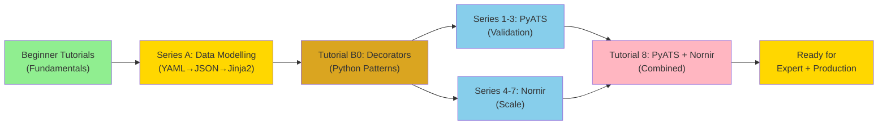

## Intermediate Tutorials

## "From Guessing to Proving — Validate Your Automation at Enterprise Scale"

In the [Beginner Tutorials](../beginner/index.md), you built single-device and multi-device automation using loops. That works for small changes, but **how do you know your automation actually worked? How do you prove ROI? How do you scale to hundreds or thousands of devices?**

The answer is a two-part approach:

1. **PyATS** — Master network device validation and testing (Cisco's enterprise test framework used internally with millions of tests monthly)
2. **Nornir** — Master parallel execution and orchestration at scale

In these intermediate tutorials, we'll evolve your automation from sequential scripts to **validated, parallel, production-grade systems** that complete in minutes instead of hours, with built-in confidence.

---

## 🎯 Two Paths to Enterprise Automation

### Path 1: PyATS Mastery (Network Validation)

Learn Cisco's production test framework used internally to validate infrastructure changes before they reach production.

**Why it matters:**

- ✅ **Prove automation works** — Don't guess if your change succeeded; validate with structured device parsing
- ✅ **Detect configuration drift** — Automated compliance checking across hundreds of devices
- ✅ **Production safety** — Pre-flight validation before changes, post-flight verification after
- ✅ **Built on Genie parsers** — Cisco's structured parsing library (same as DNAC uses internally)

### Path 2: Nornir Mastery (Enterprise Scale)

Learn the framework designed from the ground up for parallel network operations.

**Why it matters:**

- ✅ **Performance at scale** — Execute tasks in parallel across 100s/1000s of devices (not sequential loops)
- ✅ **Enterprise patterns** — Device grouping, credential management, result aggregation
- ✅ **Real-world architecture** — Multi-step workflows, database integration, change detection
- ✅ **Proven in production** — Used by network teams managing thousands of devices globally

### Together: PyATS + Nornir (The Complete System)

The **final tutorial** shows how to combine both:

- Deploy with Nornir (parallel execution)
- Validate with PyATS (structured testing)
- Use PRIME Framework integration for repeatable, safe deployments

### Foundation Patterns: Core Skills for Modern Automation

Before diving into specific frameworks, master the **foundational patterns** used throughout production automation.

#### Data Modelling Essentials (New)

**Master the data formats that power network automation:**

- **[YAML Data Modelling](./yaml-data-modeling-network-automation.md)** — Human-readable configuration files, device inventories (Nornir, PyATS)
- **[JSON Data Handling](./json-data-handling-network-automation.md)** — API interactions, structured logging, REST APIs
- **[Jinja2 Configuration Templates](./jinja2-configuration-templates.md)** — Generate device configs from data, eliminate copy-paste errors

**Why these matter:**

- ✅ **YAML** — Nornir inventories, PyATS testbeds, readable by network engineers
- ✅ **JSON** — Every modern network API (DNA Center, Meraki, RESTCONF)
- ✅ **Jinja2** — Template-driven configuration generation at scale
- ✅ **Separation of concerns** — Data separate from code, version control friendly

These three skills form the foundation for all subsequent tutorials. Master them first.

#### Python Patterns for Network Automation

**Decorator patterns**—the Python technique used throughout production automation:

- ✅ **Retry Logic** — Handle transient failures automatically without rewriting code
- ✅ **Audit Logging** — Compliance tracking for every operation
- ✅ **Error Handling** — Unified error handling and alerts across all functions
- ✅ **Rate Limiting** — Prevent API throttling and device overload
- ✅ **Performance Monitoring** — Identify bottlenecks data-driven optimisation
- ✅ **Composable Infrastructure** — Stack multiple concerns without code duplication

Decorators are the "secret weapon" of production network automation. You'll see them used throughout PyATS and Nornir tutorials.

### Production Reliability Series (New)

These intermediate tutorials extend the core PyATS/Nornir path with production operational patterns:

- [Testing Automation Scripts](./testing-network-automation.md)
- [Credential Management for Network Automation](./credential-management-network-automation.md)
- [Error Recovery and Rollback](./error-recovery-rollback-network-automation.md)
- [State Management and Idempotency](./state-management-idempotency-network-automation.md)
- [Structured Logging for Network Automation](./structured-logging-network-automation.md)
- [Health Checks and Pre-Flight Validation](./health-checks-pre-flight-validation.md)

---

## 📚 What You'll Learn

By completing these intermediate tutorials, you'll understand:

**PyATS Path:**

- ✅ How Cisco tests network devices internally
- ✅ Device parsing and structured data extraction
- ✅ Building validation tests (compliance, configuration, health checks)
- ✅ Pre-flight and post-flight validation patterns
- ✅ Integrating PyATS into deployment workflows
- ✅ Handling failures and automatic rollback

**Decorator Foundations (Applies to All Paths):**

- ✅ How decorators solve cross-cutting concerns
- ✅ Retry patterns for resilience
- ✅ Logging and audit trails for compliance
- ✅ Error handling and recovery
- ✅ Rate limiting for safe scaling
- ✅ Performance monitoring and optimisation
- ✅ Composing multiple decorators together

**Nornir Path:**

- ✅ Why parallelization matters and how Nornir delivers it
- ✅ Task-based architecture and reusable automation components
- ✅ Nornir's inventory system and device grouping
- ✅ Multi-device result aggregation and processing
- ✅ Error handling and resilience at enterprise scale
- ✅ Performance optimisation and benchmarking
- ✅ Credential management and security best practices
- ✅ How to architect systems for production deployment

**Combined:**

- ✅ Deploy → Validate → Measure workflows
- ✅ Automatic rollback on validation failure
- ✅ PRIME Framework integration for sustainable automation

---

## 📋 Prerequisites

### Required Knowledge

- ✅ **Completed all [Beginner Tutorials](../beginner/index.md)** — You should understand Netmiko, multi-device loops, and Python functions
- ✅ Comfortable with Python classes and object-oriented programming
- ✅ Familiar with Python dictionaries and list comprehensions
- ✅ Understanding of YAML file format (basic)
- ✅ Familiar with structured data (dictionaries, nested structures)

### Required Software

**For the full series (PyATS + Nornir):**

```bash
pip install pyats genie netmiko nornir nornir-netmiko nornir-utils pandas openpyxl pyyaml
```

**For PyATS tutorials only:**

```bash
pip install pyats genie netmiko pandas openpyxl
```

**For Nornir tutorials only:**

```bash
pip install nornir nornir-netmiko nornir-utils netmiko pandas openpyxl pyyaml
```

### Required Access

- **Multiple Cisco devices** (5+) with:
    - SSH enabled
    - Same credentials
    - Reachable from your workstation
    - Privilege level 15 (to read running configs)

### Optional: Choose Your Path

- **PyATS focused?** Start with Tutorial #1 (PyATS Fundamentals)
- **Nornir focused?** Start with Tutorial #4 (Why Nornir?)
- **Want the complete system?** Follow tutorials 1-7 in order

---

## 📚 Tutorial Series

### Foundation: Data Modelling for Network Automation

Master the three essential data formats before building complex automation systems.

#### Tutorial Series A: Data Modelling Trilogy

##### A1. [YAML Data Modelling — Human-Readable Configuration](./yaml-data-modeling-network-automation.md)

**Learn the foundation of network automation data structures.**

Learn:

- YAML syntax fundamentals
- Nornir inventory structure (hosts, groups, defaults)
- PyATS testbed structure (devices, connections)
- Configuration data modelling patterns
- Common pitfalls and validation
- Version control best practices

**What You'll Build:** Complete device inventory system with YAML files that work with Nornir and PyATS.

**Why First:** YAML is used by Nornir inventories, PyATS testbeds, and Ansible playbooks—you need this for all subsequent tutorials.

**Prerequisite:** Completed Beginner tutorials and comfortable with Python dictionaries

---

##### A2. [JSON Data Handling — API Interactions and Structured Logging](./json-data-handling-network-automation.md)

**Master the data format for APIs, logging, and machine-to-machine communication.**

Learn:

- JSON syntax and differences from YAML
- Consuming REST APIs with JSON responses
- Generating JSON for API requests
- Structured logging with JSON output
- JSON Schema validation
- Performance optimisation for large datasets

**What You'll Build:** REST API client with structured logging and complete error handling.

**Why Now:** Modern network devices and controllers expose REST APIs that speak JSON—essential for API-driven automation.

**Prerequisite:** Complete Tutorial A1 (YAML)

---

##### A3. [Jinja2 Configuration Templates — Generate Configs from Data](./jinja2-configuration-templates.md)

**Transform structured data into device configurations automatically.**

Learn:

- Jinja2 template syntax (variables, conditionals, loops, filters)
- Rendering templates with Python
- Template inheritance and reusability
- Advanced filters for network automation
- Whitespace control for clean configs
- Multi-device configuration generation

**What You'll Build:** Complete configuration generation system that produces device configs from YAML data and Jinja2 templates.

**Why Now:** Combines YAML/JSON data with templates to eliminate manual configuration errors—the core pattern of scalable automation.

**Prerequisite:** Complete Tutorials A1 and A2

---

### Foundation: Python Patterns for Network Automation

#### B0. [Decorators in Network Automation — Build Resilient, Observable Systems](./decorators-network-automation.md)

**Master the decorator pattern used throughout production automation.**

Learn:

- Why decorators matter in network automation
- Automatic retry with exponential backoff
- Audit logging for compliance
- Unified error handling
- Rate limiting for safe scaling
- Performance monitoring and optimisation
- Composing multiple decorators
- Integration with Nornir and PyATS

**What You'll Build:** Reusable decorators you'll use in every subsequent tutorial—retry logic, audit logging, error handling, rate limiting, and performance monitoring.

**Why Now:** These patterns are foundational and used throughout the remaining tutorials. Understanding decorators first makes the PyATS and Nornir tutorials much clearer.

**Prerequisite:** Comfortable with Python functions and basic OOP

---

### PyATS: Master Network Validation

#### 1. [PyATS Fundamentals — Why Cisco Trusts It](./pyats-fundamentals.md)

**Understand PyATS and why Cisco runs millions of tests monthly with it.**

Learn:

- Why PyATS matters (Cisco's internal test framework)
- Device connections and testbed configuration
- Structured parsing with Genie
- Writing simple validation tests
- Integrating with the PRIME Framework

**What You'll Build:** A first validation test that parses device state and confirms changes succeeded.

**Prerequisite:** Complete Beginner tutorials and Tutorial #0 (Decorators)

---

#### 2. [PyATS Network Validation — Real-World Testing Patterns](./pyats-network-validation.md)

**Master production validation patterns that catch real problems.**

Learn:

- Real device parsing (VLAN, interfaces, routing, BGP)
- Compliance checking (required configurations, health checks)
- Handling failures gracefully
- Multi-device validation at scale
- Timeout handling and error strategies

**What You'll Build:** A complete validation suite for VLAN compliance, interface health, and BGP neighbor checks.

**Prerequisite:** Complete Tutorial #1 above

---

#### 3. [Building Reliable Automation with PyATS — Deploy, Validate, Rollback](./building-reliable-automation-with-pyats.md)

**Integrate PyATS into real deployment workflows.**

Learn:

- Netmiko + PyATS (configuration + validation)
- Nornir + PyATS (parallel deployment + parallel validation)
- Automatic rollback on validation failure
- Pre-flight and post-flight patterns
- PRIME Framework integration
- Production deployment strategies

**What You'll Build:** A complete deployment workflow that safely rolls back if validation fails.

**Prerequisite:** Complete Tutorial #2 above

---

### Nornir: Master Enterprise Scale

#### 4. [Why Nornir? — Understanding the Problem and Solution](./why-nornir.md)

**Before we build, understand WHY Nornir matters.**

Learn:

- Why loops are a bottleneck (theoretical and practical)
- Performance comparison: Sequential vs. Parallel
- The limitations of Beginner Tutorial #3 approach
- Nornir's architecture and core concepts
- When to use Nornir vs. simpler scripts

**What You'll Build:** None yet—pure understanding. But you'll benchmark your existing Beginner Tutorial #3 script and see concrete speedup numbers.

**Prerequisite:** Complete Beginner Tutorial #3 (Config Backup)

---

#### 5. [Nornir Fundamentals — Write Your First Production Task](./nornir-fundamentals.md)

**Master the core concepts before tackling complex scenarios.**

Learn:

- Nornir installation and project structure
- Inventory management (YAML format)
- Task creation with plain Nornir task functions
- Running tasks against devices
- Result processing and filtering
- Logging at enterprise scale

**What You'll Build:** A parallel config backup script in ~60 lines of code that's 20x faster than Beginner Tutorial #3.

**Prerequisite:** Complete Tutorial #4 above

---

#### 6. [Enterprise Config Backup Deep Dive — Building a Real System](./enterprise-config-backup-nornir.md)

**Apply Nornir to the problem you already know: config backups.**

Learn:

- Advanced task composition
- Multi-step workflows (backup → validate → report)
- Database integration for backup metadata
- Change detection and compliance checking
- Complete production architecture
- Performance optimisation

**What You'll Build:** A complete enterprise backup system with timestamped backups, change detection, database logging, and compliance scoring.

**Prerequisite:** Complete Tutorial #5 above

---

#### 7. [Advanced Nornir Patterns — Production-Grade Architecture](./advanced-nornir-patterns.md)

**Master the patterns used in real enterprise deployments.**

Learn:

- Custom inventory plugins
- Middleware and execution pipelines
- Advanced error handling and retry strategies
- State management across tasks
- Memory optimisation for large networks (10k+ devices)
- Multi-vendor support and platform abstraction
- Integrating with external systems (APIs, databases, message queues)
- Testing and debugging Nornir tasks

**What You'll Build:** Reusable patterns and architectures you can apply to any enterprise automation problem.

**Prerequisite:** Complete Tutorial #6 above

---

## 🔧 Setup Requirements

Before starting these tutorials:

### 1. Python Environment

```bash
# Create a virtual environment
python -m venv intermediate_env
source intermediate_env/bin/activate
# Windows PowerShell: .\intermediate_env\Scripts\Activate.ps1
# Windows CMD: intermediate_env\Scripts\activate.bat

# Install all required packages (PyATS + Nornir)
pip install pyats genie netmiko nornir nornir-netmiko nornir-utils pandas openpyxl pyyaml
```

### 2. Test Devices

You'll need at least 5 Cisco devices accessible via SSH. If you don't have a lab:

- Use Cisco Devnet Always-On sandboxes (free)
- Use Cisco modelling labs (CSR1000v virtual routers)
- Use GNS3 or EVE-NG for local simulation

### 3. Verify Installation

```bash
python -c "from pyats.topology import loader; print('PyATS OK')"
python -c "from nornir import InitNornir; print('Nornir OK')"
python -c "import netmiko; print('Netmiko OK')"
```

### 4. Project Structure

Create a directory for your Nornir projects:

```text
my-nornir-project/
├── inventory/
│   ├── hosts.yaml      # Device inventory
│   ├── groups.yaml     # Device groupings
│   └── defaults.yaml   # Default settings
├── tasks/
│   └── my_tasks.py     # Your automation tasks
├── configs/            # Where backups will be stored
└── nornir_config.yaml  # Nornir configuration
```

We'll build this structure in Tutorial #2.

## 💡 How to Use These Tutorials

1. **Start with Tutorial Series A: Data Modelling Trilogy** — YAML, JSON, and Jinja2 form the foundation
   - **A1: YAML** → Device inventories and configuration files
   - **A2: JSON** → API interactions and structured logging
   - **A3: Jinja2** → Template-driven configuration generation
2. **Continue with Tutorial B0: Decorators** — Python patterns used throughout automation
3. **Choose your framework path:**
   - **PyATS focused?** Continue to Tutorial #1 (PyATS Fundamentals)
   - **Nornir focused?** Skip to Tutorial #4 (Why Nornir?)
   - **Want it all?** Follow tutorials in order (A1-A3 → B0 → 1-7)
4. **Read the "Why" sections first** — Understand the problem before the solution
5. **Review complete working code** — Copy and run each script in your lab
6. **Study the line-by-line breakdown** — Learn exactly what each line does
7. **Experiment and modify** — Change parameters, try different devices
8. **Build on the patterns** — Use data modelling and framework patterns in your own automation

---

## 🎓 Learning Path



---

## 🎯 Connection to PRIME Framework

These tutorials align with the **[Implement](../../../prime-framework/implement.md)** stage of the PRIME Framework:

**Philosophy Principles:**

- **🎯 Pragmatic:** Nornir solves real problems (scale) with minimal overhead
- **🔍 Transparent:** Extensive logging and result processing for complete visibility
- **🛡️ Reliable:** Built-in error handling, result aggregation, and validation patterns

**Framework Application:**
When we move from tutorials to consulting engagements, Nornir becomes the foundation of the **Implement** stage—delivering production automation at enterprise scale.

---

## 📊 What You'll Achieve

After completing all 4 intermediate tutorials, you'll be able to:

| Capability | Before | After |
| :--- | :--- | :--- |
| **Max devices per script** | 50 (before slowness) | 5,000+ (easily) |
| **Config backup time** | 30+ minutes | 3-5 minutes |
| **Error visibility** | Per-device try/catch | Unified result aggregation |
| **Code reusability** | One-off scripts | Composable tasks |
| **Extensibility** | Hard to modify | Plugins and middleware |
| **Enterprise readiness** | Partial (manual scaling) | Full (handles production issues) |

---

!!! success "Next Steps"
    Ready? Start with **[Tutorial A1: YAML Data Modelling](./yaml-data-modeling-network-automation.md)** to master the foundation of structured network automation data.
    Then continue with:
    - **[Tutorial A2: JSON Data Handling](./json-data-handling-network-automation.md)** — APIs and structured logging
    - **[Tutorial A3: Jinja2 Templates](./jinja2-configuration-templates.md)** — Configuration generation
    - **[Tutorial B0: Decorators](./decorators-network-automation.md)** — Python patterns
    After mastering data modelling and Python patterns, choose your framework path:
    - **PyATS track?** Continue to [Tutorial #1: PyATS Fundamentals](./pyats-fundamentals.md)
    - **Nornir track?** Skip to [Tutorial #4: Why Nornir?](./why-nornir.md)

---

## 🆘 Troubleshooting

**"I'm not sure if I'm ready for these tutorials"**
    - Complete all [Beginner Tutorials](../beginner/index.md) first
    - These tutorials assume you're comfortable with Python functions, loops, and basic OOP

**"I don't have 5+ devices to practice with"**
    - Use Cisco Devnet Always-On labs (free, no lab equipment needed)
    - Use GNS3 or EVE-NG with CSR1000v images
    - Virtual labs work perfectly for learning

**"Nornir seems complex"**
    - Yes, it's more complex than Beginner scripts—but the complexity is worth it
    - Tutorial #1 explains WHY complexity is justified
    - Each tutorial builds gradually; don't skip ahead

---

## 📖 Additional Resources

- **[Nornir Official Docs](https://nornir.readthedocs.io/)** — Authoritative reference
- **[Nornir Community](https://github.com/nornir-automation/nornir)** — GitHub repository
- **[Netmiko Documentation](https://github.com/ktbyers/netmiko)** — For device connections
- **[Network to Code Blog](https://networktocode.com/blog/)** — Real-world Nornir examples

---

## 💬 Questions or Feedback?

Found these tutorials helpful? Have questions about Nornir?

[Contact us](../../../about.md#contact) — We'd love to hear how you're using Nornir!

---

[← Back to Tutorials](../index.md) | [Continue to Tutorial 1 →](./why-nornir.md)
