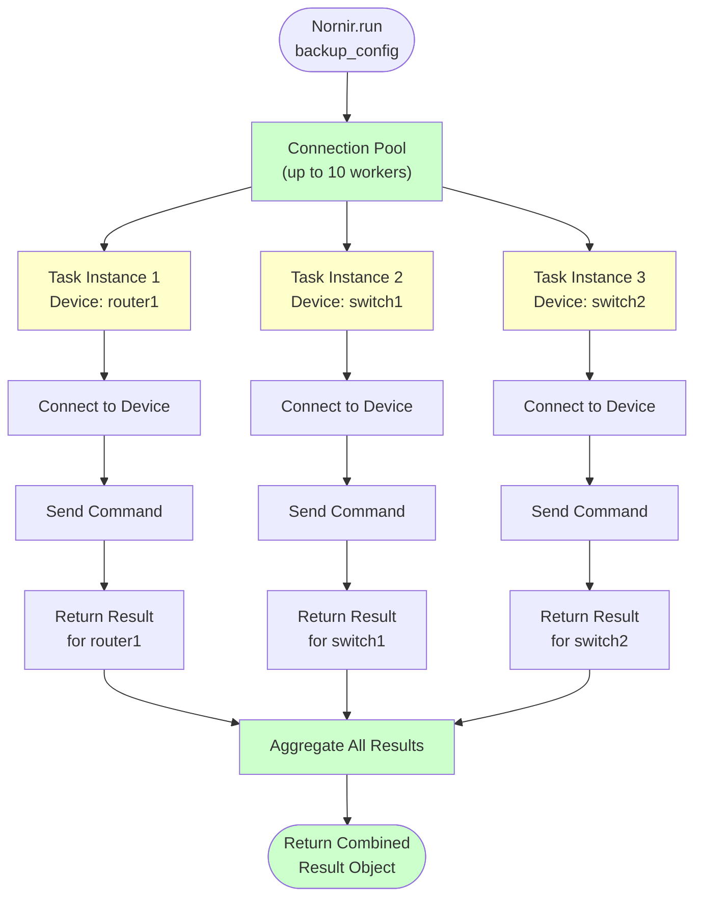

## Nornir Fundamentals

## "From Sequential Scripts to Parallel Tasks — The Foundation of Enterprise Automation"

Now that you understand **why** Nornir matters ([Tutorial #1](./why-nornir.md)), let's learn **how** to use it.

In this tutorial, we'll build your first Nornir automation. You'll take the same logic from [Beginner Tutorial #3](../beginner/multi-device-config-backup.md) and transform it into a parallel system that runs 10x faster.

**Best part:** The business logic (how to connect to devices and retrieve configs) is almost identical. Nornir just handles the parallelization automatically.

---

## 🎯 What You'll Learn

By the end of this tutorial, you'll understand:

- ✅ Nornir installation and project structure
- ✅ Inventory files (YAML-based device management)
- ✅ Writing Nornir **task functions** (the core of Nornir)
- ✅ Running tasks against multiple devices in parallel
- ✅ Processing results from parallel executions
- ✅ Logging that works in parallel environments
- ✅ Best practices for production Nornir scripts

---

## 📋 Prerequisites

### Required Knowledge

- ✅ **Completed [Tutorial #1: Why Nornir](./why-nornir.md)** — Understand the problem we're solving
- ✅ **Completed [Beginner Tutorial #3](../beginner/multi-device-config-backup.md)** — Familiar with Netmiko and device connections
- ✅ Understanding of Python functions, dictionaries
- ✅ Basic YAML format understanding

### Required Software

```bash
# Create a virtual environment
python -m venv nornir_venv
source nornir_venv/bin/activate
# Windows PowerShell: .\nornir_venv\Scripts\Activate.ps1
# Windows CMD: nornir_venv\Scripts\activate.bat

# Install required packages
pip install nornir nornir-netmiko nornir-utils netmiko pandas pyyaml
```

### Required Access

- **5+ Cisco devices** with:
  - SSH enabled
  - Same credentials
  - Accessible from your workstation
  - Privilege level 15 (for `show running-config`)

---

## ⚡ Start Simple: Your First Nornir Task (Before We Build the Full System)

Before diving into the complete architecture, let's write the absolute minimal Nornir program to prove the concept works. This takes 2 minutes.

### Minimal Example: Ping 3 Devices in Parallel

Create `minimal_example.py`:

```python
#!/usr/bin/env python3
"""
Absolute minimal Nornir example
Ping 3 devices in parallel
"""

from nornir import InitNornir
from nornir.core.task import Task, Result
from nornir_netmiko.tasks import netmiko_send_command

def ping_device(task: Task) -> Result:
    """
    Ping a device and return result
    This runs once per device, in parallel
    """
    device_name = task.host.name
    
    result = task.run(
        netmiko_send_command,
        command_string="ping 8.8.8.8 repeat 3"
    )
    
    return Result(
        host=task.host,
        result=result.result
    )

# Initialize Nornir
nr = InitNornir(config_file="nornir_config.yaml")

# Run the task on all devices
results = nr.run(task=ping_device)

# Print results
for device_name, result_obj in results.items():
    if result_obj.failed:
        print(f"✗ {device_name}: FAILED")
    else:
        print(f"✓ {device_name}: SUCCESS")
```

Create `inventory/hosts.yaml` (3 devices minimum):

```yaml
---
router1:
  hostname: 10.1.1.1
  groups:
    - ios_devices

switch1:
  hostname: 10.1.1.2
  groups:
    - ios_devices

switch2:
  hostname: 10.1.1.3
  groups:
    - ios_devices
```

Create `inventory/groups.yaml`:

```yaml
---
ios_devices:
  platform: cisco_ios
  username: admin
  password: your_password
```

Create `nornir_config.yaml`:

```yaml
---
runner:
  plugin: threaded
  options:
    num_workers: 3
inventory:
  plugin: SimpleInventory
  options:
    host_file: "inventory/hosts.yaml"
    group_file: "inventory/groups.yaml"
    defaults_file: "inventory/defaults.yaml"
```

Create `inventory/defaults.yaml`:

```yaml
---
data:
  connection_timeout: 15
  auth_timeout: 10
```

**Run it:**

```bash
python minimal_example.py
```

**Expected output:**

```bash
✓ router1: SUCCESS
✓ switch1: SUCCESS
✓ switch2: SUCCESS
```

**What just happened:** All 3 devices ran in parallel. You can feel the difference if you time it (`time python minimal_example.py` on Linux/Mac, `Measure-Command { python minimal_example.py }` in PowerShell). With a sequential script, it would take 3x longer.

**Key insight:** Nornir ran your plain task function across all devices with `num_workers: 3`, handling the parallelization automatically. You focused on the logic, Nornir handled the concurrency.

## 📊 Understanding Task Execution Flow in Nornir

The diagram below shows how your tasks execute in parallel:



**Key insight:** Each task instance (T1, T2, T3) runs independently. While T1 waits for SSH, T2 and T3 are processing simultaneously.

---

## 🏗️ Nornir Project Structure

Create a directory for your Nornir project and organise it like this:

```text
my-nornir-automation/
├── nornir_config.yaml      # ← Nornir configuration
├── inventory/
│   ├── defaults.yaml       # ← Default settings
│   ├── groups.yaml         # ← Device groupings
│   └── hosts.yaml          # ← Your device list
├── tasks/
│   └── backup.py           # ← Your Nornir task functions
└── configs/                # ← Where backups will be stored
    └── (created at runtime)
```

Let's build each file:

---

## 📄 File 1: nornir_config.yaml

This file tells Nornir how to initialize:

```yaml
---
runner:
  plugin: threaded
  options:
    num_workers: 10                # How many tasks run in parallel
inventory:
  plugin: SimpleInventory        # Use file-based inventory
  options:
    host_file: "inventory/hosts.yaml"
    group_file: "inventory/groups.yaml"
    defaults_file: "inventory/defaults.yaml"
```

**Key setting:** `num_workers: 10` means up to 10 devices run in parallel.

**Save as:** `nornir_config.yaml` in your project root.

---

## 📄 File 2: inventory/defaults.yaml

Default settings applied to all devices:

```yaml
---
data:
  connection_timeout: 10
  auth_timeout: 5
  ssh_config_file: null
  secret: ""                     # Enable password (leave blank)
```

**Save as:** `inventory/defaults.yaml`

---

## 📄 File 3: inventory/groups.yaml

Group your devices by type or role:

```yaml
---
ios_devices:
  platform: cisco_ios
  username: admin
  password: ""                   # Will be overridden at runtime
ios_routers:
  platform: cisco_ios
  username: admin
  password: ""
```

**Save as:** `inventory/groups.yaml`

---

## 📄 File 4: inventory/hosts.yaml

Your device inventory (replaces the CSV from Tutorial #3):

```yaml
---
router1:
  hostname: 192.168.1.1
  groups:
    - ios_devices
  data:
    device_type: cisco_ios

router2:
  hostname: 192.168.1.2
  groups:
    - ios_devices
  data:
    device_type: cisco_ios

router3:
  hostname: 192.168.1.3
  groups:
    - ios_routers
  data:
    device_type: cisco_ios

switch1:
  hostname: 192.168.1.10
  groups:
    - ios_devices
  data:
    device_type: cisco_ios
```

**Key structure:**

- Device name (e.g., `router1`)
- `hostname`: IP or DNS name
- `groups`: Which group this device belongs to
- `data`: Custom fields (like `device_type`)

**Save as:** `inventory/hosts.yaml`

---

## 🔧 File 5: tasks/backup.py

This is where your Nornir tasks live. Let's build it from the ground up:

```python
"""
Nornir Tasks for Configuration Backup
Description: Parallel backup of running configs from Cisco devices
Author: Nautomation Prime
"""

from nornir.core.task import Task, Result
from nornir_netmiko.tasks import netmiko_send_command
import os
import logging

# Configure logging
logging.basicConfig(
    level=logging.INFO,
    format='%(asctime)s - %(name)s - %(levelname)s - %(message)s'
)
logger = logging.getLogger(__name__)

def backup_running_config(task: Task) -> Result:
    """
    Backup the running configuration from a device
    
    This is a Nornir task - it runs once per device, in parallel.
    
    Args:
        task: Nornir task object containing device info
        
    Returns:
        Result object with config data and metadata
    """
    device_name = task.host.name
    device_ip = task.host.hostname
    device_type = task.host.data.get('device_type', 'cisco_ios')
    
    logger.info(f"Starting backup for {device_name} ({device_ip})")
    
    try:
        # Send the 'show running-config' command via Netmiko (handled by nornir-netmiko)
        result = task.run(
            netmiko_send_command,
            command_string="show running-config",
            use_textfsm=False,  # We want raw config text, not parsed
            name="Retrieve running config"
        )
        
        config = result[0].result  # Extract the config from the result
        
        # Verify we got config data
        if isinstance(config, str) and len(config) > 100:
            logger.info(f"✓ {device_name}: Retrieved {len(config)} bytes")
            return Result(
                host=task.host,
                result={
                    'config': config,
                    'size': len(config),
                    'status': 'success'
                }
            )
        else:
            logger.warning(f"⚠ {device_name}: Config seems too small or invalid")
            return Result(
                host=task.host,
                result={
                    'config': None,
                    'size': 0,
                    'status': 'invalid-data'
                },
                failed=True
            )
            
    except Exception as e:
        logger.error(f"✗ {device_name}: {str(e)}")
        return Result(
            host=task.host,
            result={
                'config': None,
                'size': 0,
                'status': f'failed: {str(e)}'
            },
            failed=True
        )

def save_config_to_file(task: Task, config_data: dict, backup_dir: str = "configs") -> Result:
    """
    Save configuration to a timestamped file
    
    Args:
        task: Nornir task object
        config_data: Dictionary mapping host name -> that host's backup result
                     (config, size, status) from the previous task. Nornir passes
                     the SAME kwargs to every host, so we look up this host's own
                     entry via task.host.name.
        backup_dir: Directory to save configs
        
    Returns:
        Result object with file info
    """
    device_name = task.host.name
    
    try:
        # Create config directory if it doesn't exist
        os.makedirs(backup_dir, exist_ok=True)
        
        # Pull out THIS host's result from the map of all results
        host_config = config_data.get(device_name, {})
        
        # Only save if we have valid config
        if host_config.get('status') != 'success':
            logger.warning(f"⚠ {device_name}: Skipping save (status: {host_config.get('status')})")
            return Result(
                host=task.host,
                result={
                    'filename': None,
                    'path': None,
                    'status': host_config.get('status')
                },
                failed=True
            )
        
        # Create safe filename
        safe_name = device_name.replace('.', '-')
        filename = f"{safe_name}_running-config.txt"
        filepath = os.path.join(backup_dir, filename)
        
        # Write config to file
        with open(filepath, 'w') as f:
            f.write(host_config['config'])
        
        file_size = os.path.getsize(filepath)
        logger.info(f"✓ {device_name}: Saved to {filepath} ({file_size:,} bytes)")
        
        return Result(
            host=task.host,
            result={
                'filename': filename,
                'path': filepath,
                'size': file_size,
                'status': 'success'
            }
        )
        
    except Exception as e:
        logger.error(f"✗ {device_name}: File save failed - {str(e)}")
        return Result(
            host=task.host,
            result={
                'filename': None,
                'path': None,
                'status': f'save-failed: {str(e)}'
            },
            failed=True
        )
```

**Save as:** `tasks/backup.py`

---

## 🚀 File 6: main.py

Now let's orchestrate everything:

```python
"""
Main script to run Nornir backup tasks
"""

import os
import sys
import getpass
from datetime import datetime
from nornir import InitNornir
from nornir_utils.plugins.functions import print_result
from tasks.backup import backup_running_config, save_config_to_file

def main():
    """Main function to orchestrate backup"""
    
    print("=" * 70)
    print("Nornir Multi-Device Configuration Backup")
    print("=" * 70)
    
    # Get password
    device_password = getpass.getpass('Enter device password: ')
    
    try:
        # Initialize Nornir from config file
        nornir = InitNornir(config_file="nornir_config.yaml")
        
        # Update passwords in inventory
        for host in nornir.inventory.hosts.values():
            host.password = device_password
        
        print(f"\n✓ Loaded {len(nornir.inventory.hosts)} device(s) from inventory\n")
        
        # Create timestamped backup directory
        timestamp = datetime.now().strftime('%Y%m%d_%H%M%S')
        backup_dir = f"configs/{timestamp}"
        os.makedirs(backup_dir, exist_ok=True)
        print(f"✓ Created backup directory: {backup_dir}\n")
        
        # Run backup task on all devices in parallel
        print(f"{'=' * 70}")
        print("Executing parallel backups...\n")
        
        # Task 1: Retrieve configs from all devices (in parallel)
        backup_results = nornir.run(
            task=backup_running_config,
            name="Backup Running Configs"
        )
        
        # Task 2: Process results and save configs
        print(f"\n{'=' * 70}")
        print("Processing results and saving to files...\n")
        
        file_results = nornir.run(
            task=save_config_to_file,
            config_data={
                host_name: backup_results[host_name][0].result
                for host_name in backup_results.keys()
            },
            backup_dir=backup_dir
        )
        
        # Summary
        print(f"\n{'=' * 70}")
        print("BACKUP SUMMARY")
        print(f"{'=' * 70}")
        print(f"Backup Location: {backup_dir}")
        
        # Count successes and failures
        successful = sum(
            1 for result in backup_results.values() 
            if result[0].result.get('status') == 'success'
        )
        failed = len(backup_results) - successful
        
        print(f"Successful Backups: {successful}/{len(nornir.inventory.hosts)}")
        print(f"Failed Backups: {failed}/{len(nornir.inventory.hosts)}")
        print(f"{'=' * 70}")
        
        # Show backed-up devices
        if successful > 0:
            print("\nBacked Up Devices:")
            for host_name, result in backup_results.items():
                if result[0].result.get('status') == 'success':
                    size = result[0].result.get('size', 0)
                    print(f"  ✓ {host_name}: {size:,} bytes")
        
        if failed > 0:
            print("\nFailed Devices:")
            for host_name, result in backup_results.items():
                if result[0].result.get('status') != 'success':
                    status = result[0].result.get('status', 'unknown')
                    print(f"  ✗ {host_name}: {status}")
        
        print()

    except Exception as e:
        print(f"✗ Error: {str(e)}")
        sys.exit(1)

if __name__ == "__main__":
    main()
```

**Save as:** `main.py` in your project root.

---

## 🏃 How to Run

### Step 1: Set Up Your Project

```bash
# Create project directory
mkdir my-nornir-automation
cd my-nornir-automation

# Create subdirectories
mkdir inventory
mkdir tasks
mkdir configs

# Create virtual environment
python -m venv venv
source venv/bin/activate
# Windows PowerShell: .\venv\Scripts\Activate.ps1
# Windows CMD: venv\Scripts\activate.bat

# Install dependencies
pip install nornir nornir-netmiko nornir-utils netmiko getpass pyyaml
```

### Step 2: Create All Files

Copy the YAML and Python files we created above into their respective locations.

### Step 3: Edit inventory/hosts.yaml

Update with YOUR actual devices:

```yaml
---
my-router1:
  hostname: 10.1.1.1
  groups:
    - ios_devices
  data:
    device_type: cisco_ios

my-router2:
  hostname: 10.1.1.2
  groups:
    - ios_devices
  data:
    device_type: cisco_ios

# Add more devices here...
```

### Step 4: Run the Script

```bash
python main.py
```

You'll be prompted:

```bash
Enter device password:
```

Type your password and press Enter.

### Step 5: Watch It Run

You'll see output like:

```bash
======================================================================
Nornir Multi-Device Configuration Backup
======================================================================

✓ Loaded 5 device(s) from inventory

✓ Created backup directory: configs/20260216_143022

======================================================================
Executing parallel backups...

2026-02-16 14:30:22 - __main__ - INFO - Starting backup for router1 (10.1.1.1)
2026-02-16 14:30:22 - __main__ - INFO - Starting backup for router2 (10.1.1.2)
2026-02-16 14:30:22 - __main__ - INFO - Starting backup for switch1 (10.1.1.10)
[Notice all three start at the SAME TIME - that's parallelization!]
2026-02-16 14:30:27 - __main__ - INFO - ✓ router1: Retrieved 45,234 bytes
2026-02-16 14:30:27 - __main__ - INFO - ✓ router2: Retrieved 38,912 bytes
2026-02-16 14:30:28 - __main__ - INFO - ✓ switch1: Retrieved 62,148 bytes

======================================================================
Processing results and saving to files...

2026-02-16 14:30:28 - __main__ - INFO - ✓ router1: Saved to configs/20260216_143022/router1_running-config.txt (45,234 bytes)
2026-02-16 14:30:28 - __main__ - INFO - ✓ router2: Saved to configs/20260216_143022/router2_running-config.txt (38,912 bytes)
2026-02-16 14:30:28 - __main__ - INFO - ✓ switch1: Saved to configs/20260216_143022/switch1_running-config.txt (62,148 bytes)

======================================================================
BACKUP SUMMARY
======================================================================
Backup Location: configs/20260216_143022
Successful Backups: 3/3
Failed Backups: 0/3
======================================================================

Backed Up Devices:
  ✓ router1: 45,234 bytes
  ✓ router2: 38,912 bytes
  ✓ switch1: 62,148 bytes
```

**Notice:** All 3 devices backed up in ~6 seconds total (not 18 seconds sequential)!

---

## 📖 Understanding the Code

Let's break down the key Nornir concepts:

### The Task Function

```python
def backup_running_config(task: Task) -> Result:
```

**What it does:** A Nornir task is just a plain function whose first parameter is a `Task` object. You hand the function to `nr.run(task=...)` — there is **no special decorator** (Nornir has no `@task`).

**How it works:**

- `task` is a special Nornir object containing device info + methods
- `task.host` gives you the device object
- `task.run()` executes other tasks or plugins
- `Result` is what you return

**Why:** Nornir handles the threading/async complexity for you. You just write a normal function that accepts a `Task` and returns a `Result`.

---

### The Task Object

```python
task.host.name           # Device name from inventory (e.g., "router1")
task.host.hostname       # Device IP/DNS (e.g., "10.1.1.1")
task.host.username       # Device username
task.host.password       # Device password
task.host.data           # Custom data from inventory
task.host.groups         # Groups this device belongs to
```

**Usage:** Access device info like normal Python attributes.

---

### Running Netmiko Through Nornir

```python
result = task.run(
    netmiko_send_command,
    command_string="show running-config",
    use_textfsm=False,
    name="Retrieve running config"
)
```

**What it does:** Executes a Netmiko command via Nornir.

**Why:** The `nornir-netmiko` plugin bridges Netmiko and Nornir, handling SSH connections across all devices.

---

### The Result Object

```python
return Result(
    host=task.host,
    result={'config': config, 'size': len(config), 'status': 'success'},
    failed=False  # or True if something went wrong
)
```

**What it does:** Packages your result for aggregation.

**Why:** Nornir collects all results ( from all devices) and provides unified access.

---

### Running Tasks in main.py

```python
backup_results = nornir.run(
    task=backup_running_config,
    name="Backup Running Configs"
)
```

**What it does:** Runs `backup_running_config` on ALL devices in parallel.

**Returns:** Aggregated results from all devices.

**Most important:**  You don't write loops! Nornir handles the parallelization automatically.

---

### Accessing Results

```python
for host_name, result in backup_results.items():
    status = result[0].result.get('status')
    if status == 'success':
        print(f"✓ {host_name}")
    else:
        print(f"✗ {host_name}")
```

**Structure:** `backup_results[device_name][0].result`

- Device name from inventory
- Index [0] is the first task result; if you run multiple tasks per host, use [1], [2], etc.
- `.result` is your returned data

---

## 🚀 Performance Comparison

Let's measure the difference:

**Tutorial #3 (Sequential):**

```bash
5 devices × 6 seconds = 30 seconds
```

**This Nornir script (Parallel):**

```bash
1 round × 6 seconds = 6 seconds
(All 5 devices run simultaneously)
```

**Speedup: 5x** (for 5 devices, you'd get even more with 20+ devices)

---

## 🔧 Customizing for Your Network

### Changing Device Groups

Inventory groups organise devices by type:

```yaml
# inventory/groups.yaml
ios_routers:
  username: admin_ios
  
ios_switches:
  username: admin_switches
  
nxos_devices:
  username: admin_nx
```

Then use groups in `hosts.yaml`:

```yaml
---
core-router1:
  hostname: 10.1.1.1
  groups:
    - ios_routers    # ← Uses ios_routers group settings
```

### Running Tasks on Specific Groups

```python
from nornir.core.filter import F

# Only run on ios_routers
filtered_inventory = nornir.filter(F(groups__contains="ios_routers"))
results = filtered_inventory.run(task=backup_running_config)
```

### Adding Device Variables

```yaml
---
router1:
  hostname: 10.1.1.1
  groups:
    - ios_devices
  data:
    device_type: cisco_ios
    location: "New York"        # ← Custom variable
    is_production: true         # ← Custom variable
    backup_priority: high       # ← Custom variable
```

Access in tasks:

```python
location = task.host.data.get('location')
priority = task.host.data.get('backup_priority')
```

---

## 📊 Advanced Variations

### Add Device Connection Timeout

```yaml
# inventory/defaults.yaml
data:
  connection_timeout: 15
  auth_timeout: 5
  read_timeout: 30
```

---

### Different Credentials Per Group

```python
# In main.py
for host in nornir.inventory.hosts.values():
    if "ios" in [g.name for g in host.groups]:
        host.password = ios_password
    elif "nxos" in [g.name for g in host.groups]:
        host.password = nxos_password
```

---

### Execute Tasks Serially (Not Parallel)

Sometimes you want to run sequentially (e.g., upgrades where order matters):

```python
# In nornir_config.yaml
runner:
  plugin: threaded
  options:
    num_workers: 1  # ← Serial execution instead of parallel
```

---

## 🐛 Troubleshooting

### "YAML parsing error in inventory"

**Check:** YAML spacing and indentation (must be 2 spaces, not tabs)

---

### "Connection failed: hostname not reachable"

**Check:**

- Device IP is correct in `hosts.yaml`
- Device is reachable: `ping 10.1.1.1`
- SSH is enabled: `show ip ssh`

---

### "No module named nornir_netmiko"

**Fix:** Install the plugin

```bash
pip install nornir-netmiko
```

---

### "TypeError: task function must have signature task(Task)"

**Check:** Your task function signature:

```python
def my_task(task: Task) -> Result:  # ← Must match this
```

---

---

## 🐛 Common Issues & Solutions

### Issue 1: "No module named 'nornir_netmiko'"

**Cause:** Netmiko plugin not installed

**Solution:**

```bash
pip install nornir-netmiko
```

### Issue 2: "Connection refused" or "SSH timeout"

**Root causes (in order of likelihood):**

1. **Device IP is wrong**
    - Check: `ping 192.168.1.1` (from your machine)
    - Fix: Verify `hosts.yaml` IP addresses

2. **SSH not enabled on device**
    - Check: `show ip ssh` on the device
    - Fix: `ip ssh version 2` and `line vty 0 4` config

3. **Credentials are wrong**
    - Check: Can you manually SSH? `ssh admin@192.168.1.1`
    - Fix: Update `groups.yaml` password

4. **Device is down or unreachable**
    - Check: Device is powered on and network is up
    - Fix: Troubleshoot network connectivity first

5. **Firewall blocking SSH**
    - Check: `telnet 192.168.1.1 22` (any open TCP session or blank screen means the port is reachable)
    - Fix: Adjust firewall rules

**Debug technique:** Before running Nornir, test SSH manually:

```bash
ssh -v admin@192.168.1.1
```

The verbose output (-v) shows exactly where it's hanging.
Windows PowerShell uses the same command if OpenSSH client is installed.

### Issue 3: "YAML parsing error" in inventory

**Cause:** Indentation or spacing issues

**Solution:** YAML is indent-sensitive (must use 2 spaces, no tabs):

```yaml
# ✓ CORRECT
ios_devices:
  username: admin
  password: secret

# ✗ WRONG (tabs used)
ios_devices:
    username: admin
    password: secret
```

**Check:** In your editor, enable "visible whitespace" (`Ctrl+Shift+P` → "toggle whitespace")

### Issue 4: "Connection pool exhausted" or "too many open files"

**Cause:** `num_workers` is too high for your system

**Your system limits:**

```bash
# Check max open files (Linux/Mac)
ulimit -n

# Typical defaults range from ~256-1024
# If ulimit -n is 1024, keep num_workers <= 100
# Windows: no ulimit equivalent, start with 10-20 workers and increase slowly
```

**Solution:** Reduce `num_workers` in `nornir_config.yaml`:

```yaml
runner:
  plugin: threaded
  options:
    num_workers: 10  # ← Start conservative, increase in small steps
```

### Issue 5: "Failed to acquire lock on device" or similar errors

**Cause:** Device doesn't support concurrent SSH sessions

**Solution:**

- Reduce `num_workers`
- OR check device documentation for session limits
- Some devices allow only 5-10 concurrent SSH sessions per device

---

## 🧪 Basic Testing: Validate Your Setup Before Production

Before running backups on real devices, validate your Nornir setup with these tests:

### Test 1: Verify Inventory Loads

```python
#!/usr/bin/env python3
"""Test that Nornir can load your inventory"""

from nornir import InitNornir

nr = InitNornir(config_file="nornir_config.yaml")

print(f"✓ Loaded {len(nr.inventory.hosts)} devices:")
for host in nr.inventory.hosts.values():
    print(f"  - {host.name}: {host.hostname}")
```

**Expected output:**

```bash
✓ Loaded 5 devices:
  - router1: 192.168.1.1
  - switch1: 192.168.1.2
  - switch2: 192.168.1.3
  - switch3: 192.168.1.4
  - firewall1: 192.168.1.5
```

### Test 2: Verify Device Reachability

```python
#!/usr/bin/env python3
"""Test SSH connectivity to each device"""

from nornir import InitNornir
from nornir.core.task import Task, Result

def test_connectivity(task: Task) -> Result:
    """Try to connect to device, return success/failure"""
    try:
        # This triggers a connection attempt
        task.host.get_connection("netmiko", task.nornir.config)
        return Result(host=task.host, result="✓ Connected")
    except Exception as e:
        return Result(
            host=task.host,
            result=f"✗ Failed: {str(e)}",
            failed=True
        )

nr = InitNornir(config_file="nornir_config.yaml")
results = nr.run(task=test_connectivity)

# Summary
passed = sum(1 for r in results.values() if not r.failed)
failed = sum(1 for r in results.values() if r.failed)

print(f"\n✓ Passed: {passed}/{len(results)}")
if failed > 0:
    print(f"✗ Failed: {failed}/{len(results)}")
    print("\nFailed devices:")
    for device, result in results.items():
        if result.failed:
            print(f"  - {device}: {result.result}")
```

### Test 3: Test Command Execution

```python
#!/usr/bin/env python3
"""Test that you can run real commands"""

from nornir import InitNornir
from nornir.core.task import Task, Result
from nornir_netmiko.tasks import netmiko_send_command

def test_commands(task: Task) -> Result:
    """Run a simple show command"""
    result = task.run(
        netmiko_send_command,
        command_string="show version | include Cisco"
    )
    
    output = result.result
    return Result(host=task.host, result=output)

nr = InitNornir(config_file="nornir_config.yaml")
results = nr.run(task=test_commands)

for device, result_obj in results.items():
    output = result_obj.result[:50] + "..."  # First 50 chars
    print(f"{device}: {output}")
```

---

## ⚠️ Real-World Gotchas & Best Practices

### Gotcha 1: Hardcoded Passwords Are Evil

**Bad:**

```yaml
ios_devices:
  username: admin
  password: "MySecurePassword123!"  # ← NO! Git will expose this!
```

**Good:**

```yaml
ios_devices:
  username: admin
  password: ""  # Leave blank, use environment variable
```

Then in Python:

```python
import os

# Password from environment (safer in CI/CD)
nr = InitNornir(config_file="nornir_config.yaml")

# Inject credentials from secure source
for host in nr.inventory.hosts.values():
    host.password = os.environ.get("DEVICE_PASSWORD")
```

### Gotcha 2: Too Many Workers = System Crash

**Bad:**

```yaml
runner:
  plugin: threaded
  options:
    num_workers: 500  # If you have 500 devices!
```

**Good:**

```yaml
runner:
  plugin: threaded
  options:
    num_workers: 20  # Conservative, increase if needed
```

**Rule of thumb:** Start with 10, then increase in small steps while watching runtime and failures. If runtime keeps dropping without more timeouts, you can add workers. If timeouts or failures rise, you have exceeded what the network/devices can handle—back off.

**Example:**

- 10 workers: 8 min, 0 failures
- 20 workers: 4 min, 0 failures
- 30 workers: 3.5 min, 5 timeouts
**Result:** Use 20 workers. The speedup from 30 is small and reliability drops.

### Gotcha 3: Failing Device Breaks the Entire Job

**Your old Tutorial #3 code:**

```python
for device in devices:
    backup_device(device)  # If device 10 fails, 11-100 don't run
```

**Nornir approach:**

```python
results = nr.run(backup_config)  # All devices run, failures isolated

# Check results individually
for device, result_obj in results.items():
    if result_obj.failed:
        print(f"Device {device} failed, but others still completed")
```

**Lesson:** Framework-level error isolation is huge for enterprise reliability.

### Gotcha 4: Logs Are Messy in Parallel Environment

**Bad (from Tutorial #3):**

```python
for device in devices:
    print(f"Backing up {device}")  # Output is interleaved/garbled
```

**Good (Nornir way):**

```python
import logging

logging.basicConfig(
    format='%(asctime)s - %(name)s - %(levelname)s - %(message)s'
)
logger = logging.getLogger("backup")

# Within your task:
logger.info(f"Device {task.host.name}: Starting backup")
```

### Gotcha 5: You Can't Modify Results After Task Completes

**Bad:**

```python
def backup_config(task: Task) -> Result:
    # ... get config ...
    result = Result(host=task.host, result={'config': config})
    
    # Don't try to modify after return
    result.result['timestamp'] = time.now()  # Too late!
```

**Good:**

```python
def backup_config(task: Task) -> Result:
    # ... get config ...
    
    # Include everything BEFORE returning
    result_data = {
        'config': config,
        'timestamp': time.now(),
        'size': len(config)
    }
    
    return Result(host=task.host, result=result_data)
```

---

## 📦 Project Templates & Best Practices

As you scale beyond this tutorial, use this structure:

### Recommended Project Layout

```text
my-nornir-automation/
├── .gitignore              # Exclude secrets, venv, __pycache__
├── .env.example            # Template for environment variables
├── README.md               # Project documentation
├── requirements.txt        # Dependencies (pip install -r)
├── pyproject.toml          # Modern Python project config
│
├── nornir_config.yaml      # Nornir configuration
│
├── inventory/
│   ├── defaults.yaml
│   ├── groups.yaml
│   └── hosts.yaml
│
├── tasks/                  # Your Nornir task functions
│   ├── __init__.py
│   ├── backup.py
│   ├── discovery.py
│   └── compliance.py
│
├── middleware/             # Custom middleware (auth, validation)
│   └── __init__.py
│
├── plugins/                # Custom plugins (custom inventory, etc)
│   └── __init__.py
│
├── tests/                  # Unit tests
│   ├── __init__.py
│   ├── test_backup.py
│   └── test_discovery.py
│
├── logs/                   # Job logs (gitignored)
├── configs/                # Backed-up configs (gitignored)
└── output/                 # Reports and results (gitignored)
```

### Sample `requirements.txt`

```text
nornir==3.3.0
nornir-netmiko==0.4.0
nornir-utils==0.4.0
netmiko==4.3.0
paramiko==3.3.1
pyyaml==6.0
requests==2.31.0
pytest==7.4.0
pytest-mock==3.11.1
python-dotenv==1.0.0
```

### Sample `pyproject.toml`

```toml
[project]
name = "my-nornir-automation"
version = "1.0.0"
description = "Enterprise network automation with Nornir"
authors = [{name = "Your Name", email = "you@example.com"}]
requires-python = ">=3.8"
dependencies = [
    "nornir>=3.3.0",
    "nornir-netmiko>=0.4.0",
    "netmiko>=4.3.0",
    "pyyaml>=6.0",
    "requests>=2.31.0",
]

[project.optional-dependencies]
dev = [
    "pytest>=7.4.0",
    "pytest-mock>=3.11.1",
    "black>=23.0.0",
    "isort>=5.12.0",
]

[build-system]
requires = ["setuptools>=65.0", "wheel"]
build-backend = "setuptools.build_meta"

[tool.pytest.ini_options]
testpaths = ["tests"]
python_files = "test_*.py"
```

### Sample `.env.example`

```bash
# Copy to .env and fill in your values
# NEVER commit .env to git!

DEVICE_USERNAME=admin
DEVICE_PASSWORD=your_password_here
NORNIR_NUM_WORKERS=10
LOG_LEVEL=INFO

# Optional: For advanced patterns
NETBOX_URL=https://netbox.example.com/api/
NETBOX_TOKEN=your_netbox_token
```

### Sample `.gitignore`

```text
# Python
__pycache__/
*.py[cod]
*$py.class
*.so
venv/
env/

# Environment variables
.env
.env.local

# Nornir outputs
configs/
logs/
output/
*.db
backup.db

# IDE
.vscode/
.idea/
*.swp
*.swo

# OS
.DS_Store
Thumbs.db
```

### Initialize Your Environment

```bash
# One-time setup
python -m venv venv
source venv/bin/activate
# Windows PowerShell: .\venv\Scripts\Activate.ps1
# Windows CMD: venv\Scripts\activate.bat
pip install -r requirements.txt

# Load your .env file
cp .env.example .env  # Linux/Mac
# Windows PowerShell: Copy-Item .env.example .env
# Windows CMD: copy .env.example .env
# Edit .env with your credentials

# Verify setup
python -c "from nornir import InitNornir; nr = InitNornir(config_file='nornir_config.yaml'); print(f'Loaded {len(nr.inventory.hosts)} devices')"
```

### Key Practices

✅ **Use `python-dotenv`** to load `.env` file:

```python
from dotenv import load_dotenv
import os

load_dotenv()
device_password = os.environ.get('DEVICE_PASSWORD')
```

✅ **Never commit secrets** — use `.env` file, CI/CD secrets, or vaults

✅ **Organize by function** — separate backup, discovery, compliance tasks

✅ **Include unit tests** — catch bugs before production

✅ **Document assumptions** — README should explain how to set up and use

---

## 🎓 Key Concepts Mastered

Congratulations! You've learned:

✅ **Inventory Management** — Organise devices in YAML  
✅ **Task Functions** — Write once, Nornir runs on all devices  
✅ **Parallel Execution** — Automatic parallelization, no threading headaches  
✅ **Result Aggregation** — Unified results from all devices  
✅ **Error Handling** — Failed devices don't stop the whole job  
✅ **Logging** — Professional logging that works in parallel  
✅ **Performance** — 5-20x speedup vs. sequential scripts  

---

## 🎯 Next Steps

You've mastered Nornir fundamentals! Here's your path forward:

**Continue with Intermediate Tutorials:**

1. **[Enterprise Config Backup with Nornir](./enterprise-config-backup-nornir.md)** (Recommended Next)
   - See this same pattern at production scale
   - Database storage for backup metadata
   - Change detection between backups
   - Compliance checking

2. **[Advanced Nornir Patterns](./advanced-nornir-patterns.md)**
   - Custom inventory sources
   - Advanced filtering and task chaining
   - Integration with external systems
   - Performance optimisation techniques

    **Learn More About Network Automation Frameworks:**

3. **[Why Nornir?](./why-nornir.md)** — Understand when to use Nornir vs alternatives

    **Study Production Code:**

4. **[Deep Dives](../../deep-dives/index.md)** — See how production tools apply these patterns
   - [Access Switch Audit](../../deep-dives/access-switch-audit.md) — Parallel device collection at scale
   - [CDP Network Audit](../../deep-dives/cdp-audit.md) — Multi-threaded network discovery

    **Ready to Deploy?**

5. **[Script Library](../../../scripts/index.md)** — Deploy production-ready tools built with Nornir
6. **[PRIME Framework](../../../prime-framework/index.md)** — Structure your automation projects for success

---

## 💡 Production Readiness Checklist

Before deploying this in production:

- [ ] Test with your actual device inventory
- [ ] Verify all devices are reachable
- [ ] Check credential storage (use env vars or a vault, avoid plain text)
- [ ] Add error notification (email on failure)
- [ ] Set up job scheduling (cron or scheduler)
- [ ] Validate backup integrity
- [ ] Test recovery process

Tutorial #3 covers these topics!

---

[← Back to Intermediate Tutorials](./index.md) | [Continue to Tutorial #3 →](./enterprise-config-backup-nornir.md)
