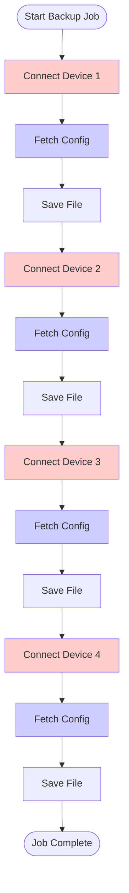
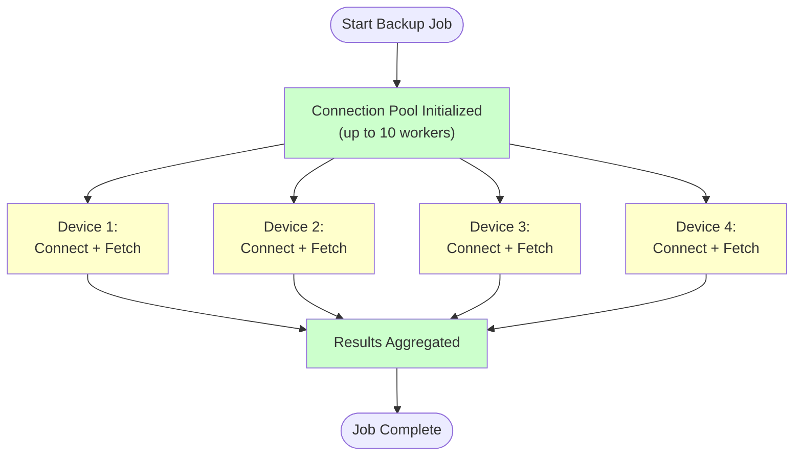

## Why Nornir? Understanding the Problem and Solution

## "From 30 Minutes to 3 Minutes — Why Enterprise Networks Need Parallel Automation"

You've completed the [Beginner Tutorials](../beginner/index.md) and successfully built a multi-device config backup script. It works great for 10 devices, even 50 devices. But what if your organisation has 500 devices? Or 5,000?

In this tutorial, we'll uncover the critical scalability problem with your current approach, demonstrate how it manifests in real networks, and introduce **Nornir**—the solution designed for enterprise automation.

**Important:** This tutorial is conceptual. We're NOT writing production code yet. We're understanding the problem so that Nornir's solution makes sense.

---

## 🎯 What You'll Learn

By the end of this tutorial, you'll understand:

- ✅ Why loops are fundamentally limited for device operations
- ✅ The mathematical principle of parallelization (Amdahl's Law)
- ✅ Real-world performance impact: sequential vs. parallel
- ✅ Nornir's architecture and why it's designed differently
- ✅ The cost/benefit tradeoff of adding framework complexity
- ✅ When Nornir is the right choice (and when it isn't)

---

## 🔴 The Problem: Sequential Bottleneck

Let's revisit your [Beginner Tutorial #3](../beginner/multi-device-config-backup.md):

```python
# From Tutorial #3 — The Serial Approach
for device in devices:
    hostname, filename, size, status = backup_device_config(device, backup_dir)
```

**What this does:**

1. Connect to Device #1
2. Retrieve config (5 seconds of network I/O)
3. Save to file (1 second)
4. Disconnect
5. **THEN** move to Device #2
6. Repeat...

**The fundamental issue:** While the script waits for Device #1's network response, your CPU is completely idle. It can't fetch Device #2's config—it's stuck waiting.

---

### Real-World Impact

Let's do some math:

## **Scenario: Enterprise network with 300 devices**

**Per-device timing:**

- SSH connection: 2 seconds
- `show running-config` execution: 3 seconds (network latency)
- File write: 1 second
- **Total per device: ~6 seconds**

**Sequential approach (Tutorial #3):**

```text
300 devices × 6 seconds = 1,800 seconds = 30 MINUTES
```

**Parallel approach (Nornir):**

```text
6 seconds per round (10 devices run at the same time)
300 ÷ 10 = 30 rounds
30 × 6 = 180 seconds (about 3 minutes)
```

**Real-world result:** The same job takes 30 minutes with your current script but only 2-3 minutes with Nornir.

**That's a 10-15x speedup.**

---

## 📊 Visualizing Sequential vs. Parallel

### Sequential Execution (Tutorial #3 Approach)

```text
Device 1: [=====...wait for network.....=====] ✓
Device 2:                                      [=====...wait for network.....=====] ✓
Device 3:                                                                           [=====...wait for network.....=====] ✓
Device 4:                                                                                                                  [=====...wait for network.....=====] ✓

Time: ████████████████████████████ (10 minutes for 4 devices)
CPU:  ░░░░░░░░░░░░░░░░░░░░░░░░░░░░ (CPU idle ~90% of the time)
```

**Notice:** While Device 1 waits for the network, Devices 2, 3, 4 aren't even started. The CPU is idle.

### Parallel Execution (Nornir Approach)

```bash
Device 1: [=====network=====]
Device 2:  [  ↑ overlapping  =====network=====]
Device 3:   [  ↑ overlapping  =====network=====]
Device 4:    [  ↑ overlapping  =====network=====]

Time: ████████████ (3 minutes for 4 devices)
CPU:  ████████████ (CPU efficiently scheduling I/O)
```

**Notice:** While Device 1 waits for the network, Devices 2, 3, 4 are fetching simultaneously. The network is fully utilized.

### Task Execution Flow Comparison

#### Sequential Task Flow



#### Parallel Task Flow (Nornir)



---

## 🧮 The Math: Amdahl's Law

Why doesn't this scale infinitely? There's a mathematical ceiling:

**Amdahl's Law:**

```text
Speedup = 1 / [(1 - P) + (P / N)]

Where:
  P = percentage of task that can be parallelized (e.g., 0.95 for network ops)
  N = number of parallel processors/threads
```

**For network operations** (which are ~95% parallel):

- 10 parallel connections: 8.3x speedup
- 20 parallel connections: 13.3x speedup
- 50 parallel connections: 26x speedup
- 100 parallel connections: 47x speedup (diminishing returns visible here)

**Practical takeaway:** You get massive gains up to ~10-20 concurrent connections, then diminishing returns. But even diminishing returns beat sequential by a mile.

---

## 🚀 Why Your Tutorial #3 Script Doesn't Scale

Your current `multi-device-config-backup.py` uses this pattern:

```python
for device in devices:
    # Connect
    # Collect config
    # Save file
    # Move to next device (don't start next until this is done)
    pass
```

This is **sequential iteration**. It's simple, it's clear, it's great for learning—but it's a dead-end for enterprise scale.

### The Limitations

| Aspect | Tutorial #3 | Enterprise Need |
| :--- | :--- | :--- |
| **Max devices** | 50-100 (before slowness) | 500-5000+ |
| **Expected runtime** | 10+ minutes | 2-3 minutes |
| **Code complexity** | Simple loops | Framework (Nornir) |
| **Failure isolation** | Per-device try/catch | Unified result aggregation |
| **Extensibility** | Hard (one-off changes) | Easy (reusable tasks) |
| **Team reusability** | One script per job | Shared task library |

---

## ✏️ Interlude: Why Not Just Use Threading in Python?

You might think: *"Why learn Nornir? Can't I just add `threading` to Tutorial #3?"*

You **could**, but here's why that's a bad idea. If you want the production-safe alternative, move next into [Nornir Fundamentals](./nornir-fundamentals.md) and then [Advanced Nornir Patterns](./advanced-nornir-patterns.md).

```python
import threading

# This creates threads—but threads in Python don't truly parallelize due to GIL
def backup_with_threading(devices):
    threads = []
    for device in devices:
        t = threading.Thread(target=backup_device_config, args=(device,))
        threads.append(t)
        t.start()
    
    for t in threads:
        t.join()
```

**Problems:**

1. **Python's GIL (Global Interpreter Lock)** — Threads don't actually run in parallel; they take turns
2. **Result aggregation** — Where does output go? How do you collect all results?
3. **Result aggregation** — No unified error handling
4. **Credentials** — Thread-safe password management gets complex
5. **Scalability** — Creating 500 threads crashes Python

**Nornir uses a controlled worker pool** (the default threaded runner) for network I/O. The GIL does not block this use case because SSH/API calls spend most of their time waiting on the network, so worker threads can overlap device operations safely.

---

## 🏗️ Nornir's Architecture

Nornir solves this problem by building a **task-based framework** instead of a script-based one.

### Core Concepts

#### 1. **Tasks** (not loops)

Instead of:

```python
for device in devices:
    do_something(device)
```

You write:

```python
def backup_config(task):
    # This function runs once per device, in parallel
    config = task.run(netmiko_task, ...)
    return Result(host=task.host, result=config.result)
```

#### 2. **Inventory** (not hardcoded or CSV)

Nornir abstracts device information:

```yaml
# inventory/hosts.yaml
device1:
  hostname: 192.168.1.1
  groups:
    - ios_devices
  vars:
    privileged: true

device2:
  hostname: 192.168.1.2
  groups:
    - ios_devices
```

#### 3. **Runner** (not manual iteration)

Nornir's runner automatically:

- Loads all devices from inventory
- Executes tasks in parallel
- Collects results
- Handles failures

#### 4. **Result Aggregation** (not scattered output)

```python
result = nornir.run(backup_task)

# Built-in result object:
result[device_id].result  # The return value
result[device_id].failed  # Did it fail?
result[device_id].exception  # What went wrong?
```

**The benefit:** Nornir handles all the parallel complexity for you. You focus on the business logic.

---

## 📈 Architecture Comparison

### Tutorial #3 (Sequential Script Architecture)

```text
main()
  ├── read_inventory()  [CSV]
  ├── for each device:
  │   ├── backup_device_config()
  │   │   ├── SSH connect
  │   │   ├── send_command()
  │   │   ├── Write file
  │   │   └── Return (hostname, filename, size, status)
  │   └── Collect results in list
  └── create_backup_manifest()
```

**Characteristics:**

- Linear control flow
- One device at a time
- Results scattered (some in variables, some in files)
- Hard to reuse (tied to specific task logic)

### Nornir (Task-Based Parallel Architecture)

```text
Nornir Instance
  ├── Inventory Manager
  │   └── Loads devices from YAML/Netbox/API
  ├── Task Registry
  │   └── backup_config()    # plain task function
  │   └── validate_config()  # plain task function
  │   └── compare_configs()  # plain task function
  └── Runner
      ├── Parallel task execution (connection pool)
      ├── Middleware pipeline
      ├── Result aggregation
      └── Plugin system
```

**Characteristics:**

- Task-based (functional programming)
- Parallel by default
- Unified result object
- Highly reusable (tasks are libraries)

---

## 💡 When to Use Nornir

### Use Nornir When

✅ **Scale matters** (50+ devices)  
✅ **Performance matters** (tight backup windows)  
✅ **Complexity exists** (multi-step workflows, compliance checks)  
✅ **Teams collaborate** (shared task libraries)  
✅ **Enterprise requirements** (audit trails, integration, reliability)  
✅ **Future growth** (will your network grow?)  

### **Use Tutorial #3 When:**

✅ **Quick one-off script**  
✅ **Very small network** (<10 devices)  
✅ **Learning automation basics** (Tutorial #3 is perfect for this)  
✅ **No performance requirements**  

---

## 📊 Detailed Comparison: Approaches to Multi-Device Automation

The table below breaks down how different approaches compare across real-world concerns:

| Aspect | Tutorial #3 (Sequential) | Threading (DIY) | Nornir (Framework) | Ansible (Alternative) |
| :--- | :--- | :--- | :--- | :--- |
| **Learning curve** | Easy | Moderate | Moderate | Moderate-Hard |
| **Max devices** | ~100 | ~50 (GIL limits) | 500-5000+ | 1000+ |
| **Runtime (100 devices)** | 10 min | 2-3 min* | 1-2 min | 2-3 min |
| **Code complexity** | Low | High | Moderate | High |
| **Error isolation** | Try/catch per device | Thread local storage | Native (per-host) | Native (per-host) |
| **Credential management** | Hardcoded/env vars | Thread-safe needed | Secure pattern | Vault support |
| **Team reusability** | One-off scripts | Hard (threading logic) | Easy (task libraries) | Easy (playbooks) |
| **Extensibility** | Hard | Very hard | Easy | Easy |
| **Logging** | Messy in parallel | Race conditions | Clean/unified | Clean/unified |
| **Integration** | Manual (APIs, DBs) | Manual | Plugin system | Module system |
| **Production-ready** | No | Rarely | Yes | Yes |
| **Maintenance burden** | Low initially, high later | Very high | Moderate | Moderate |

- Threading performance varies wildly due to GIL contention

---

## ⚠️ Real-World Gotchas & Edge Cases

### Gotcha #1: The 3 AM Production Outage

**Scenario:** Your sequential script has been running fine for 6 months. Your network grows 10x. Now backups that took 30 minutes take 5 hours.

**The problem:** You didn't anticipate scale early.

**The lesson:** Planning for scale isn't premature optimisation—it's professional development.

### Gotcha #2: The Failing Device That Kills Everything

**Sequential script (unprotected):**

```python
for device in devices:
    backup_device(device)  # If device 47 fails, 48-100 never run
```

**Real scenario:** Device 47 has SSH timeout. Your backup never completes. Management asks "why weren't the other 53 devices backed up?"

**Solution:** Framework-level error isolation (Nornir handles this automatically)

### Gotcha #3: Credentials Leak Into Logs

**Common mistake:**

```python
print(f"Connecting with {username}:{password}")  # # ← NEVER DO THIS!
```

**In parallel environments**, this becomes even more visible. Nornir's logging patterns protect you from this.

### Gotcha #4: Device Dependency Chains

**Real scenario:** Before backing up an access switch, you need to pull its inventory from your IPAM system.

```text
1. Call IPAM API for device list
2. Parallel: Back up each device
3. Parallel: Validate each backup
4. Merge results for compliance report
```

**Sequential:** Can't start step 2 until step 1 completes (correct!)  
**Threading DIY:** Race conditions if not careful  
**Nornir:** Built-in patterns for this (Tutorial #3 covers this!)

### Gotcha #5: Memory Exhaustion with Large Device Counts

**Scenario:** You parallelize all 5,000 devices at once.

**What happens:**

- 5,000 SSH connections × 4MB per connection = 20GB RAM
- Python crashes
- Takes you 2 hours to figure out why

**The fix:** Connection pools with "max workers" limiting (Nornir: `num_workers: 50`)

---

## 🆘 Practical Decision Tree

Use this to decide which approach is right *now*:

```text
Do you have network devices to manage with scripts?
│
├─ YES: How many?
│   │
│   ├─ Fewer than 10: Use Tutorial #3
│   │                  (Simple is good!)
│   │
│   ├─ 10-50 devices: Use Tutorial #3 now, plan Nornir later
│   │                 (You have time before performance matters)
│   │
│   └─ 50+ devices: Use Nornir now
│       (Performance matters, complexity is justified)
│
└─ ALSO CONSIDER:
    │
    ├─ Will this run more than once? → Plan for reuse
    ├─ Will your network grow? → Plan for scale
    ├─ Will your ops team use this? → Plan for maintainability
    └─ Is this business-critical? → Plan for reliability
```

---

## 📚 You've Got Options, But They're Different

**Honest truth:** There's no "best" tool. There's the right tool for your *current* situation.

- **Tutorial #3** is your "learn automation" tool
- **Threading** is your "never use this" tool (seriously, don't — use Nornir when you need controlled parallelism)
- **Nornir** is your "production ready" tool
- **Ansible** is your "infrastructure as code" tool

They're solving different problems at different scales. Nornir solves *this* problem (parallel network device operations) extremely well.

---

## 🧪 Interactive Learning Checkpoint

Before moving on, ask yourself:

1. **Do you understand why loops alone won't work for many devices?**
    - If no: Re-read "The Problem: Sequential Bottleneck"
    - If yes: ✓ Move forward

2. **Can you explain parallel execution to someone?**
    - If no: Study the Mermaid diagrams and ASCII art above
    - If yes: ✓ Move forward

3. **Do you know when you'd use Nornir vs. Tutorial #3?**
    - If no: Review the "When to Use" section
    - If yes: ✓ You're ready for Tutorial #2

**Stuck?** This is that moment where concepts should click. Take 10 minutes and re-read any section that confused you. This foundation matters for everything coming next.

## 🎯 The Production Reality

In real organisations, here's what happens:

**Month 1:** *"Let's automate config backups!"*  
→ Build Tutorial #3 script  
→ Works great!

**Month 3:** *"We added offices in Asia and Europe. Backups now take 90 minutes."*  
→ "Hmm, let me add threading..."  
→ Threads cause issues...  

**Month 6:** *"Can we also do compliance checking? And integrate with our ticketing system?"*  
→ "The script is spiraling... This needs a redesign..."  
→ **This is where you wish you'd started with Nornir**

---

## 🔍 Under the Hood: Why Nornir Works

Nornir's default **threaded runner** uses a bounded worker pool:

```python
# Parallel execution with a worker pool (simplified)
from concurrent.futures import ThreadPoolExecutor


def backup_device(device):
    # While this device waits for SSH, other workers run
    return f"Backed up {device}"


def backup_all(devices, workers=10):
    with ThreadPoolExecutor(max_workers=workers) as executor:
        results = list(executor.map(backup_device, devices))
    return results

# Up to 10 devices run at once
# Nornir provides this scheduling and result aggregation for you
```

**Nornir abstracts this complexity**, so you write simple task functions and Nornir handles controlled parallel execution automatically.

---

## 📊 Real Enterprise Example

## **Telecom company with 2,500 Cisco devices**

**Old approach (Tutorial #3):**

```text
Backup job scheduled: 2:00 AM
Expected completion: 4:30 AM (150 minutes)
Maintenance window: 2:00-6:00 AM ✓ Fits
```

**With Nornir:**

```text
Backup job scheduled: 2:00 AM
Expected completion: 2:12 AM (12 minutes)
Maintenance window: 2:00-6:00 AM ✓ Fits comfortably
Plus: Can now run more audits/checks in same window!
```

**The business value:** 20 minutes used by automation instead of 2+ hours = real cost savings.

---

## 🧠 The Learning Curve

**Truth:** Nornir IS more complex than Tutorial #3.

But complexity serves a purpose:

```text
Difficulty vs. Power

Tutorial Difficulty:  ▄ (low)
Tutorial Power:       ▄ (limited by scale)

Nornir Difficulty:    ████ (moderate)
Nornir Power:         ████████████████ (enterprise scale)
```

**The cost/benefit:** Adding moderate complexity early saves *enormous* complexity later (no threading hacks, no refactoring).

---

## 🔮 What's Coming Next

In [Tutorial #2: Nornir Fundamentals](./nornir-fundamentals.md), we'll:

1. Install Nornir and dependencies
2. Create your first inventory file
3. Write your first Nornir task function
4. Run it against 5+ devices in parallel
5. See the performance benefit firsthand

**Spoiler:** You'll write basically the same logic as Tutorial #3, but Nornir will parallelize it automatically.

---

## 🎯 Key Takeaway

If you're automating networks at any significant scale:

**Sequential scripts = Training wheels**  
**Nornir = Real enterprise tool**

You don't need to choose immediately. But if you're building anything more than a quick proof-of-concept, learning Nornir is an investment that pays dividends.

---

## 💬 Your Perspective

As someone building this for the first time, here's my honest take:

- **Nornir feels more complex** when you first see it (it is)
- **BUT** it's designed specifically for your problem (parallel network ops)
- **AND** the payoff is huge (10-20x faster)
- **AND** once you understand it, it becomes your default tool

---

## 📚 Before You Continue

Make sure you have:

- ✅ Completed all [Beginner Tutorials](../beginner/index.md)
- ✅ Successfully run Tutorial #3 on at least 5 devices
- ✅ Observed how long it takes (30+ min for many devices)
- ✅ Understood the sequential bottleneck

When you're ready, [Tutorial #2 →](./nornir-fundamentals.md) will teach you to solve this problem with Nornir.

---

## 🆘 Questions Before Moving On?

**"Do I really need Nornir?"**  

- If you have <20 devices and no growth expected: Probably not — Tutorial #3 is enough
- If you have >50 devices or growth expected: Absolutely yes
- If you're in between: Consider learning it so you're prepared as you scale

**"Will I still use the Tutorial #3 approach?"**  

- Yes, for quick/one-off scripts
- But for anything you'll run more than once or scale: Nornir

**"Is Nornir hard to learn?"**  

- Moderate difficulty (Tutorial #2 makes it accessible)
- But the concepts are universal (async I/O, task-based automation)
- Worth the investment

---

[Continue to Tutorial #2: Nornir Fundamentals →](./nornir-fundamentals.md)

---

[← Back to Intermediate Tutorials](./index.md)
