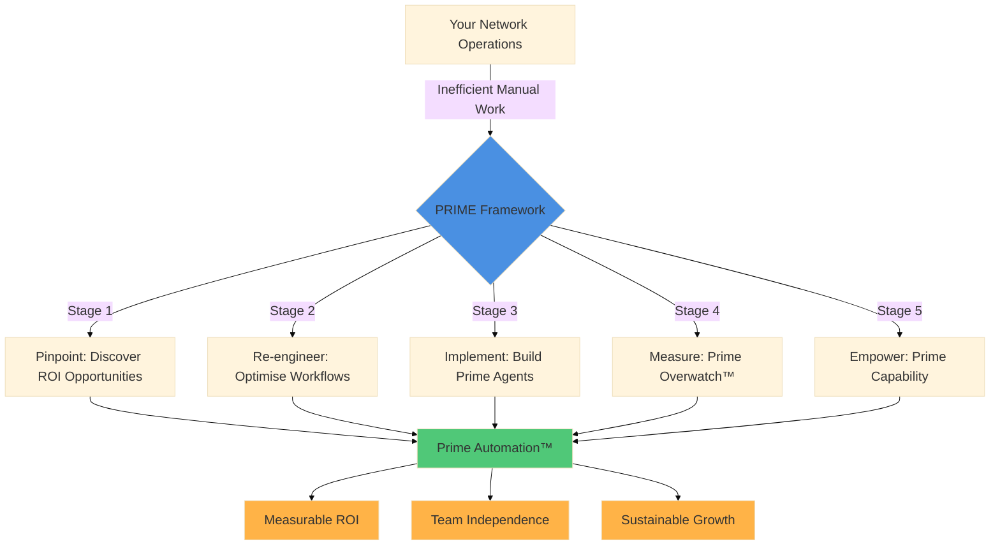

Methodology for measurable, team-owned Cisco automation delivery

## The PRIME Framework

The PRIME Framework is Nautomation Prime's five-stage delivery model for turning operational pain points into production-grade automation, measurable ROI, and real team ownership. It exists to stop organisations automating the wrong things, shipping brittle scripts, and ending up dependent on the original author.

[Request Discovery Call](../contact.md){.md-button .md-button--primary}
[View Services](../services.md){.md-button}
[How We Work](../how-we-work.md){.md-button}
[Read the Philosophy](./philosophy.md){.md-button}

<ul class="np-signal-list">
  <li>Five-stage delivery model</li>
  <li>Typical payback: 6-12 months</li>
  <li>Safety and handover built in</li>
  <li>Designed for team ownership</li>
</ul>

## Who the framework is for

-   ### Leaders who need proof before they invest

    Use the framework when leadership needs a clear business case, measured value, and visibility into what automation is actually achieving.

-   ### Teams inheriting fragile scripts

    Use the framework when existing automation works just enough to be risky, but nobody wants to own, change, or troubleshoot it.

-   ### Engineers moving from one-off scripts to a programme

    Use the framework when the goal is not just faster tasks, but a repeatable automation operating model that can scale.

-   ### Organisations that cannot afford unsafe change

    Use the framework when validation, rollback, governance, and gradual rollout matter as much as delivery speed.

---

## 🎯 Why a Framework?

Network automation isn't just about writing scripts—it's about **transforming operations**. Too many automation projects fail because they:

- ❌ Automate the wrong things (busy work instead of bottlenecks)
- ❌ Lack production safety (untested code hits critical infrastructure)
- ❌ Create new technical debt (unmaintainable "black box" scripts)
- ❌ Don't measure impact (no ROI visibility)
- ❌ Fail to transfer knowledge (dependency on one person)

The PRIME Framework addresses all of these challenges with a structured, proven approach.

---

## 📐 The Five Stages

### [**P** — Pinpoint](./pinpoint.md) Inefficiencies

**Objective:** Identify high-impact automation opportunities

**What Happens:**

- Workflow analysis and time-motion studies
- Identification of repetitive manual tasks
- Risk assessment of error-prone processes
- ROI estimation for potential automations

**Deliverable:** Prioritised automation roadmap with estimated savings

---

### [**R** — Re-engineer](./re-engineer.md) Workflows

**Objective:** Design optimised processes before automating

**What Happens:**

- Process redesign (don't automate bad workflows!)
- Architecture planning for scalability
- Safety mechanism design (pre-flight checks, rollback capability)
- Integration planning with existing tools

**Deliverable:** Technical design documents and workflow diagrams

---

### [**I** — Implement](./implement.md) Solutions

**Objective:** Build production-ready automation following the [PRIME Philosophy](./philosophy.md)

**What Happens:**

- Development of hardened Python scripts
- Line-by-line documentation for transparency
- Comprehensive error handling and validation
- Testing in lab/staging environment

**Deliverable:** Production-ready code with full documentation

---

### [**M** — Measure](./measure.md) Performance

**Objective:** Prove value and continuously improve

**What Happens:**

- Metrics collection (time saved, errors eliminated)
- Performance monitoring and optimisation
- User feedback gathering
- Iterative refinement based on real-world usage

**Deliverable:** ROI reports and optimised automation

---

### [**E** — Empower](./empower.md) Your Team

**Objective:** Ensure long-term success and self-sufficiency

**What Happens:**

- Knowledge transfer and training
- Documentation and runbooks
- Ongoing support window
- Capability building for internal teams

**Deliverable:** Self-sufficient teams with transferable skills

---

## 🔄 Why This Framework Works

### 1. **Starts with Value, Not Technology**

The "Pinpoint" stage ensures we're solving real problems, not automating for automation's sake. Every project begins with a business case.

### 2. **Emphasises Design Over Quick Fixes**

The "Re-engineer" stage prevents the common mistake of automating broken workflows. We optimise first, then automate.

### 3. **Prioritises Production Safety**

The "Implement" stage isn't just coding—it's building with enterprise-grade error handling, validation, and transparency.

### 4. **Proves Return on Investment**

The "Measure" stage provides concrete evidence of value, justifying continued investment in automation.

### 5. **Builds Capability, Not Dependency**

The "Empower" stage ensures clients aren't dependent on external consultants—they gain skills and confidence.

---

## 🎓 Framework + Philosophy

The PRIME Framework is how we **deliver** automation projects. The **[PRIME Philosophy](./philosophy.md)** defines **how we think and build**:

**Core Principles:**

- **Transparency Over Obscurity** — Every line of code explained, no black boxes
- **Measurability Over Assumptions** — Data-driven decisions, proven ROI
- **Ownership Over Dependency** — Your team owns the automation, not us
- **Safety Over Speed** — Production-grade reliability, not quick hacks
- **Empowerment Over Magic Buttons** — Understanding, not mysterious automation

**[Read the full Philosophy →](./philosophy.md)**

| PRIME Stage | Philosophy Application |
| :--- | :--- |
| **Pinpoint** | Vendor-neutral analysis (no tool lock-in) |
| **Re-engineer** | Production-hardened design from the start |
| **Implement** | Line-by-line transparency in all code |
| **Measure** | Honest, documented results |
| **Empower** | Knowledge transfer, not gatekeeping |

Together, they ensure **value, quality, and sustainability**.

---

## 💼 Framework in Practice

### Typical Timeline (Medium Complexity Project)

| Stage | Duration | Key Milestone |
| :--- | :---: | :--- |
| Pinpoint | 1 week | Automation roadmap approved |
| Re-engineer | 1-2 weeks | Technical design signed off |
| Implement | 2-4 weeks | Code delivered & tested |
| Measure | 2-4 weeks | ROI demonstrated |
| Empower | 1-2 weeks | Team trained & autonomous |

**Total:** 7-13 weeks for most projects

### Investment by Stage

Projects are priced as fixed-fee engagements based on scope and complexity. You can engage for:

- **Full Framework** (all five stages) — Recommended for maximum value and sustainable ROI
- **Selected Stages** (e.g., Implement + Empower) — When design documentation already exists
- **Pinpoint Assessment Only** — Understand opportunities before committing to full engagement

**See [Services & Pricing](../services.md) for detailed engagement models and cost estimates.**

!!! info "Flexible Engagement Models"
    We work with your timeline and budget. Most projects complete in 7-13 weeks. We can structure payment around project milestones to align with your financial planning.

---

## 📊 Proven Results

The PRIME Framework has delivered measurable improvements across enterprise networks:

!!! success "Framework Outcomes"
    - **65% average time savings** on repetitive tasks (VLAN provisioning, config audits)
    - **90% error reduction** in configuration changes
    - **6-12 month payback period** on automation investments
    - **Proven knowledge transfer success** — teams become self-sufficient and extend automation independently

---

## 🚀 Getting Started with PRIME

### Start with a discovery conversation, not a blind implementation

The usual entry point is a short discovery conversation to understand your environment, automation maturity, constraints, and likely ROI. If the fit is right, the next step is often [Pinpoint](./pinpoint.md), where priorities and business value are clarified before wider delivery begins.

[Request Discovery Call](../contact.md){.md-button .md-button--primary}
[View Services & Pricing](../services.md){.md-button}
[See How We Work](../how-we-work.md){.md-button}

### Typical entry path

1. Discovery conversation to understand operational problems and constraints.
2. Optional [Pinpoint](./pinpoint.md) assessment to identify the highest-value opportunities.
3. Full PRIME Framework engagement or selected stages, depending on your needs.

---

## 🔍 Deep Dive: Individual Stages

Explore each stage in detail:

1. **[Pinpoint Inefficiencies](./pinpoint.md)** — How we identify the right automation targets
2. **[Re-engineer Workflows](./re-engineer.md)** — Optimising processes before coding
3. **[Implement Solutions](./implement.md)** — Building production-ready solutions
4. **[Measure Performance](./measure.md)** — Proving value and continuous improvement
5. **[Empower Your Team](./empower.md)** — Knowledge transfer and long-term success

---

## 🆚 PRIME Framework vs. Traditional Automation

How does the PRIME Framework compare to typical automation approaches?

| Aspect | Traditional Approach | PRIME Framework |
| :--- | :--- | :--- |
| **Discovery** | "What do you want automated?" | **Pinpoint:** Data-driven ROI analysis, prioritisation matrix |
| **Planning** | Jump straight to coding | **Re-engineer:** Workflow optimisation, architecture design, safety planning |
| **Development** | Quick scripts, minimal testing | **Implement:** Production-hardened with PRIME Philosophy principles |
| **Validation** | "It works on my laptop" | **Measure:** Metrics collection, ROI proof, continuous improvement |
| **Sustainability** | Vendor lock-in, no documentation | **Empower:** Knowledge transfer, team capability building |
| **Typical Outcome** | Script that works once, breaks later | **Prime Automation™** — sustainable, measurable, team-owned |
| **Business Value** | Unknown/untracked | Proven ROI (typically 6-12 month payback) |

**The difference:** Traditional automation delivers code. PRIME Framework delivers **capability**.

---

## 🎨 Prime Terminology

Throughout our framework and services, you'll encounter these unique terms:

| Term | Definition |
| :--- | :--- |
| **Prime Automation™** | Automation built following the PRIME Framework—characterised by measurable ROI, production safety, and team empowerment |
| **Prime Workflows** | Re-engineered operational processes optimised for automation (not just automated existing workflows) |
| **Prime Agents** | Python scripts developed with autonomous decision-making capability (pre-flight checks, validation, rollback) |
| **Prime Efficiency Stack** | The technology foundation (Netmiko, Nornir, TextFSM, Jinja2) used across all implementations |
| **Prime Overwatch™** | Continuous monitoring and metrics collection (Measure stage) for automation performance |
| **Prime Capability** | The end goal of the Empower stage—teams that can maintain, modify, and extend automation independently |

These aren't just buzzwords—they represent specific approaches that differentiate our methodology.

---

## 📊 Case Study Examples

### Case Study 1: Access Layer VLAN Provisioning → Prime Automation™

**Client:** UK financial services firm, 300+ access switches  
**Challenge:** Manual VLAN adds taking 15 mins/switch, high error rate  
**PRIME Stages:**

- **Pinpoint:** Identified 200+ VLAN changes/year = 50 hours wasted
- **Re-engineer:** Designed **Prime Workflows** with templated provisioning + approval gates
- **Implement:** **Prime Agent** using Jinja2 templates with pre/post-flight validation
- **Measure:** **Prime Overwatch™** tracked 2 mins/change average, error-free operations over 6 months
- **Empower:** Team achieved **Prime Capability**—now extends scripts for SVI creation

**ROI:** £12,500/year savings, 6-month payback

---

### Case Study 2: Compliance Audit Automation → Prime Efficiency Stack

**Client:** Healthcare provider, 150 Cisco devices, quarterly PCI-DSS audits  
**Challenge:** Manual config review taking 40 hours per quarter  
**PRIME Stages:**

- **Pinpoint:** Compliance checking identified as most time-intensive task
- **Re-engineer:** Defined "golden config" standards in YAML, created **Prime Workflows**
- **Implement:** **Prime Agent** built on **Prime Efficiency Stack** (Netmiko + TextFSM + pandas)
- **Measure:** **Prime Overwatch™** showed 97% reduction in audit time (40h → 1h)
- **Empower:** Security team gained **Prime Capability** to maintain golden configs

**ROI:** £8,000/year savings, increased compliance confidence, 3x coverage

---

## 🎬 Experience the PRIME Framework

### Visual Overview

---

## 📖 Additional Case Studies

### Case Study 3: IOS-XE Upgrade Orchestration → Prime Agents Intelligence

**Client:** Retail chain, 200+ branch routers requiring IOS-XE 17.x upgrade  
**Challenge:** Manual upgrades took 1 hour/device, required site visits, unpredictable failures  
**PRIME Stages:**

- **Pinpoint:** 200 devices × 1 hour = 200 hours effort, travel costs £15k, compliance deadline
- **Re-engineer:** Designed **Prime Workflows** with staged rollouts (10% → 25% → 50% → 100%)
- **Implement:** **Prime Agent** with autonomous pre-flight checks (CPU, memory, disk space, MD5 verification)
- **Measure:** **Prime Overwatch™** tracked success rate (192/200 successful, 8 skipped due to hardware constraints)
- **Empower:** Network team achieved **Prime Capability**—now handles firmware updates independently

**ROI:** £22,000 saved (160 hours + travel elimination), 96% success rate, no network downtime incidents

---

## 💡 Frequently Asked Questions

??? question "Do I need all five stages?"

    **For best results, yes.** The stages are sequential and build on each other. However, if you have existing design documentation, we can start at the "Implement" stage.
    
    If you're unsure about ROI, start with just the "Pinpoint" stage as a standalone assessment.

??? question "How is this different from other consultancies?"

    Most consultancies jump straight to implementation without understanding workflows ("Implement-first"). Others provide strategy without execution ("PowerPoint automation").
    
    PRIME Framework combines **both strategy and execution** with a proven structure.

??? question "Can I implement the framework myself?"

    Absolutely! The framework isn't proprietary—it's a best-practice methodology. Our [Tutorials](../foundation/tutorials/index.md) and [Deep Dives](../foundation/deep-dives/index.md) give you the technical skills to follow the PRIME Framework internally.

??? question "What if my team is new to Python?"

    **You can still use the PRIME Framework.** We offer different engagement tracks:
    
    **Track 1: Operational Ownership (No Python Required)**
    
    - We deliver production-ready automation with comprehensive user documentation
    - Focus: Your team learns to **operate** the automation effectively
    - Empowerment: Understanding what automation does, when to run it, how to interpret results
    - Outcome: Reliable automation that reduces manual work, owned operationally by your team
    
    **Track 2: Code-Level Ownership (Python Knowledge Helpful)**
    
    - We deliver code with line-by-line technical documentation
    - Focus: Your team learns to **modify and extend** automation
    - Empowerment: Training includes Python fundamentals, code walkthroughs, modification workshops
    - Outcome: Full autonomy—your team writes new automation independently
    
    **Track 3: Hybrid (Recommended for Growing Teams)**
    
    - Operational ownership initially, with gradual code-level capability building
    - Focus: Start using automation immediately, build Python skills over time
    - Empowerment: Phased training—operations first, code literacy second, modification third
    - Outcome: Progressive independence as team skills develop
    
    See [Services: Engagement Tracks](../services.md#engagement-tracks-by-technical-capability) for detailed breakdowns.
    
    We also offer [beginner tutorials](../foundation/tutorials/beginner/index.md) to help your team build Python foundational skills.

??? question "How do you handle failed automations?"

    The "Measure" stage includes failure analysis and remediation. If automation doesn't deliver expected value, we refine iteratively. The fixed-fee model means we're incentivised to deliver working solutions.

---

## 🌟 Ready to Transform Your Network Operations?

The PRIME Framework takes the guesswork out of network automation. Whether you're just starting your automation journey or scaling existing efforts, this proven methodology delivers results.

**Next Steps:**

- **[Understand our principles](./philosophy.md)** — Read the PRIME Philosophy
- **[Request a free discovery call](mailto:enquiries@nautomationprime.io)** to discuss your needs
- **[Explore our services](../services.md)** to see engagement options and pricing
- **[Learn the foundations](../foundation/tutorials/index.md)** with free tutorials
- **[Study production tools](../foundation/deep-dives/index.md)** to see the framework in action

---

> **Mission:** To empower network engineers through the **[PRIME Framework](./index.md)**—delivering automation with measurable ROI, production-grade quality, and sustainable team capability built on the **[PRIME Philosophy](./philosophy.md)** of transparency, measurability, ownership, safety, and empowerment.
